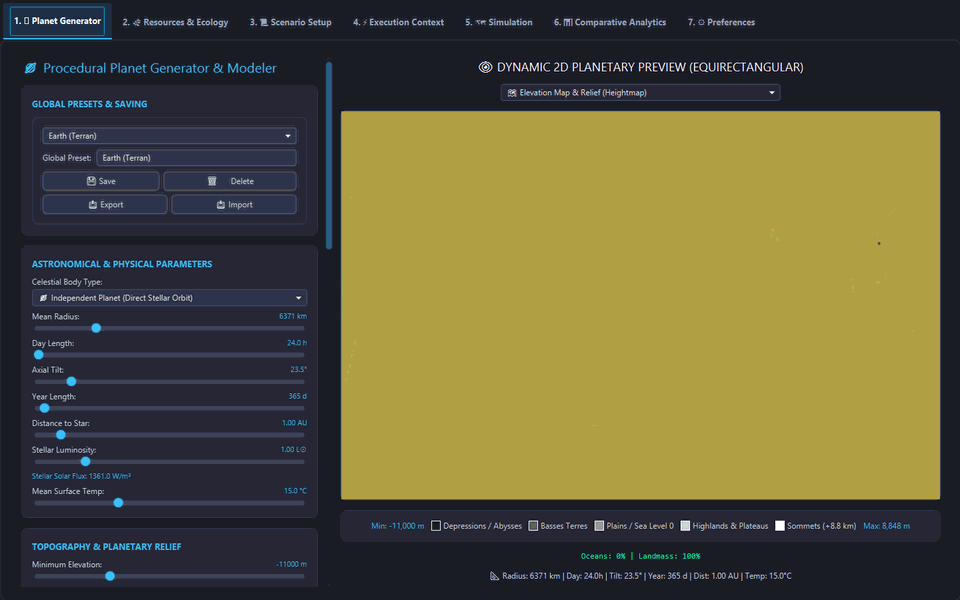
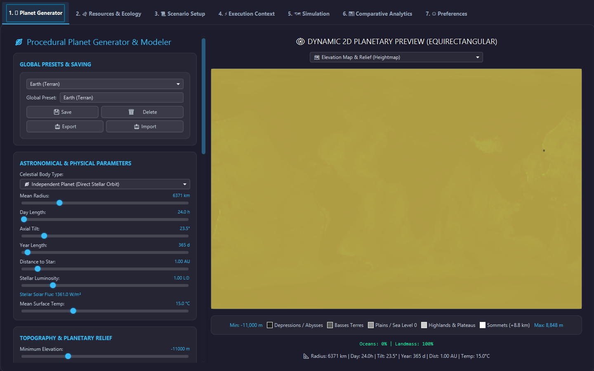
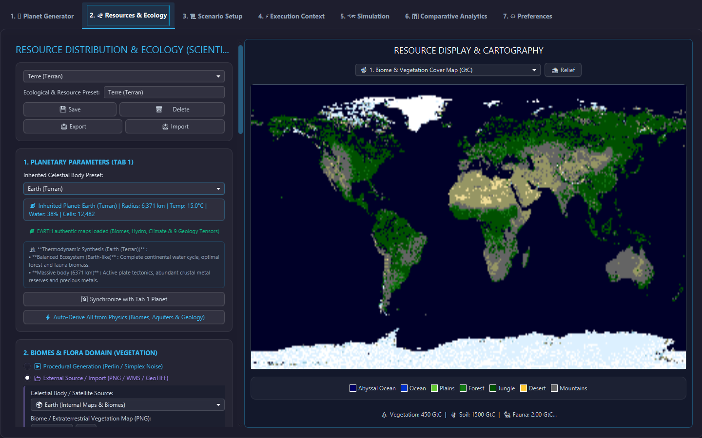
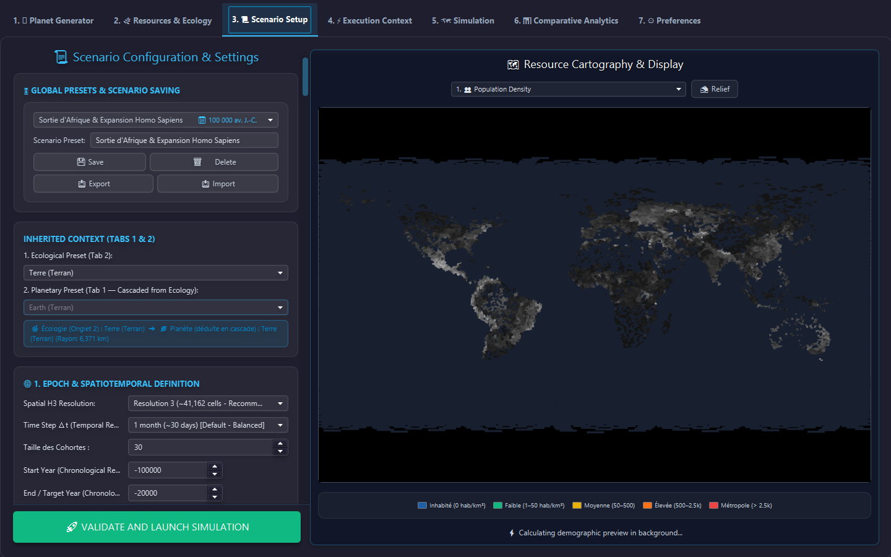
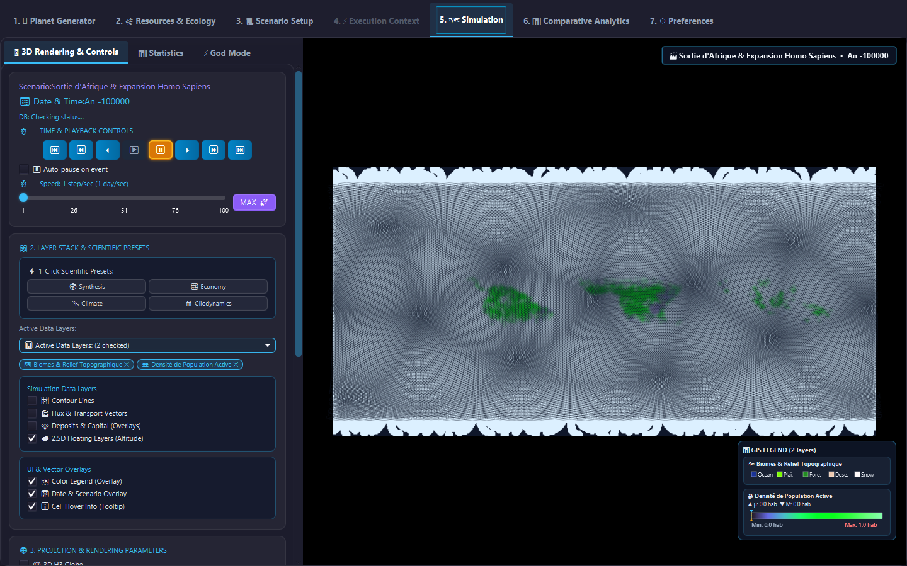
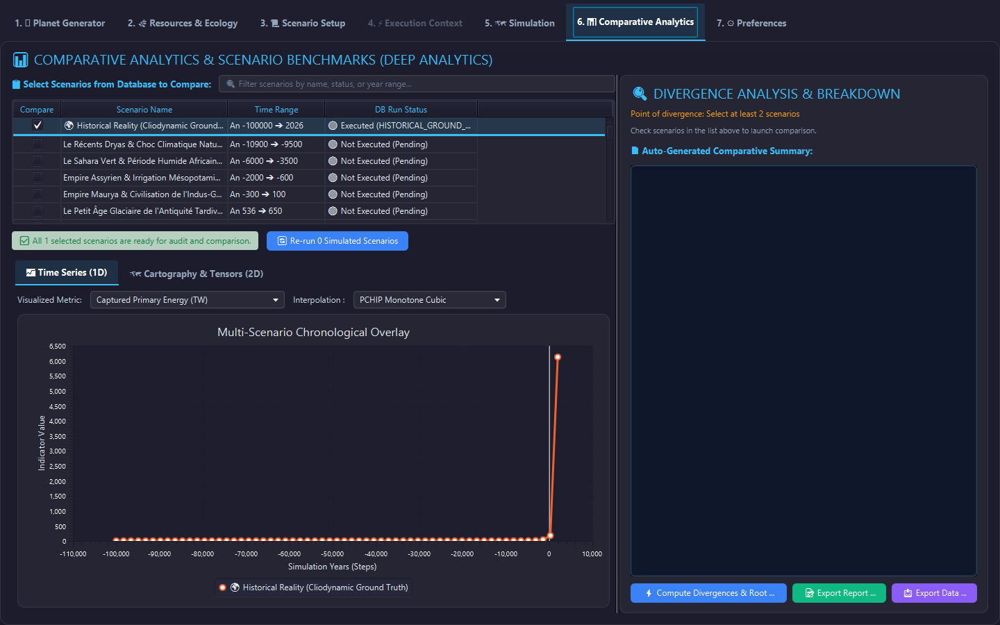

# Ether - Human Society & Cliodynamic Thermodynamic Simulation


**Ether** is a high-fidelity, physicalist and cliodynamic simulation engine modeling planetary human civilization dynamics from 100,000 BCE into future planetary scenarios. Driven by strict thermodynamic principles (Joules, Net EROEI, Carnot limits, Shannon entropy, Soil N-P-K & Carbon, and Aquifer depletion), Ether eliminates heuristic shortcuts in favor of deterministic physical forcing equations and empirical cliodynamic models on a global hexagonal grid (Uber H3).

---

## ⚡ Instant Standalone Deployment (1-Click)

Ether runs out of the box **without requiring any external database configuration**:

```bash
# Windows
install.bat   # or run.bat / .\run.ps1

# Linux / macOS
chmod +x install.sh run.sh
./install.sh  # or ./run.sh
```

To build a standalone portable `.zip` release distribution:
```powershell
powershell -ExecutionPolicy Bypass -File scripts\package_release.ps1
```

For complete deployment options (standalone, Docker PostGIS, distributed cluster, and headless batch CLI), see [docs/DEPLOYMENT.md](docs/DEPLOYMENT.md).

---

## 🎨 Application Architecture & 7 Core Interface Panels



Ether features an integrated 7-panel JavaFX studio providing end-to-end control over planetary genesis, resource distribution, scenario parameters, cliodynamic engines, real-time 3D simulation, telemetry, and system options:

| Application Panel | Detailed Functionality & Visual Preview |
| :--- | :--- |
| **1. 🪐 Biophysical Planet Generator (`PlanetGeneratorPanel`)** | **Procedural World Genesis & Tectonic Modeling**<br>Interactive planet sculptor allowing custom generation of planetary topographies, ocean-to-land ratios, atmospheric pressure, temperature gradients, insolation forcing, mantle heat flux, and soil N-P-K strata.<br><br> |
| **2. ⛏️ Geological Tensors & Resource Distribution (`ResourceDistributionPanel`)** | **8-Layer Geological Tensor Ingestion & Distribution**<br>Ingests empirical spatial datasets (ESRI ASCII Grid `.asc`, GeoJSON, GeoTIFF, WMS) for 8 energy and mineral resource tensors (Coal, Crude Oil, Natural Gas, Uranium, Helium-3, Iron & Copper, REE/Precious Metals, Aquifers) with procedural fallback toggles.<br><br> |
| **3. 🎛️ Scenario Setup Navigation (`ScenarioSetupPanel`)** | **12-Section Historical & Paleoclimate Setup Navigation**<br>Standardized setup hierarchy to configure temporal horizons (from -300,000 BP to future epochs), paleoclimate radiative forcing, cohort demographic matrices, initial technological diffusion, Asabiyyah social cohesion, and pre-flight JIT thermodynamic viability checks.<br><br> |
| **4. ⚙️ Execution Context & Engine Dispatcher (`ExecutionContextPanel`)** | **Simulation Engine Dispatcher & Multi-Core Calibration**<br>Manages simulation loop execution parameters, core physical forcing laws, active Type B cliodynamic plugins, thread pool allocation, and micro/macro tick frequencies.<br><br> |
| **5. 🌐 Real-Time H3 Simulation Canvas (`H3MapCanvas`)** | **Real-Time 3D/2D H3 Hexagonal Globe & Archon Engine**<br>Renders 175,000 hexagonal cells on Uber H3 grid with live multi-layer heatmaps (Malthusian Pressure, Biomes, Population, Radiance, Demographics, Asabiyyah), coordinate tracking, and the Cybernetic God Mode (Archon Engine) for real-time catastrophe injection.<br><br> |
| **6. 📊 Cliodynamics Telemetry & Comparative Analytics (`ComparativeAnalyticsPanel`)** | **Planetary Cliodynamics Telemetry & Empirical Fitting**<br>Calculates real-time Root Mean Square Error (RMSE) and $R^2$ historical goodness-of-fit against empirical datasets (Seshat, Maddison, HYDE 3.4), age pyramids, Gini inequality indices, and EROEI net surplus curves.<br><br> |
| **7. 🔧 Preferences & System Configuration (`PreferencesPanel`)** | **Theme Management, Full i18n & Data Provenance**<br>Controls UI themes (Dark/Light mode), 5-language localization (`EN`, `FR`, `DE`, `ES`, `ZH`), auto-save intervals, external spatial data paths, and SHA-256 cryptographic manifest exports (`provenance.json`).<br><br> |

---

## 🎛️ Standardized Scenario Setup Navigation (Sections 1 to 12)

The `ScenarioSetupPanel` uses a standardized 1–12 numerical navigation hierarchy ensuring a seamless configuration workflow across planetary parameters, cliodynamics, and performance toggles:

1. **1. Scenario Presets & Historical Archetypes** (Historical eras & benchmark scenario profiles)
2. **2. Temporal Horizon & Chronology** (Start year, end year, tick rate & calendar sub-steps)
3. **3. Biophysical Planet Geography & H3 Grid** (Planet radius, atmospheric pressure, sea level offset, axial tilt)
4. **4. Astro-Climate Forcing & Paleoclimate Events** (Insolation, radiative greenhouse forcing, volcanic aerosol shocks)
5. **5. Demographic Cohorts & Population Matrix** (Initial population, age pyramids, carrying capacity sensitivity)
6. **6. Spatial Density & Initial Settlement Distribution** (Settlement archetypes: One Continent, Nile Valley, Fertile Crescent, Beringia, Urban Clusters)
7. **7. Biophysical Resources & Stockpiles** (Initial food reserve months, capital $K_0$, metal/wood/water reserves)
8. **8. Initial Technology & Knowledge Diffusion** (Initial tech level, innovation rate, Shannon transmission bandwidth)
9. **9. Sociology, Institutions & Social Cohesion** (Asabiyyah solidarity, elite formation ratio, fiscal stress threshold)
10. **10. Simulation Engine & Plugin Selection** (Core physical laws, 50+ Type B cliodynamic engines, terraforming modules)
11. **11. Calibration, JIT Compilation & Engine Performance** (Parallel worker threads, multi-frequency climate ticks, JIT warm-up)
12. **12. World Cartographic Preview & Scene Initialization** (Interactive preview canvas, layer toggles, pre-flight diagnostic summary)

---

## ⚡ High-Fidelity Earth Benchmark (175,000 H3 Cells & 50M Humans)

Ether has been benchmarked on a full planetary Earth grid at resolution 6-8 (175,000 H3 cells) with 50 Million humans in Classical Antiquity (-500 BCE) under complete physical, thermodynamic, and cliodynamic models:

| Performance Metric | Measured Value | Evaluation & Throughput |
| :--- | :--- | :--- |
| **H3 Grid Resolution** | **175,000 H3 Cells** | Full Earth planetary coverage |
| **Simulated Population** | **50,000,000 Humans** | Classical Antiquity (-500 BCE) |
| **Total Execution Time** | **10.62 seconds** | Complete 10-second multi-cycle run |
| **Simulation Speed (TPS)** | **0.56 Ticks / sec** | **1 simulated year every 1.35s – 1.77s** |
| **Average Duration per Tick** | **1,350 ms – 1,770 ms / year** | 12 monthly sub-steps + macro cycle |
| **Cell Update Throughput** | **1,185,994 cell-updates / sec** | **~1.19 Million cell-updates per second** |
| **RAM Footprint (Heap Delta)** | **194 MB → 742 MB (+548 MB)** | Highly optimized memory consumption |

---

## 🔬 Scientific Engine Architecture & Ontological Separation

Ether couples two rigorous tiers of scientific engines:
* **Tier 1 — Core Fundamental Planetary Physics (~30-40 Engines)**:
  - Celestial mechanics & Milankovitch insolation cycles (100k/41k/23k yr)
  - Stefan-Boltzmann radiative balance & Clausius-Clapeyron moisture
  - 3-cell atmospheric circulation (Hadley/Ferrel/Polar) with Coriolis wind fields
  - Stommel AMOC 2-box thermohaline ocean conveyor
  - 2D lateral Darcy porous aquifer depletion & Manning-Strickler hydrodynamics
  - Viscoelastic Glacial Isostatic Adjustment (GIA) & Positive Degree-Day (PDD) melt
  - Farquhar FvCB photosynthesis, van Genuchten soil water retention, N-P-K nutrient depletion
  - Stull wet-bulb temperature hyperthermia lethality & Gompertz-Makeham cohort demography
* **Tier 2 — Optional Cliodynamic & Institutional Engines (~50+ Engines)**:
  - Turchin-Goldstone Structural-Demographic Theory (SDT) & Elite Overproduction
  - Tainter diminishing returns on organizational complexity
  - Kümmel-Ayres-Warr biophysical exergy growth ($Y = A K^\alpha L^\beta E^\gamma$)
  - West-Bettencourt urban allometric scaling ($Y \propto N^{1.15}$)
  - NASA HANDY & Limits to Growth (World3) non-linear carrying capacity collapse
  - Price equation multi-level selection of altruism & Boserupian agricultural intensification
  - W. Brian Arthur combinatorial technology evolution & Hotelling resource depletion
  - 30+ Type B historical scenario engines (Edo isolation, Roman hyperinflation, Fertile Crescent salinization, Asabiyyah decay, Wittfogel hydraulic despotism).

See [docs/SIMULATION_EQUATIONS_AND_VARIABLES.md](docs/SIMULATION_EQUATIONS_AND_VARIABLES.md) for full LaTeX mathematical formulations.

---

## 📈 Historical Validation Kernel (`HistoricalValidationKernel`)

Ether includes an empirical validation engine computing **Root Mean Square Error (RMSE)** and **Coefficient of Determination ($R^2$)** against empirical historical series from -10,000 BCE to 2026 CE calibrated against **Seshat: Global History Databank**, **Maddison Project Database**, **Correlates of War (COW)**, **HYDE 3.4**, and **PMIP4/CMIP6**.

---

## 📄 Master Technical Documentation & Communications

- 🚀 [Instant Deployment & Standalone Guide](docs/DEPLOYMENT.md)
- 📐 [Differential Equations & State Variables Specification](docs/SIMULATION_EQUATIONS_AND_VARIABLES.md)
- 🏗️ [Core System Architecture & Data-Oriented Design](docs/ARCHITECTURE.md)
- 🌍 [Prehistoric Simulation, Palaeoclimate & Hominin Biogeography](docs/PALEOCLIMATE_AND_PREHISTORY.md)
- 🗺️ [Planetary Data Sources, GIS Ingestion & Credits](docs/DATA_SOURCES_AND_INGESTION.md)
- 🛠️ [Setup & Operational Operations Guide](docs/SETUP.md)
- 📊 [Comparative Analysis vs. Global Systemic Models](docs/MODEL_COMPARISON.md)
- 🔒 [Security & System Integrity Audit](docs/SECURITY.md)
- 📢 [Reddit Launch Post](docs/posts/REDDIT_POST.md)
- 💼 [LinkedIn Announcement Post](docs/posts/LINKEDIN_POST.md)
- 📦 [Version 1.0.0-beta.1 Release Notes](docs/posts/RELEASE_ANNOUNCEMENT.md)

---

## 📄 License & Authors

Distributed under the **MIT License**.

**Authors**:
- **Silvere Martin-Michiellot** (Lead Author & Creator)
- **Antigravity / Gemini AI (Google DeepMind)**
