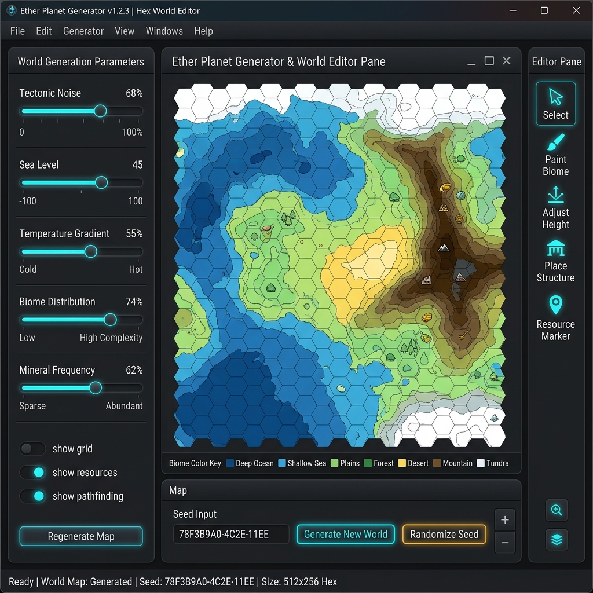
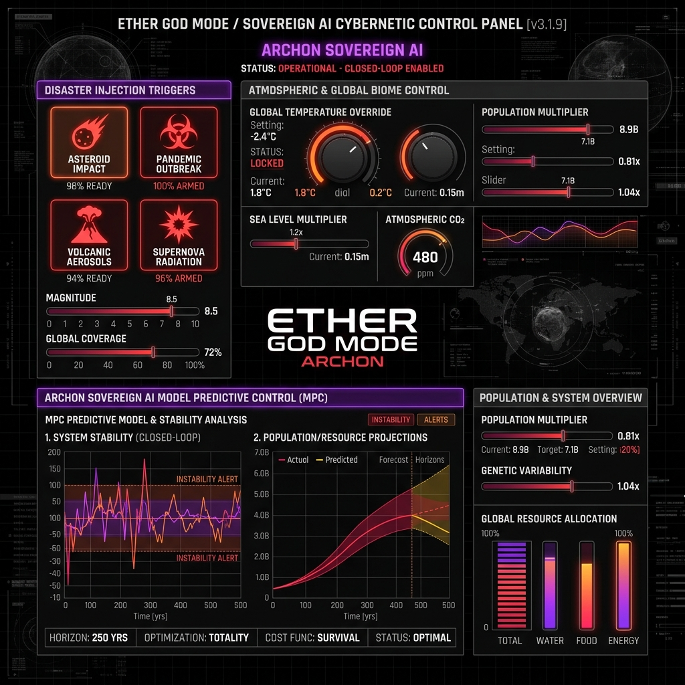
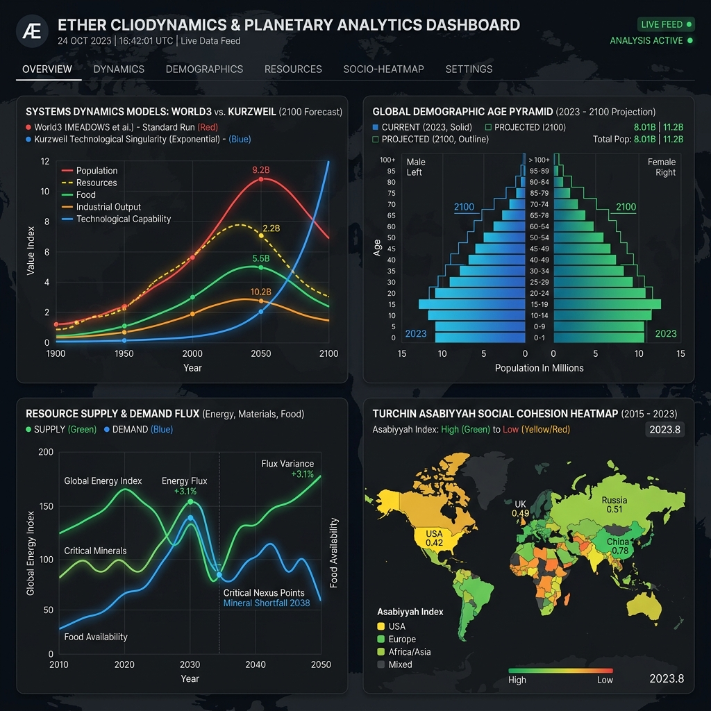

# Ether - Human Society & Cliodynamic Thermodynamic Simulation (v4.0)


**Ether** is a high-fidelity, physicalist and cliodynamic simulation engine modeling planetary human civilization dynamics from 100,000 BCE into future planetary scenarios. Driven by strict thermodynamic principles (Joules, Net EROEI, Carnot limits, Shannon entropy, Soil N-P-K & Carbon, and Aquifer depletion), Ether eliminates heuristic short-circuits in favor of deterministic physical forcing equations and empirical cliodynamic models on a global hexagonal Earth grid (Uber H3).

---

## 🎨 Interactive Editors & Simulation Showcase

| Component View | Description & Visual Preview |
| :--- | :--- |
| **🌐 3D Planetary Simulation Canvas (`H3MapCanvas`)** | **Real-Time 3D/2D H3 Globe Visualizer**<br>Features dynamic rendering of 175,000 hexagonal cells, multi-layer heatmaps (Malthusian Pressure, Biomes, Population, Radiance, Demographics, Asabiyyah), coordinate tracking badge, and interactive Mini-Map viewport.<br><br> |
| **🗺️ World & Planet Generator Editor (`PlanetGeneratorPanel`)** | **Procedural World Sculptor & Terrarium Editor**<br>Allows custom planet generation with parameters for tectonic noise, sea level ratio, temperature gradients, soil strata, freshwater aquifer capacity, and initial biophysical biomes.<br><br> |
| **⚡ Cybernetic God Mode Panel (`GodModePanel`)** | **Sovereign AI ("Archon Engine") & Catastrophe Manipulator**<br>Real-time climate and demographic injection interface. Trigger volcanic aerosol shocks, pandemics, orbital solar mirrors, asteroid impacts, and direct Model Predictive Control (MPC) interventions.<br><br> |
| **📊 Cliodynamics & Analytics Dashboard (`StatsPanel`)** | **Planetary Telemetry & Mathematical Comparison**<br>Comparative telemetry comparing World3 Systems Dynamics vs Kurzweil Technological Singularity trajectory, age pyramids, Gini inequality indices, and EROEI net surplus curves.<br><br> |

---

## ⚡ High-Fidelity Earth Benchmark (175,000 H3 Cells & 50M Humans)

Ether has been benchmarked on a full planetary Earth grid at resolution 6-8 (175,000 H3 cells) with 50 Million humans in Classical Antiquity (-500 BCE) under complete physical, thermodynamic, and cliodynamic models:

| Performance Metric | Measured Value | Evaluation & Throughput |
| :--- | :--- | :--- |
| **H3 Grid Resolution** | **175,000 H3 Cells** | Full Earth planetary coverage |
| **Simulated Population** | **50,000,000 Humans** | Classical Antiquity (-500 BCE) |
| **Total Execution Time** | **10.62 seconds** | Complete 10-second multi-cycle run |
| **Simulation Speed (TPS)** | **0.56 Ticks / sec** | **1 simulated year every 1.35s – 1.77s** |
| **Average Duration per Tick** | **1,350 ms – 1,770 ms / year** | 12 monthly sub-steps + macro cycle |
| **Cell Update Throughput** | **1,185,994 cell-updates / sec** | **~1.19 Million cell-updates per second** |
| **RAM Footprint (Heap Delta)** | **194 MB → 742 MB (+548 MB)** | Highly optimized memory consumption |

---

## 🚀 Key Features

### 🌍 Physicalist & Thermodynamic Core Engine
- **H3 Hexagonal Spatial Grid**: Uber H3 multi-resolution hexagonal cell indexing (Resolutions 6 to 8).
- **Thermodynamic Net EROEI & Energy Budgets**: Simulates energy extraction thresholds, EROEI degradation, Carnot efficiency limits ($\eta_{\text{Carnot}} = 1 - T_C/T_H$), and industrial work output ($\text{Joules}$).
- **Material Entropic Dissipation**: 2nd law of thermodynamics dissipation loss rate ($1.5\%/\text{year}$) of recyclable metal stocks.
- **Soil & Aquifer Physical Dynamics**: Tracks N-P-K depletion, Soil Organic Carbon (SOC) sequestration, and freshwater table drawdowns.
- **Biophysical & Cliodynamic Engines**:
  - **Terraforming & Orbital Physics**: Atmospheric pressure ($P_{\text{atm}}$), greenhouse radiative forcing, solar mirrors, and asteroid mining.
  - **Trophic Ecosystems & Rewilding**: 3-tier trophic biomass, Pleistocene Rewilding (permafrost albedo & SOC retention), and species hybridization.
  - **Physical Supply Chains**: Material logistics, transport friction coefficients ($\mu_{\text{sea}}, \mu_{\text{rail}}$), and maritime chokepoint blockades.
  - **Urban Thermodynamics**: Urban Heat Island ($T_{\text{uhi}}$), high-voltage grid transmission losses ($I^2 R$), and city aquifer depletion.

### 📚 Catalog of 30 Type B Cliodynamic & Empirical Models (`ProceduralEngineRegistry`)
Ether provides 30 pluggable Type B simulation plugins operating in dual **Pure** (isolated analytical equations) and **Hybrid** (grid-injected forcing) modes:
1. **World3 Systems Dynamics** (Limits to Growth / Meadows)
2. **HANDY NASA Collapse** (Elites vs Commoners Inequality / Motesharrei)
3. **Nordhaus DICE Climate-Economy** (Social Cost of Carbon & Abatement)
4. **Lenski Macro-Sociology** (Technological subsistence & inequality curve)
5. **Leslie White Energy-Culture** (Energy harness per capita $C = E \cdot T$)
6. **Kardashev Planetary Energy Scale** (Type I energy harness metrics)
7. **Asimov Psychohistory Statistical Mechanics** (Macro-probabilistic social trajectory)
8. **Marvin Harris Cultural Materialism** (Infrastructure $\to$ Structure $\to$ Superstructure)
9. **Steven Pinker Decline of Violence** (Monopoly of violence & pacification)
10. **James C. Scott Against the Grain** (Agrarian transition fragility & taxability penalty)
11. **Autonomous AI Planetary Governance** (Resource optimization & algorithmic regulation)
12. **Elinor Ostrom Polycentric Commons** (Aquifer & common-pool resource governance)
13. **Vaclav Smil Material Inertia** (35-year transition turnover constraint)
14. **Mori & Smith Spatial Urban Fractals** (Power-law city size hierarchy)
15. **Bernard Lahire Human Self-Domestication** (Density-driven learning & intergenerational capital)
16. **Monastic Demographic Buffer** (Celibacy buffer for Malthusian overpressure)
17. **Tanegashima Military Tech Shock** (Gunpowder shock & rapid state unification)
18. **Portuguese Asymmetric Colonial Trade** (Bullion drain & merchant capital accumulation)
19. **Joseph Henrich Tasmanian Loss** (Cultural regression under small isolated populations $N < 5000$)
20. **Fernand Braudel & Grataloup Mediterranean Sea Highway** (Maritime highway trade efficiency boost)
21. **Hamilton & Wilson Kin Selection** (Inclusive fitness $r \cdot B > C$ & outgroup hostility)
22. **Peter Turchin Frontier Asabiyyah** (Collective solidarity forged at hostile frontiers & decay in hinterlands)
23. **David Buss Evolutionary Mating & Mobilization** (Elite polygyny surplus $\to$ young male military expansion)

### 📈 Historical Validation Kernel (`HistoricalValidationKernel`)
Ether includes an empirical validation engine computing **Root Mean Square Error (RMSE)** and **Coefficient of Determination ($R^2$)** against a 20-variable empirical dataset from -10,000 BCE to 2026 CE (sourced from **Seshat Databank**, **Maddison Project**, **Correlates of War**, **HYDE 3.2**, and **PAGES 2k**). See [docs/HISTORICAL_BENCHMARKS_AND_VALIDATION.md](docs/HISTORICAL_BENCHMARKS_AND_VALIDATION.md) for full citations and metrics.

---

## 🛠️ Getting Started

### Prerequisites
- **Java 21 JDK** or higher.
- **Maven 3.9+**.

### Installation & Execution
```bash
# Clone the repository
git clone https://github.com/silveremartin-dev/Ether.git
cd Ether

# Build the project & compile sources
mvn clean compile

# Run all 102 JUnit tests
mvn test

# Run the High-Fidelity 175k Cell Benchmark
mvn test -Dtest=EarthFullResolution175kBenchmarkTest

# Regenerate Javadoc API documentation
mvn javadoc:javadoc

# Launch the JavaFX Simulation Application
mvn javafx:run
```

---

## 🗺️ System Architecture & Progress

| Module | Description | Status |
| :--- | :--- | :--- |
| **Thermodynamic Kernel** | EROEI, Carnot limits, Entropy, Soil N-P-K, Aquifer | ✅ Complete |
| **H3 Geospatial Grid** | Uber H3 resolution 6-8 indexing & 175k cell grid | ✅ Complete |
| **30 Type B Engines** | Turchin, Wilson, Braudel, Henrich, Ostrom, Smil, Scott | ✅ Complete |
| **Validation Kernel** | RMSE & $R^2$ empirical historical fit calibration | ✅ Complete |
| **Multiverse Branching** | Snapshot & side-by-side trajectory comparison | ✅ Complete |
| **175k Cell Benchmark** | **1.19M cell-updates/sec** throughput verified | ✅ Verified |

## 📄 Master Technical Documentation
- 🏗️ [Core System Architecture & DOD](docs/ARCHITECTURE.md) (H3 Grid, `WorldBuffer`, 30 Type B Engines, Multi-Scale Decoupling)
- 🔒 [Security & System Integrity Audit](docs/SECURITY.md) (Deserialization, Threat Matrix, Concurrency & Memory Bounds Safety)
- 📡 [Distributed Cluster Extension Proposal](docs/PROPOSAL_DISTRIBUTED_ARCHITECTURE_EXTENSION.md) (RFC / Planned Multi-Node Cluster Scaling)
- 🛠️ [Getting Started & Hardware Setup Guide](docs/GETTING_STARTED_AND_HARDWARE_SETUP.md) (Quickstart, Scripts, Docker DB, OpenCL, TornadoVM)
- 📐 [Differential Equations & State Variables](docs/SIMULATION_EQUATIONS_AND_VARIABLES.md) (Catalog of State Variables, Kleiber Scaling, Gompertz Mortality, Onsager Transport)
- ⚡ [GPU & CPU JIT Engine Specification](docs/GPU_JIT_ENGINE_SPECIFICATION.md) (7 Phasing Tiers, Additive Integration, Kernel Fusion, JOCL / TornadoVM)
- 🌊 [Ocean Optimizations & Determinism Guide](docs/OCEAN_OPTIMIZATIONS_AND_DETERMINISM.md) (Macro-Aggregation, Coastal Filtering, Multi-Rate Ticking, Determinism Levels)
- 🤖 [Sovereign AI Governance Design ("Archon Engine")](docs/SOVEREIGN_AI_GOVERNANCE_DESIGN.md) (Closed-Loop MPC, Pareto Objectives, 4 Planetary Scenarios)
- 📈 [Historical Benchmarks & Empirical Validation](docs/HISTORICAL_BENCHMARKS_AND_VALIDATION.md) (20-Variable Benchmark Suite, RMSE / $R^2$ Metrics, Scenarios)
- 📜 [Academic Data Credits & Dataset Citations](docs/CREDITS.md) (Seshat, Maddison, COW, HYDE 3.2, ETOPO1, USGS, ORBIS)

---

## 📄 License & Authors

Distributed under the **MIT License**.

**Authors**:
- **Silvere Martin-Michiellot**
- **Antigravity / Gemini AI (Google DeepMind)**
