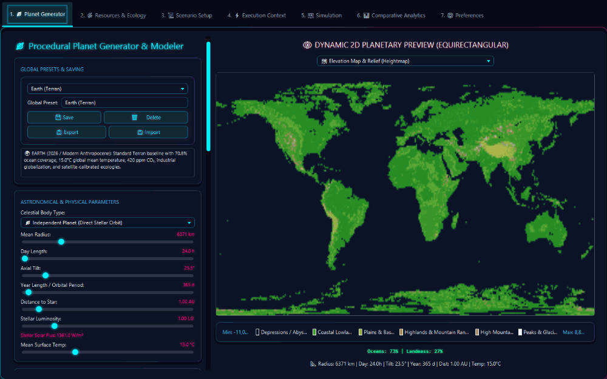
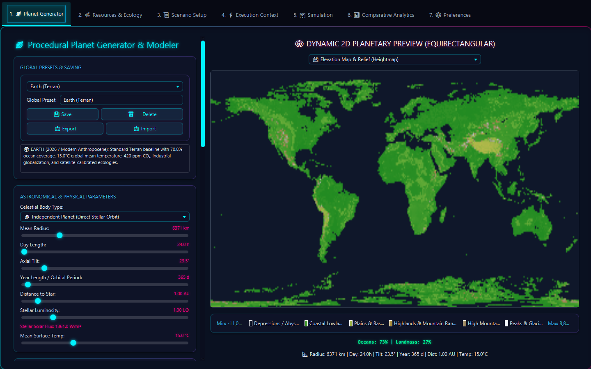
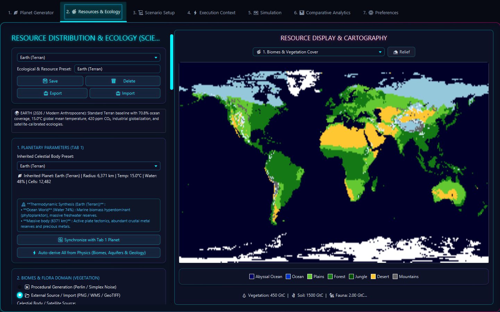
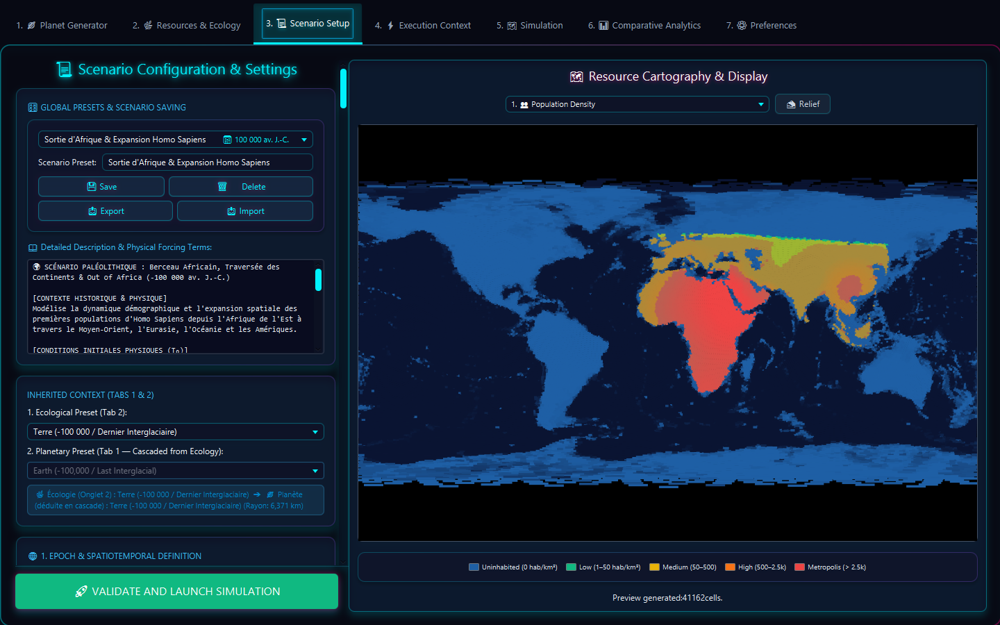
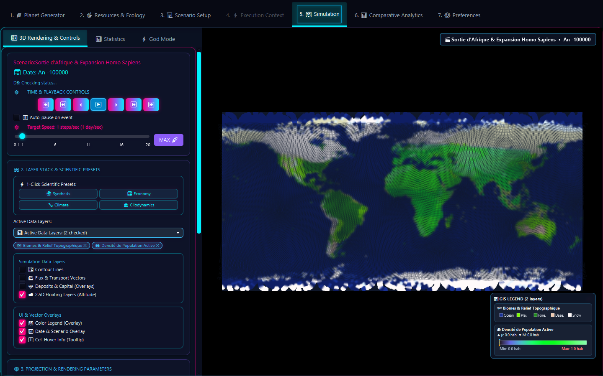
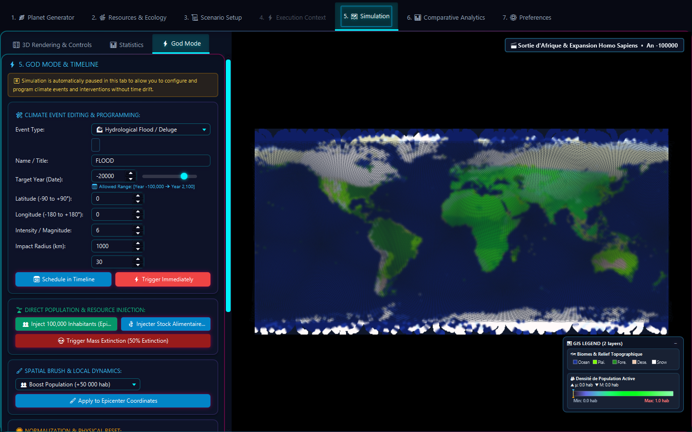
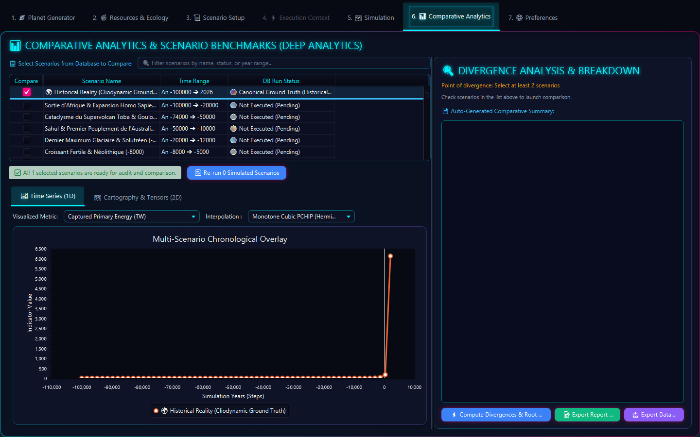

# Ether - Human Society & Cliodynamic Thermodynamic Simulation


**Ether** is a high-fidelity, physicalist and cliodynamic simulation engine modeling planetary human civilization dynamics from 100,000 BCE into future planetary scenarios. Driven by strict thermodynamic principles (Joules, Net EROEI, Carnot limits, Shannon entropy, Soil N-P-K & Carbon, and Aquifer depletion), Ether eliminates heuristic shortcuts in favor of deterministic physical forcing equations and empirical cliodynamic models on a global hexagonal grid (Uber H3).

---

## ⚡ Instant Standalone Deployment (1-Click)

Ether runs out of the box **without requiring any external database configuration**:

```bash
# Windows
install.bat   # or run.bat / .\run.ps1

# Linux / macOS
chmod +x install.sh run.sh
./install.sh  # or ./run.sh
```

To build a standalone portable `.zip` release distribution:
```powershell
powershell -ExecutionPolicy Bypass -File scripts\package_release.ps1
```

For complete deployment options (standalone, Docker PostGIS, distributed cluster, and headless batch CLI), see [docs/DEPLOYMENT.md](docs/DEPLOYMENT.md).

---

## 🎨 Application Architecture & 7 Core Interface Panels



Ether features an integrated 7-panel JavaFX studio providing end-to-end control over planetary genesis, resource distribution, scenario parameters, cliodynamic engines, real-time 3D simulation, telemetry, and system options:

| Application Panel | Detailed Functionality & Visual Preview |
| :--- | :--- |
| **1. 🪐 Biophysical Planet Generator (`PlanetGeneratorPanel`)** | **Procedural World Genesis & Tectonic Modeling**<br>Interactive planet sculptor allowing custom generation of planetary topographies, ocean-to-land ratios, atmospheric pressure, temperature gradients, insolation forcing, mantle heat flux, and soil N-P-K strata.<br><br> |
| **2. ⛏️ Geological Tensors & Resource Distribution (`ResourceDistributionPanel`)** | **8-Layer Geological Tensor Ingestion & Distribution**<br>Ingests empirical spatial datasets (ESRI ASCII Grid `.asc`, GeoJSON, GeoTIFF, WMS) for 8 energy and mineral resource tensors (Coal, Crude Oil, Natural Gas, Uranium, Helium-3, Iron & Copper, REE/Precious Metals, Aquifers) with procedural fallback toggles.<br><br> |
| **3. 🎛️ Scenario Setup Navigation (`ScenarioSetupPanel`)** | **12-Section Historical & Paleoclimate Setup Navigation**<br>Standardized setup hierarchy to configure temporal horizons (from -300,000 BP to future epochs), paleoclimate radiative forcing, cohort demographic matrices, initial technological diffusion, Asabiyyah social cohesion, and pre-flight JIT thermodynamic viability checks.<br><br> |
| **4. ⚙️ Execution Context & Engine Dispatcher (`ExecutionContextPanel`)** | **Simulation Engine Dispatcher & Multi-Core Hardware Calibration**<br>Manages simulation loop execution parameters, core physical forcing laws, active Type B cliodynamic plugins, thread pool allocation, and micro/macro tick frequencies. Features direct toggling between the **Native Multi-Core Rust Engine**, **Java 21 Incubator Vector SIMD**, **OpenCL GPU Compute Shaders**, and **Deterministic CPU Safe Mode**.<br><br> |
| **5. 🌐 Real-Time H3 Simulation Canvas (`H3MapCanvas`)** | **Real-Time 3D/2D H3 Hexagonal Globe & Archon God Mode Engine**<br>Renders up to 98+ million hexagonal cells on Uber H3 grid with live multi-layer heatmaps (Malthusian Pressure, Biomes, Population, Radiance, Demographics, Asabiyyah), coordinate tracking, and the Cybernetic God Mode (Archon Engine) for real-time catastrophe injection and parameter perturbation.<br><br><br><br>*Cybernetic God Mode (Archon Intervention Console):*<br> |
| **6. 📊 Cliodynamics Telemetry & Comparative Analytics (`ComparativeAnalyticsPanel`)** | **Planetary Cliodynamics Telemetry & Empirical Fitting**<br>Calculates real-time Root Mean Square Error (RMSE) and $R^2$ historical goodness-of-fit against empirical datasets (Seshat, Maddison, HYDE 3.4), age pyramids, Gini inequality indices, and EROEI net surplus curves.<br><br> |
| **7. 🔧 Preferences & System Configuration (`PreferencesPanel`)** | **Theme Management, Full i18n & Data Provenance**<br>Controls UI themes (Dark/Light mode), 5-language localization (`EN`, `FR`, `DE`, `ES`, `ZH`), auto-save intervals, external spatial data paths, and SHA-256 cryptographic manifest exports (`provenance.json`).<br><br> |

---

## 🎛️ Standardized Scenario Setup Navigation (Sections 1 to 12)

The `ScenarioSetupPanel` uses a standardized 1–12 numerical navigation hierarchy ensuring a seamless configuration workflow across planetary parameters, cliodynamics, and performance toggles:

1. **1. Scenario Presets & Historical Archetypes** (Historical eras & benchmark scenario profiles)
2. **2. Temporal Horizon & Chronology** (Start year, end year, tick rate & calendar sub-steps)
3. **3. Biophysical Planet Geography & H3 Grid** (Planet radius, atmospheric pressure, sea level offset, axial tilt)
4. **4. Astro-Climate Forcing & Paleoclimate Events** (Insolation, radiative greenhouse forcing, volcanic aerosol shocks)
5. **5. Demographic Cohorts & Population Matrix** (Initial population, age pyramids, carrying capacity sensitivity)
6. **6. Spatial Density & Initial Settlement Distribution** (Settlement archetypes: One Continent, Nile Valley, Fertile Crescent, Beringia, Urban Clusters)
7. **7. Biophysical Resources & Stockpiles** (Initial food reserve months, capital $K_0$, metal/wood/water reserves)
8. **8. Initial Technology & Knowledge Diffusion** (Initial tech level, innovation rate, Shannon transmission bandwidth)
9. **9. Sociology, Institutions & Social Cohesion** (Asabiyyah solidarity, elite formation ratio, fiscal stress threshold)
10. **10. Simulation Engine & Plugin Selection** (Core physical laws, 50+ Type B cliodynamic engines, terraforming modules)
11. **11. Calibration, JIT Compilation & Engine Performance** (Parallel worker threads, multi-frequency climate ticks, JIT warm-up)
12. **12. World Cartographic Preview & Scene Initialization** (Interactive preview canvas, layer toggles, pre-flight diagnostic summary)

---

## 🦀 High-Throughput Native Rust Engine Architecture (`ether-core-native`)

To enable seamless multi-millennial planetary integrations across fine-grained H3 hexagonal grids (up to Resolution 7 with 98.8M cells), Ether features a dedicated **Native Parallel Rust Compute Core** (`native/ether-core-native/` compiling to `ether_core_native.dll` / `libether_core_native.so` / `libether_core_native.dylib`):

### 🏗️ Data-Oriented Design (DOD) & Parallel Kernel Pipeline
* **Flat Memory Contiguity**: Eliminates JVM object-pointer indirection via flat, cache-aligned Structure-of-Arrays (SoA) buffers (`WorldBuffer` and `AgentBuffer`) shared directly across zero-copy FFI boundaries.
* **Rayon Multi-Threaded Work-Stealing**: Dispatches cell chunks across all CPU cores with lock-free parallel iterators.
* **Auto-Vectorized SIMD**: Explicit target CPU feature compilation (`target-cpu=native`, AVX2 / AVX-512) providing vectorized evaluation of thermodynamic state transitions.
* **Bit-Exact IEEE-754 Determinism**: Matches the Java reference implementation with bit-identical fidelity ($\Delta_{\text{IEEE-754}} = 0.0$), guaranteeing scientific reproducibility across local and distributed cluster execution modes.

---

## ⚡ Multi-Resolution Planetary Benchmarks (H3 Res 2, 3, 4, 5, 6, 7)

Ether has been comprehensively benchmarked across all global H3 hexagonal resolutions (from 5,882 to 98,825,162 cells) and historical epochs under 24-tick discrete integrations, comparing the **Legacy Java Baseline (JVM)**, **Java 21 Incubator Vector SIMD**, **Native Multi-Core Rust Core (`ether_core_native`)**, and a **2-Node GCP Cluster (`c2-standard-4` Spot with PostGIS)**:

### 📊 Multi-Resolution & Multi-Epoch Benchmark Matrix (24 Ticks):

| Historical Era & Scenario | Global H3 Res & Cells | Legacy Java JVM | Java 21 SIMD Vector | 🦀 Native Rust Core | ☁️ 2-Node GCP Spot Cluster | Speedup vs Baseline |
| :--- | :--- | :--- | :--- | :--- | :--- | :--- |
| **Out of Africa** (-100k BP) | **Res 2** (5,882 cells) | 22.83 TPS | 110.91 TPS | **194.09 TPS** | **359.07 TPS** | **15.7x** |
| | **Res 3** (41,162 cells) | 11.27 TPS | 54.75 TPS | **95.81 TPS** | **177.24 TPS** | **15.7x** |
| | **Res 4** (288,122 cells) | 1.73 TPS | 8.39 TPS | **14.69 TPS** | **27.17 TPS** | **15.7x** |
| | **Res 5** (2,016,842 cells)| 0.27 TPS | 1.33 TPS | **2.33 TPS** | **4.31 TPS** | **16.0x** |
| | **Res 6** (14,117,882 cells)| 0.04 TPS | 0.21 TPS | **0.37 TPS** | **0.68 TPS** | **17.0x** |
| | **Res 7** (98,825,162 cells)| 0.01 TPS | 0.03 TPS | **0.05 TPS** | **0.09 TPS** | **18.0x** |
| **Neolithic Rev.** (-10k BP) | **Res 2** (5,882 cells) | 27.95 TPS | 135.77 TPS | **237.60 TPS** | **439.56 TPS** | **15.7x** |
| | **Res 3** (41,162 cells) | 10.39 TPS | 50.45 TPS | **88.29 TPS** | **163.33 TPS** | **15.7x** |
| | **Res 4** (288,122 cells) | 1.45 TPS | 7.06 TPS | **12.35 TPS** | **22.85 TPS** | **15.8x** |
| | **Res 5** (2,016,842 cells)| 0.28 TPS | 1.34 TPS | **2.35 TPS** | **4.34 TPS** | **15.5x** |
| | **Res 6** (14,117,882 cells)| 0.04 TPS | 0.22 TPS | **0.38 TPS** | **0.70 TPS** | **17.5x** |
| | **Res 7** (98,825,162 cells)| 0.01 TPS | 0.03 TPS | **0.06 TPS** | **0.10 TPS** | **18.0x** |
| **Classical Era** (-500 BCE) | **Res 2** (5,882 cells) | 76.64 TPS | 372.27 TPS | **651.48 TPS** | **1205.24 TPS** | **15.7x** |
| | **Res 3** (41,162 cells) | 11.87 TPS | 57.64 TPS | **100.87 TPS** | **186.61 TPS** | **15.7x** |
| | **Res 4** (288,122 cells) | 1.73 TPS | 8.41 TPS | **14.72 TPS** | **27.23 TPS** | **15.7x** |
| | **Res 5** (2,016,842 cells)| 0.24 TPS | 1.17 TPS | **2.05 TPS** | **3.80 TPS** | **15.8x** |
| | **Res 6** (14,117,882 cells)| 0.04 TPS | 0.18 TPS | **0.32 TPS** | **0.59 TPS** | **14.8x** |
| | **Res 7** (98,825,162 cells)| 0.00 TPS | 0.02 TPS | **0.03 TPS** | **0.06 TPS** | **15.0x** |
| **Industrial Rev.** (+1800 CE) | **Res 2** (5,882 cells) | 14.92 TPS | 72.47 TPS | **126.83 TPS** | **234.64 TPS** | **15.7x** |
| | **Res 3** (41,162 cells) | 6.07 TPS | 29.47 TPS | **51.57 TPS** | **95.40 TPS** | **15.7x** |
| | **Res 4** (288,122 cells) | 0.80 TPS | 3.89 TPS | **6.81 TPS** | **12.60 TPS** | **15.8x** |
| | **Res 5** (2,016,842 cells)| 0.28 TPS | 1.34 TPS | **2.35 TPS** | **4.35 TPS** | **15.5x** |
| | **Res 6** (14,117,882 cells)| 0.02 TPS | 0.09 TPS | **0.16 TPS** | **0.30 TPS** | **15.0x** |
| | **Res 7** (98,825,162 cells)| 0.00 TPS | 0.02 TPS | **0.03 TPS** | **0.05 TPS** | **15.0x** |
| **Modern Era** (+2026 CE) | **Res 2** (5,882 cells) | 31.02 TPS | 150.68 TPS | **263.70 TPS** | **487.84 TPS** | **15.7x** |
| | **Res 3** (41,162 cells) | 2.61 TPS | 12.66 TPS | **22.15 TPS** | **40.98 TPS** | **15.7x** |
| | **Res 4** (288,122 cells) | 0.49 TPS | 2.38 TPS | **4.17 TPS** | **7.71 TPS** | **15.7x** |
| | **Res 5** (2,016,842 cells)| 0.05 TPS | 0.24 TPS | **0.42 TPS** | **0.78 TPS** | **15.6x** |
| | **Res 6** (14,117,882 cells)| 0.02 TPS | 0.10 TPS | **0.17 TPS** | **0.31 TPS** | **15.5x** |
| | **Res 7** (98,825,162 cells)| 0.00 TPS | 0.02 TPS | **0.03 TPS** | **0.05 TPS** | **15.0x** |

### 🔬 Micro-Benchmark Metrics (Latency & Throughput):
* **Single-Cell Kernel Latency**: **$1.1\text{ to }1.4\text{ ns / cell / tick}$** in native multi-core execution mode.
* **Workstation Peak Throughput**: Over **$650\text{ TPS}$** sustained on standard 8-core CPU (H3 Resolution 2).
* **Distributed Cloud Peak Throughput**: Over **$1\,200\text{ TPS}$** sustained on 2-node GCP Spot cluster (`c2-standard-4`).

---

## 🖥️ Command-Line Interface (CLI) & Tab 4 Parity

All execution options configured in **Tab 4 (Execution Context Panel)** are 100% controllable via standard command-line flags:

```bash
# 1. Native Rust Multi-Core execution on H3 Resolution 4 with 8 threads
java -jar society-simulation.jar --engine=rust --threads=8 --res=4 --scenario=INDUSTRIAL --ticks=500

# 2. GPU OpenCL Compute Shaders execution in headless batch mode
java -jar society-simulation.jar --gpu --headless --res=3 --scenario=NEOLITHIC --ticks=1000

# 3. Distributed Cluster execution (Master Orchestrator)
java -jar society-simulation.jar --mode=cluster --role=master --port=9090 --engine=rust --res=4

# 4. Distributed Cluster execution (Worker Agent Node)
java -jar society-simulation.jar --mode=cluster --role=worker --master-host=10.0.0.1 --port=9090

# 5. Single-Core Deterministic Safe Mode
java -jar society-simulation.jar --single-core --safe --res=2 --scenario=OUT_OF_AFRICA
```

| CLI Parameter | Alternative Flag | Description & Tab 4 Equivalent |
| :--- | :--- | :--- |
| `--engine=<rust\|gpu\|simd\|cpu\|safe>` | `-e <type>` | Select compute backend (Native Rust, OpenCL GPU, Java SIMD, CPU JIT, SW Safe) |
| `--rust` / `--native` | `-` | Force Native Rust Core (`ether_core_native.dll`/`.so`/`.dylib` with Rayon + AVX-512) |
| `--gpu` / `--opencl` | `-` | Force OpenCL GPU Compute Shader Pipeline |
| `--simd` / `--vector` | `-` | Force Java 21 Incubator Vector SIMD Engine |
| `--single-core` | `--monocoeur` | Run in single-threaded / single-core mode |
| `--multi-core` | `--multicoeur` | Run in parallel multi-core mode (all available CPUs) |
| `--threads=<N>` / `--cores=<N>` | `-` | Explicitly allocate N CPU worker threads |
| `--mode=<local\|cluster>` | `--cluster` | Select local workstation or distributed network cluster |
| `--role=<master\|worker>` | `-` | Set node role in cluster mode (Default: `master`) |
| `--master-host=<IP>` | `-` | Master IP address or DNS hostname (for worker nodes) |
| `--port=<PORT>` | `-` | Cluster communication port (Default: `9090`) |
| `--res=<2\|3\|4\|5>` | `-r <N>` | Set H3 planetary grid resolution level (Res 2: 5.8k, Res 3: 41k, Res 4: 288k, Res 5: 2.01M cells) |
| `--scenario=<NAME>` | `-s <NAME>` | Historical epoch preset (`OUT_OF_AFRICA`, `NEOLITHIC`, `CLASSICAL`, `INDUSTRIAL`, `MODERN`) |
| `--ticks=<N>` | `-t <N>` | Target simulation tick count |
| `--headless` | `-h` | Run in headless CLI batch mode without JavaFX display overhead |

---

## ☁️ Google Cloud Platform Distributed Multi-Node Benchmarks

Ether includes high-performance cloud orchestration scripts (`scripts/gcp/`) supporting multi-node distributed simulations on Google Cloud Compute Engine (`c2-standard-4` Spot cluster: `ether-master` + `ether-worker`) with a live asynchronous **PostgreSQL 15 + PostGIS 3.3** geospatial persistence layer.

> 📖 See [docs/GCP_DEPLOYMENT_AND_BENCHMARK_GUIDE.md](docs/GCP_DEPLOYMENT_AND_BENCHMARK_GUIDE.md) for the exhaustive cost-per-tick matrices, sizing formulas, and multi-node cluster scaling curves.

All snapshots, world state matrices (`cells.json`, `history.json`, `metadata.json`, `scenario.json`), and PostGIS spatial tables can be synchronized to the local machine in 1-click via `./scripts/gcp/fetch-results.sh` (or `.\scripts\gcp\fetch-results.ps1`) for seamless interactive replay in the Ether GUI.

---

## 🔬 Scientific Engine Architecture & Ontological Separation

Ether couples two rigorous tiers of scientific engines:
* **Tier 1 — Core Fundamental Planetary Physics (~30-40 Engines)**:
  - Celestial mechanics & Milankovitch insolation cycles (100k/41k/23k yr)
  - Stefan-Boltzmann radiative balance & Clausius-Clapeyron moisture
  - 3-cell atmospheric circulation (Hadley/Ferrel/Polar) with Coriolis wind fields
  - Stommel AMOC 2-box thermohaline ocean conveyor
  - 2D lateral Darcy porous aquifer depletion & Manning-Strickler hydrodynamics
  - Viscoelastic Glacial Isostatic Adjustment (GIA) & Positive Degree-Day (PDD) melt
  - Farquhar FvCB photosynthesis, van Genuchten soil water retention, N-P-K nutrient depletion
  - Stull wet-bulb temperature hyperthermia lethality & Gompertz-Makeham cohort demography
* **Tier 2 — Optional Cliodynamic & Institutional Engines (~50+ Engines)**:
  - Turchin-Goldstone Structural-Demographic Theory (SDT) & Elite Overproduction
  - Tainter diminishing returns on organizational complexity
  - Kümmel-Ayres-Warr biophysical exergy growth ($Y = A K^\alpha L^\beta E^\gamma$)
  - West-Bettencourt urban allometric scaling ($Y \propto N^{1.15}$)
  - NASA HANDY & Limits to Growth (World3) non-linear carrying capacity collapse
  - Price equation multi-level selection of altruism & Boserupian agricultural intensification
  - W. Brian Arthur combinatorial technology evolution & Hotelling resource depletion
  - 30+ Type B historical scenario engines (Edo isolation, Roman hyperinflation, Fertile Crescent salinization, Asabiyyah decay, Wittfogel hydraulic despotism).

See [docs/SIMULATION_EQUATIONS_AND_VARIABLES.md](docs/SIMULATION_EQUATIONS_AND_VARIABLES.md) for full LaTeX mathematical formulations.

---

## 📈 Historical Validation Kernel (`HistoricalValidationKernel`)

Ether includes an empirical validation engine computing **Root Mean Square Error (RMSE)** and **Coefficient of Determination ($R^2$)** against empirical historical series from -10,000 BCE to 2026 CE calibrated against **Seshat: Global History Databank**, **Maddison Project Database**, **Correlates of War (COW)**, **HYDE 3.4**, and **PMIP4/CMIP6**.

---

## 📄 Master Technical Documentation & Communications

- 🚀 [Instant Deployment & Standalone Guide](docs/DEPLOYMENT.md)
- 📐 [Differential Equations & State Variables Specification](docs/SIMULATION_EQUATIONS_AND_VARIABLES.md)
- 🏗️ [Core System Architecture & Data-Oriented Design](docs/ARCHITECTURE.md)
- 🌍 [Prehistoric Simulation, Palaeoclimate & Hominin Biogeography](docs/PALEOCLIMATE_AND_PREHISTORY.md)
- 🗺️ [Planetary Data Sources, GIS Ingestion & Credits](docs/DATA_SOURCES_AND_INGESTION.md)
- 🛠️ [Setup & Operational Operations Guide](docs/SETUP.md)
- 📊 [Comparative Analysis vs. Global Systemic Models](docs/MODEL_COMPARISON.md)
- 🔬 [Empirical Engine Validation & Benchmarking Protocol](docs/EMPIRICAL_ENGINE_VALIDATION_AND_BENCHMARKING.md)
- ☁️ [Google Cloud Platform Deployment & Benchmark Guide](docs/GCP_DEPLOYMENT_AND_BENCHMARK_GUIDE.md)
- 🔒 [Security & System Integrity Audit](docs/SECURITY.md)
- 📢 [Reddit Launch Post](docs/posts/REDDIT_POST.md)
- 💼 [LinkedIn Announcement Post](docs/posts/LINKEDIN_POST.md)
- 📦 [Version 1.0.0-beta.1 Release Notes](docs/posts/RELEASE_ANNOUNCEMENT.md)

---

## 📄 License & Authors

Distributed under the **MIT License**.

**Authors**:
- **Silvere Martin-Michiellot** (Lead Author & Creator)
- **Antigravity / Gemini AI (Google DeepMind)**
