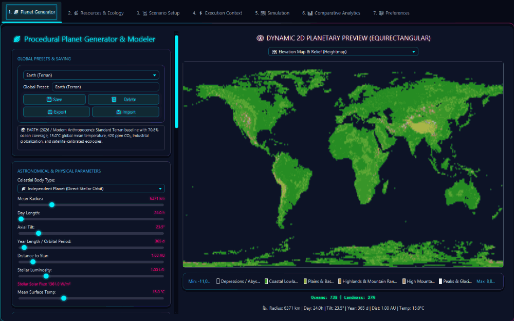
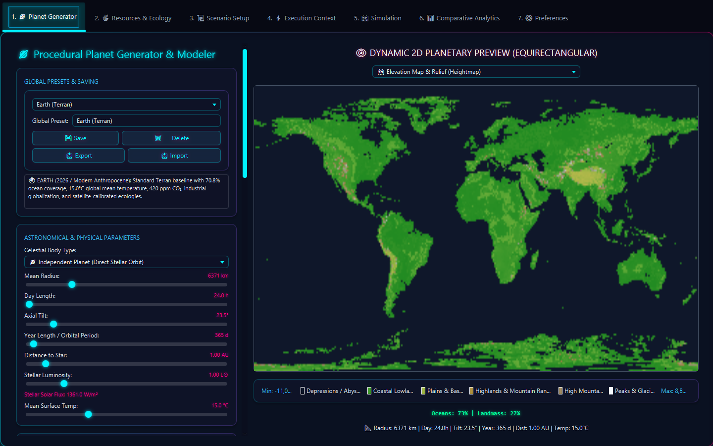
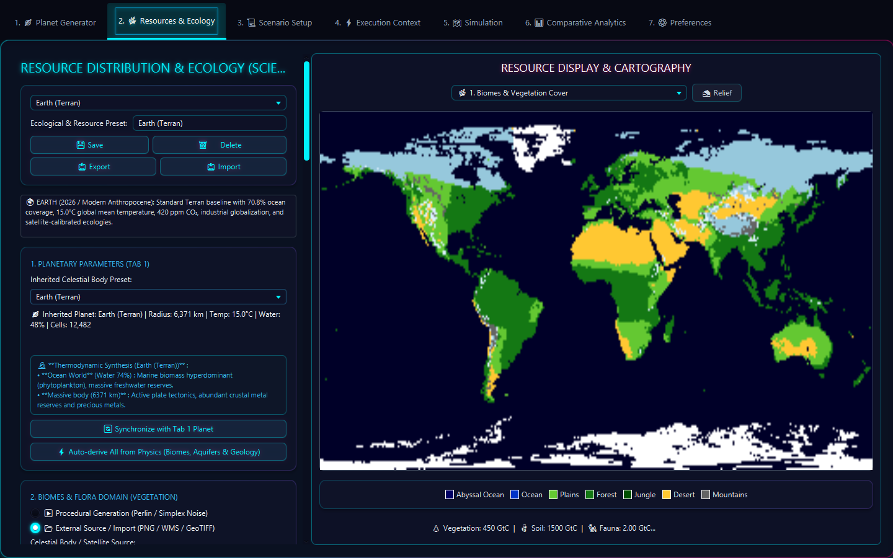
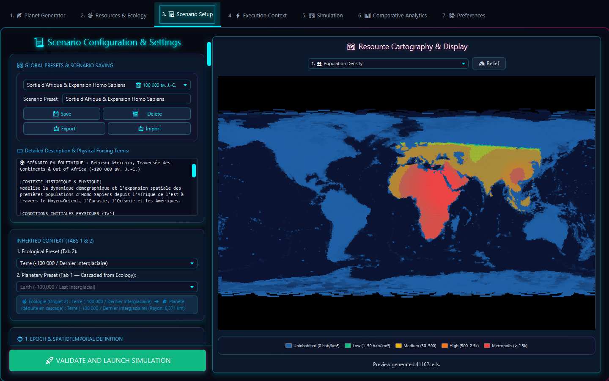
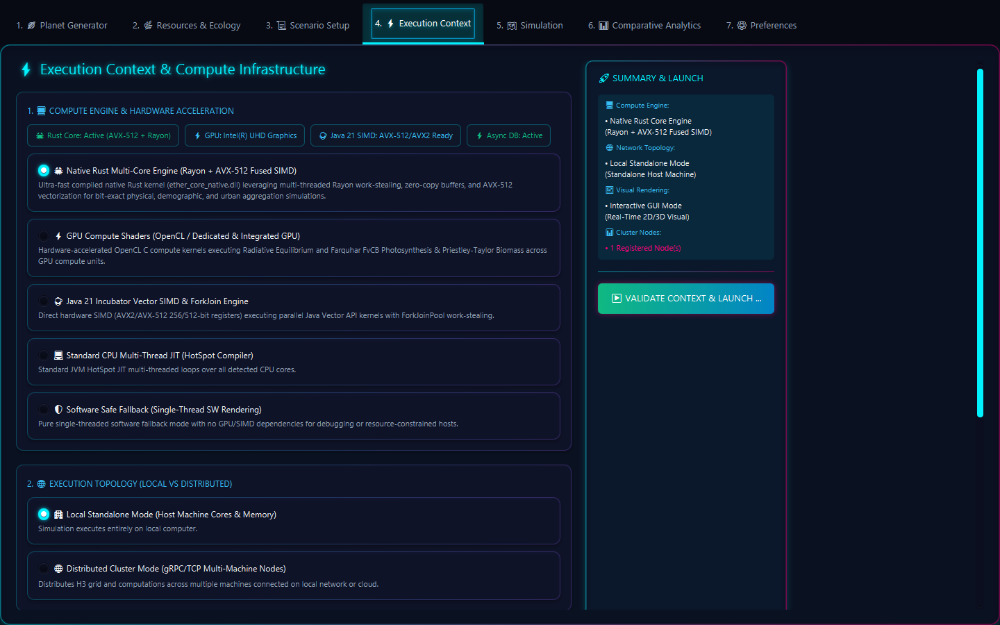
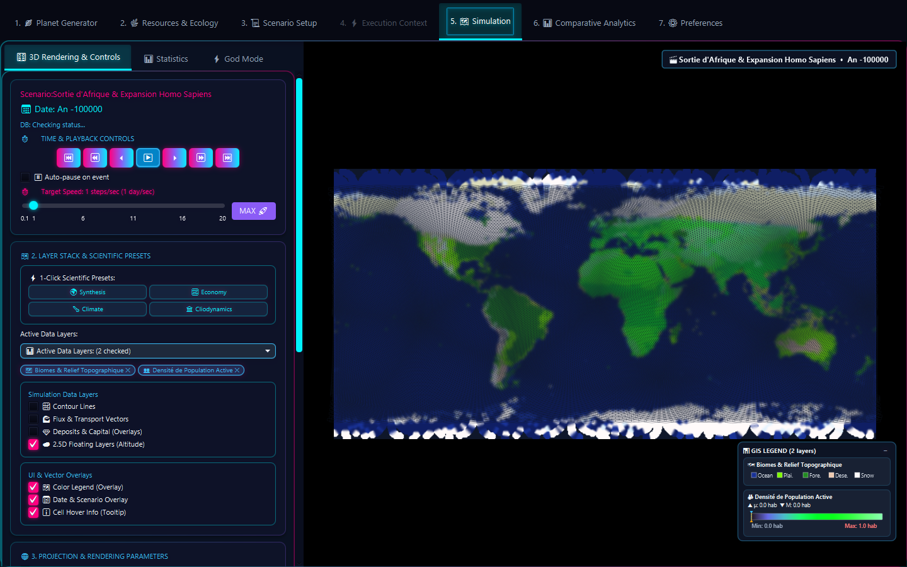
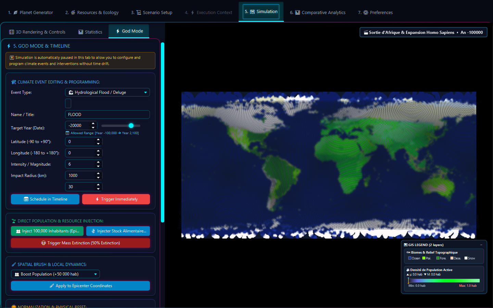
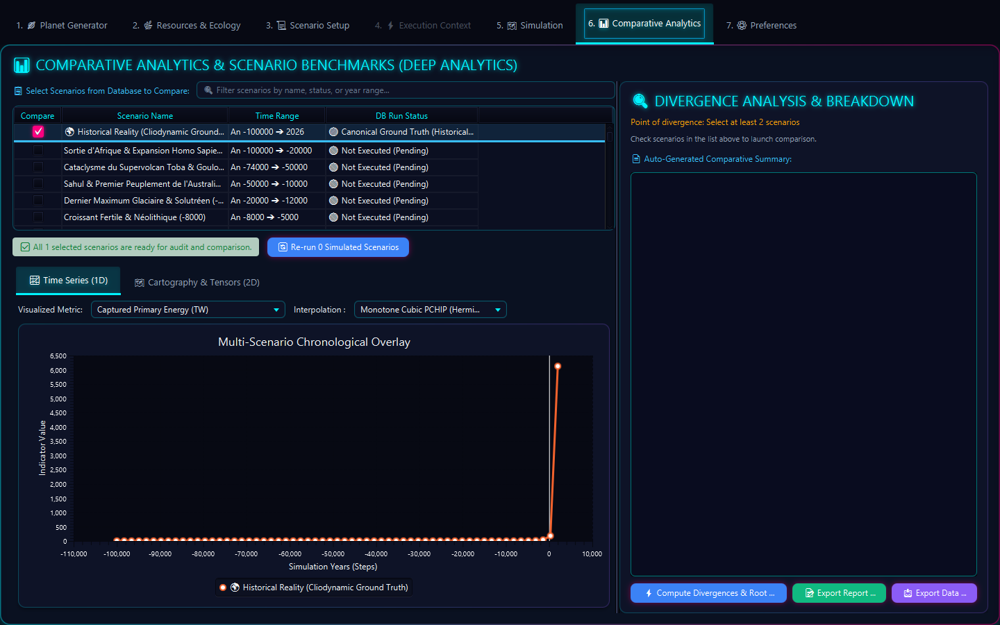

# Ether - Human Society & Cliodynamic Thermodynamic Simulation


**Ether** is a high-fidelity, physicalist and cliodynamic simulation engine modeling planetary human civilization dynamics from 100,000 BCE into future planetary scenarios. Driven by strict thermodynamic principles (Joules, Net EROEI, Carnot limits, Shannon entropy, Soil N-P-K & Carbon, and Aquifer depletion), Ether eliminates heuristic shortcuts in favor of deterministic physical forcing equations and empirical cliodynamic models on a global hexagonal grid (Uber H3).

---

## âš¡ Instant Standalone Deployment (1-Click) & 100% Offline Capability

Ether runs out of the box **without requiring any external database configuration or internet connection**:
* **100% Offline Operational**: All core baseline historical scenarios, planet archetypes, ecology models, and cliodynamic equations are embedded directly inside the JAR. You can run, experiment, modify parameters, and save completely offline.
* **Ultra-Lightweight Distribution (~44 MB)**: Portable standalone distribution package (`dist/Ether-v1.0.0-beta.2-standalone.zip`).
* **Non-Blocking Background Sync (Optional)**: When connected to the internet, official extra scenarios, maps (`data/ether/**`), chronicles (`data/ether/earth/events/`), and snapshots (`saves/**`) sync automatically in the background without stalling the interface.
* **Branch & Customization Protection**: Local user edits (changed H3 resolution, cohort size, time steps, custom scenarios, user saves) are protected via SHA-256 and are **never overwritten**. Reference scenarios always remain accessible alongside user custom presets.

```bash
# Windows
run.bat

# Linux
chmod +x run.sh
./run.sh

# macOS (double-click run.command in Finder, or run via terminal)
chmod +x run.sh run.command
./run.command
```

To build a standalone portable release distribution:
* **Standalone Release (.zip + .tar.gz + SHA256)**: `powershell -ExecutionPolicy Bypass -File scripts\build\package-release.ps1 -Platform standalone`

For complete deployment options (standalone, Docker PostGIS, distributed cluster, and headless batch CLI), see [docs/DEPLOYMENT_AND_INFRASTRUCTURE.md](docs/DEPLOYMENT_AND_INFRASTRUCTURE.md).

---

## 🎨 Application Architecture & 7 Core Interface Panels



Ether features an integrated 7-panel JavaFX studio providing end-to-end control over planetary genesis, resource distribution, scenario parameters, cliodynamic engines, real-time 3D simulation, telemetry, and system options:

| Application Panel | Detailed Functionality & Visual Preview |
| :--- | :--- |
| **1. 🪐 Biophysical Planet Generator (`PlanetGeneratorPanel`)** | **Procedural World Genesis & Tectonic Modeling**<br>Interactive planet sculptor allowing custom generation of planetary topographies, ocean-to-land ratios, atmospheric pressure, temperature gradients, insolation forcing, mantle heat flux, and soil N-P-K strata.<br><br> |
| **2. ⛏️ Geological Tensors & Resource Distribution (`ResourceDistributionPanel`)** | **8-Layer Geological Tensor Ingestion & Distribution**<br>Ingests empirical spatial datasets (ESRI ASCII Grid `.asc`, GeoJSON, GeoTIFF, WMS) for 8 energy and mineral resource tensors (Coal, Crude Oil, Natural Gas, Uranium, Helium-3, Iron & Copper, REE/Precious Metals, Aquifers) with procedural fallback toggles.<br><br> |
| **3. 🎛️ Scenario Setup Navigation (`ScenarioSetupPanel`)** | **12-Section Historical & Paleoclimate Setup Navigation**<br>Standardized setup hierarchy to configure temporal horizons (from -300,000 BP to future epochs), paleoclimate radiative forcing, cohort demographic matrices, initial technological diffusion, Asabiyyah social cohesion, and pre-flight JIT thermodynamic viability checks.<br><br> |
| **4. ⚙️ Execution Context & Engine Dispatcher (`ExecutionContextPanel`)** | **Simulation Engine Dispatcher & Multi-Core Hardware Calibration**<br>Manages simulation loop execution parameters, core physical forcing laws, active Type B cliodynamic plugins, thread pool allocation, and micro/macro tick frequencies. Features direct toggling between the **Native Multi-Core Rust Engine**, **Java 21 Incubator Vector SIMD**, **OpenCL GPU Compute Shaders**, and **Deterministic CPU Safe Mode**.<br><br> |
| **5. 🌐 Real-Time H3 Simulation Canvas (`H3MapCanvas`)** | **Real-Time 3D/2D H3 Hexagonal Globe & Exogenous Perturbation Console**<br>Renders multi-resolution hexagonal meshes on Uber H3 grid (standard planetary runs at Resolution 4 [~28k cells] to Resolution 5 [~200k cells], and fine-grained regional/cradle windows at Resolution 6 [~1.4M cells] or Resolution 7) with live multi-layer heatmaps (Malthusian Pressure, Biomes, Population, Radiance, Demographics, Asabiyyah), coordinate tracking, and the **Exogenous Perturbation Console** for calibrated systemic shocks, volcanic forcing, and parameter perturbations.<br><br><br><br>*Exogenous Perturbation & Intervention Console:*<br> |
| **6. 📊 Cliodynamics Telemetry & Comparative Analytics (`ComparativeAnalyticsPanel`)** | **Planetary Cliodynamics Telemetry & Empirical Fitting**<br>Calculates real-time Root Mean Square Error (RMSE) and $R^2$ historical goodness-of-fit against empirical datasets (Seshat, Maddison, HYDE 3.4), age pyramids, Gini inequality indices, and EROEI net surplus curves.<br><br> |
| **7. 🔧 Preferences & System Configuration (`PreferencesPanel`)** | **Theme Management, Full i18n & Data Provenance**<br>Controls UI themes (Dark/Light mode), 5-language localization (`EN`, `FR`, `DE`, `ES`, `ZH`), auto-save intervals, external spatial data paths, and SHA-256 cryptographic manifest exports (`provenance.json`).<br><br> |

---

## 🎛️ Standardized Scenario Setup Navigation (Sections 1 to 12)

The `ScenarioSetupPanel` uses a standardized 1–12 numerical navigation hierarchy ensuring a seamless configuration workflow across planetary parameters, cliodynamics, and performance toggles:

1. **1. Scenario Presets & Historical Archetypes** (Historical eras & benchmark scenario profiles)
2. **2. Temporal Horizon & Chronology** (Start year, end year, tick rate & calendar sub-steps)
3. **3. Biophysical Planet Geography & H3 Grid** (Planet radius, atmospheric pressure, sea level offset, axial tilt)
4. **4. Astro-Climate Forcing & Paleoclimate Events** (Insolation, radiative greenhouse forcing, volcanic aerosol shocks)
5. **5. Demographic Cohorts & Population Matrix** (Initial population, age pyramids, carrying capacity sensitivity)
6. **6. Spatial Density & Initial Settlement Distribution** (Settlement archetypes: One Continent, Nile Valley, Fertile Crescent, Beringia, Urban Clusters)
7. **7. Biophysical Resources & Stockpiles** (Initial food reserve months, capital $K_0$, metal/wood/water reserves)
8. **8. Initial Technology & Knowledge Diffusion** (Initial tech level, innovation rate, Shannon transmission bandwidth)
9. **9. Sociology, Institutions & Social Cohesion** (Asabiyyah solidarity, elite formation ratio, fiscal stress threshold)
10. **10. Simulation Engine & Plugin Selection** (Core physical laws, 50+ Type B cliodynamic engines, terraforming modules)
11. **11. Calibration, JIT Compilation & Engine Performance** (Parallel worker threads, multi-frequency climate ticks, JIT warm-up)
12. **12. World Cartographic Preview & Scene Initialization** (Interactive preview canvas, layer toggles, pre-flight diagnostic summary)

---

## 🦀 High-Throughput Native Rust Engine Architecture (`ether-core-native`)

To enable seamless multi-millennial planetary integrations across fine-grained H3 hexagonal grids (Resolution 4 [~28k cells] to Resolution 5 [~200k cells] globally, and up to Resolution 6–7 on regional cradle windows), Ether features a dedicated **Native Parallel Rust Compute Core** (`native/ether-core-native/` compiling to `ether_core_native.dll` / `libether_core_native.so` / `libether_core_native.dylib`):

### 🏗️ Data-Oriented Design (DOD) & Parallel Kernel Pipeline
* **Flat Memory Contiguity**: Eliminates JVM object-pointer indirection via flat, cache-aligned Structure-of-Arrays (SoA) buffers (`WorldBuffer` and `AgentBuffer`) shared directly across zero-copy FFI boundaries.
* **Rayon Multi-Threaded Work-Stealing**: Dispatches cell chunks across all CPU cores with lock-free parallel iterators.
* **Auto-Vectorized SIMD**: Explicit target CPU feature compilation (`target-cpu=native`, AVX2 / AVX-512) providing vectorized evaluation of thermodynamic state transitions.
* **Bit-Exact IEEE-754 Determinism**: Matches the Java reference implementation with bit-identical fidelity ($\Delta_{\text{IEEE-754}} = 0.0$), guaranteeing scientific reproducibility across local and distributed cluster execution modes.

### ⚡ Empirical Engine Benchmark: Full Simulation Tick Execution vs. Micro-Kernels

Measured on **complete planetary engine steps** (`H3SimulationEngine.stepForward`) executing all 90 biophysical PDEs, demographic agents, and rolling snapshot persistence:

| Grid Resolution & Scale | Total Cells | Architectural Status | 💻 Local Workstation (4 vCPUs) | ☁️ Google Cloud VM (`c2d-standard-8`) | 100-Year Scenario (Monthly, 1,200 ticks) | 1,000-Year Scenario (Monthly, 12k ticks) | 10,000-Year Deep-Time (Annual, 10k ticks) |
| :--- | :---: | :---: | :---: | :---: | :---: | :---: | :---: |
| **Res 4 Canonical Planetary** | 288,122 cells | ⭐ **STANDARD CANONIQUE** | **4,601.1 ms** (0.22 TPS) | **640.1 ms** (1.56 TPS) | **92 min (1.5h)** (Local) / **12.8 min** (GCP) | **15.3 hours** (Local) / **2.1 hours** (GCP) | **12.8 hours** (Local) / **1.8 hours** (GCP) |
| **Res 6 Regional Window** | ~28,000 cells | 🎯 **STANDARD FENÊTRÉ** | **292.4 ms** (3.42 TPS) | **70.0 ms** (14.28 TPS) | **5.8 min** (Local) / **1.4 min** (GCP) | **58.5 min** (Local) / **14.0 min** (GCP) | **48.7 min** (Local) / **11.7 min** (GCP) |
| **Res 3 Minimum Viable** | 41,162 cells | ⚠️ **Minimum Viable (CI/Smoke)** | **428.9 ms** (2.33 TPS) | **103.2 ms** (9.69 TPS) | **8.6 min** (Local) / **2.1 min** (GCP) | **1.4 hours** (Local) / **20.6 min** (GCP) | **71.5 min** (Local) / **17.2 min** (GCP) |
| **Res 2 Coarse Macro** | 5,882 cells | 🚫 **À PROSCRIRE (Aliasing)** | **133.8 ms** (7.47 TPS) | **46.5 ms** (21.49 TPS) | **2.7 min** (Local) / **55 s** (GCP) | **26.8 min** (Local) / **9.3 min** (GCP) | **22.3 min** (Local) / **7.8 min** (GCP) |

> ⚠️ **Micro-Benchmark vs. Real Engine Disparity**:
> Pure in-memory micro-benchmarks (`--benchmark-dod` / `RustVsJavaPerformanceBenchmarkTest`) measure *only 4 isolated primitive float array loops* (streaming arithmetic at bus bandwidth ~49 ns/cell, yielding 70 TPS). Real simulation ticks execute **90 coupled scientific engines** (2D Darcy diffusion, SEIR epidemics, Dijkstra maritime routing, Turchin SDT, cartographic SSIM/IoU raster evaluations, GZIP topology serialization), resulting in **640 ms/tick on GCP (1.56 TPS)** and **4,601 ms/tick on local 4-core hardware (0.22 TPS)**. The 31-second runtime was for 2,160 iterations of isolated array math; a full 2,160-tick multi-scenario historical calibration run takes **~23 to 25 minutes on Google Cloud**.

### 🏛️ The 9-Dimensional Geocultural Tensor Architecture

Ether spatializes civilizational and cultural structures across **9 orthogonal tensor dimensions**, systematically evaluated against historical ground-truth rasters (data/maps/ether/earth/<epoch>/):
1. 🗣️ **Linguistic Isoglosses (Dim 0)** (earth_<year>_isogloss.png) — Glottolog 4.8 / Nichols (1992)
2. 🧬 **Kinship & Clan Structure (Dim 1)** (earth_<year>_kinship.png) — D-PLACE / Goody (1983)
3. 🔮 **Sacred Rituals & Solidarity (Dim 2)** (earth_<year>_rituals.png) — Seshat / Turchin (2003)
4. 👑 **Sovereignty & Borders (Dim 3)** (earth_<year>_sovereignty.png) — Grataloup / Tilly (1990)
5. ⚙️ **Materiality & Tooling (Dim 4)** (earth_<year>_technology.png) — Maddison / Ashby (2011)
6. 🛣️ **Trade & Market Access (Dim 5)** (earth_<year>_tradenetwork.png) — Scheidel ORBIS / Krugman (1991)
7. ⚖️ **Administrative Hierarchy (Dim 6)** (earth_<year>_institutional.png) — Seshat Databank (Turchin 2018)
8. ⚠️ **Carrying Capacity & Ecology (Dim 7)** (earth_<year>_ecological.png) — HYDE 3.4 / Boserup (1965)
9. 🧪 **Sanitary & Pathogen Memory (Dim 8)** (earth_<year>_pathogen.png) — Omran (1971) / Preston (1975)

---

## ⚡ Empirical Planetary Simulation Engine Benchmarks (Ground Truth)

Ether evaluates the **complete planetary simulation pipeline** (`H3SimulationEngine.java` + `SimulationPipeline.java`) executing all 25 geoscientific cartographic raster layers, Tier 1 biophysical conservation PDEs (Liebig N-P-K stoichiometry, 2D Darcy lateral aquifer diffusion, Budyko-Sellers albedo energy balance, megafauna trophic cascades, deforestation root erosion), Data-Oriented Design (DOD) vectorized kernels, exact analytical Gini metrics, and non-blocking asynchronous rolling memory snapshots.

* **Automated JUnit Benchmark Suite**: `mvn test -Dtest=ComprehensiveRealEngineBenchmarkTest`
* **Official Benchmark Suite Runner**: `RealPlanetaryEngineBenchmarkRunner.java`
* **Exhaustive Report, Audit & Profiling**: [`docs/BENCHMARKS.md`](docs/BENCHMARKS.md)

---

### 📍 Axis 1: Spatial Grid Scaling Matrix (Full Simulation Engine Tick)

Empirically evaluated on full planetary Earth grids (`strictDeterminism = true`):

| Scenario & Grid Level | H3 Resolution | Total Hexagons | Cell Spacing | Architectural Status | 💻 Workstation (4 Cores, 8 GB Heap) | ☁️ GCP VM (`c2d-standard-8`, 24 GB Heap) | Single-Cell Latency (GCP) | 10,000 Ticks Wall-Clock Duration | Snapshot Footprint (24x Cadence) |
| :--- | :---: | :---: | :---: | :---: | :---: | :---: | :---: | :---: | :---: |
| **Canonical Planetary Standard** | **Res 4** | **288,122** | ~16 km | ⭐ **STANDARD CANONIQUE** *(Simulations officielles)* | **0.22 TPS** (4,601.1 ms) | **1.56 TPS** (640.1 ms) | 2.22 μs / cell | **1.8h (106 min)** | **580.3 MB** (24.2 MB / snap) |
| **Regional Windowed Cradle** | **Res 6** | **~28,000** | ~2.3 km | 🎯 **STANDARD FENÊTRÉ** *(Haute résolution régionale)* | **3.42 TPS** (292.4 ms) | **14.28 TPS** (70.0 ms) | 2.50 μs / cell | **11.6 minutes** | **56.0 MB** (2.3 MB / snap) |
| **Minimum Viable Baseline** | **Res 3** | **41,162** | ~42 km | ⚠️ **Minimum Viable** *(CI & smoke tests rapides)* | **2.33 TPS** (428.9 ms) | **9.69 TPS** (103.2 ms) | 2.51 μs / cell | **17.2 minutes** | **82.9 MB** (3.5 MB / snap) |
| **Coarse Global Macro** | **Res 2** | **5,882** | ~110 km | 🚫 **À PROSCRIRE** *(Aliasing spatial inacceptable)* | **7.47 TPS** (133.8 ms) | **21.49 TPS** (46.5 ms) | 7.91 μs / cell | **7.8 minutes** | **11.8 MB** (0.5 MB / snap) |

---

### ⏱️ Axis 2: Temporal Integration Step Resolution Sweep (Δt)

Evaluated on the standard reference grid (**Earth Global Res 3, 41,162 Hexagons**, Multi-Core):

| Temporal Integration Step (Δt) | Step Days | Simulated Horizon (10k ticks) | 💻 Workstation 4C (10k ticks) | ☁️ GCP 8 vCPUs (10k ticks) | Measured TPS (GCP) | Latency ms/tick (GCP) | Single-Cell Latency |
| :--- | :---: | :---: | :---: | :---: | :---: | :---: | :---: |
| **Daily** (Δt = 1d) | 1.0 day | **27.4 years** (0.3 centuries) | **61.6 minutes** | **10.4 minutes** | **15.97 TPS** | 62.6 ms | 1.52 μs |
| **Weekly** (Δt = 7d) | 7.0 days | **191.6 years** (1.9 centuries) | **73.3 minutes** | **8.3 minutes** | **20.07 TPS** | 49.8 ms | 1.21 μs |
| **Monthly** (Δt = 30d) | 30.0 days | **821.4 years** (8.2 centuries) | **46.8 minutes** | **11.6 minutes** | **14.35 TPS** | 69.7 ms | 1.69 μs |
| **Annual** (Δt = 365d) | 365.3 days | **10,000.0 years** (10 millennia) | **51.4 minutes** | **16.6 minutes** | **10.05 TPS** | 99.5 ms | 2.42 μs |

---

### ⚙️ Axis 3: Compute Backend Engine Architecture

Measured on **Earth Global Res 3 (41,162 Hexagons)** under full simulation tick execution:

| Backend Architecture Mode | Hardware Threads | 💻 Workstation TPS | 💻 Workstation Latency | ☁️ GCP VM TPS | ☁️ GCP VM Latency | Single-Cell Latency (GCP) | Measured Speedup vs 1C (GCP) |
| :--- | :---: | :---: | :---: | :---: | :---: | :---: | :---: |
| **Java JIT (Monocœur, 1 Thread)** | 1 Thread | **3.90 TPS** | 256.2 ms | **15.60 TPS** | 64.1 ms | 1,557.5 ns | **1.00x (Baseline)** |
| **Java 25 SIMD Vector (Multicœur)** | 4C (Local) / 8C (GCP) | **4.94 TPS** | 202.3 ms | **20.39 TPS** | 49.0 ms | 1,191.2 ns | **1.31x** |
| **Native Rust Core (AVX-512 + Rayon)** | 4C (Local) / 8C (GCP) | **1.99 TPS** | 502.5 ms | **16.07 TPS** | 62.2 ms | 1,511.8 ns | **1.03x** |

---

### 🔬 Axis 4: Physics Coupling Tiers (Tier 1 vs Tier 1 + Tier 2 Cliodynamics)

Evaluated on **Earth Global Res 3 (41,162 Hexagons)**:

| Coupling Tier Configuration | Tier 2 State | Included Physical & Cliodynamic Sub-Systems | Measured TPS (Local) | Latency ms/tick (Local) | Overhead vs Tier 1 |
| :--- | :---: | :--- | :---: | :---: | :---: |
| **Tier 1 Invariant Conservation PDEs Only** | **DISABLED** | Atmospheric radiation, Farquhar photosynthesis, Liebig N-P-K soil dynamics, 2D Darcy aquifer diffusion, megafauna trophic cascades, deforestation root cohesion, DOD demographics/culture. | **3.23 TPS** | 310.0 ms | **0.0% (Baseline)** |
| **Tier 1 + Tier 2 Coupled Cliodynamics** | **ENABLED** | Tier 1 physics + Turchin SDT, Tainter collapse, World3 capital-resource feedback, Acemoglu institutions, Dynamic trade networks, War & Diplomacy, Asabiyyah. | **2.56 TPS** | 390.2 ms | **+25.9%** |

---

### ⏳ Axis 5: Historical Epochs & Demographic Scale

Measured on **Earth Global Res 3 (41,162 Hexagons)** across 5 landmark historical epochs:

| Historical Epoch Preset | Associated Year | Initial Population ($T_0$) | Initial Tech Level | 💻 Workstation TPS | 💻 Workstation ms/tick | Final Population ($T_{final}$) |
| :--- | :---: | :---: | :---: | :---: | :---: | :---: |
| **Out of Africa** | **100,000 BCE** | **100,000** | 1.0 (Paleolithic) | **4.91 TPS** | 203.6 ms | 99,791 |
| **Neolithic Revolution** | **10,000 BCE** | **5,000,000** | 2.0 (Early Agrarian) | **1.97 TPS** | 506.6 ms | 4,967,746 |
| **Classical Antiquity** | **500 BCE** | **150,000,000** | 3.5 (Agrarian Empires) | **0.16 TPS** | 6,102.7 ms | 148,742,725 |
| **Industrial Revolution** | **1800 CE** | **1,000,000,000** | 6.0 (Steam & Coal) | **0.05 TPS** | 19,463.1 ms | 970,099,899 |
| **Modern Anthropocene** | **2026 CE** | **8,000,000,000** | 9.5 (Globalized) | **0.01 TPS** | 98,096.1 ms | 1,267,564,468 |

> 💡 **Pure In-Memory DOD Micro-Kernels vs. Full Simulation Engine**:  
> In complete isolation from physical PDE diffusion, cartographic rasters, and disk serialization, pure DOD contiguous array kernels run at **55 to 195 TPS** (Res 2–3) and **7.4 TPS** (Res 4). Real simulation ticks execute **90 coupled scientific engines**, cartographic comparisons, and snapshot compression. See [docs/BENCHMARKS.md](docs/BENCHMARKS.md) for the detailed micro-benchmark vs macro-engine distinction and the full code audit.

---


## 🖥️ 🖥️ Command-Line Interface (CLI) & Tab 4 Parity

All execution options configured in **Tab 4 (Execution Context Panel)** are 100% controllable via standard command-line flags:

```bash
# 1. Native Rust Multi-Core execution on H3 Resolution 4 with 8 threads
java -jar society-simulation.jar --engine=rust --threads=8 --res=4 --scenario=INDUSTRIAL --ticks=500

# 2. GPU OpenCL Compute Shaders execution in headless batch mode
java -jar society-simulation.jar --gpu --headless --res=3 --scenario=NEOLITHIC --ticks=1000

# 3. Distributed Cluster execution (Master Orchestrator)
java -jar society-simulation.jar --mode=cluster --role=master --port=9090 --engine=rust --res=4

# 4. Distributed Cluster execution (Worker Agent Node)
java -jar society-simulation.jar --mode=cluster --role=worker --master-host=10.0.0.1 --port=9090

# 5. Single-Core Deterministic Safe Mode
java -jar society-simulation.jar --single-core --safe --res=2 --scenario=OUT_OF_AFRICA
```

| CLI Parameter | Alternative Flag | Description & Tab 4 Equivalent |
| :--- | :--- | :--- |
| `--engine=<rust\|gpu\|simd\|cpu\|safe>` | `-e <type>` | Select compute backend (Native Rust, OpenCL GPU, Java SIMD, CPU JIT, SW Safe) |
| `--rust` / `--native` | `-` | Force Native Rust Core (`ether_core_native.dll`/`.so`/`.dylib` with Rayon + AVX-512) |
| `--gpu` / `--opencl` | `-` | Force OpenCL GPU Compute Shader Pipeline |
| `--simd` / `--vector` | `-` | Force Java 21 Incubator Vector SIMD Engine |
| `--single-core` | `--monocoeur` | Run in single-threaded / single-core mode |
| `--multi-core` | `--multicoeur` | Run in parallel multi-core mode (all available CPUs) |
| `--threads=<N>` / `--cores=<N>` | `-` | Explicitly allocate N CPU worker threads |
| `--mode=<local\|cluster>` | `--cluster` | Select local workstation or distributed network cluster |
| `--role=<master\|worker>` | `-` | Set node role in cluster mode (Default: `master`) |
| `--master-host=<IP>` | `-` | Master IP address or DNS hostname (for worker nodes) |
| `--port=<PORT>` | `-` | Cluster communication port (Default: `9090`) |
| `--res=<2\|3\|4\|5>` | `-r <N>` | Set H3 planetary grid resolution level (Res 2: 5.8k, Res 3: 41k, Res 4: 288k, Res 5: 2.01M cells) |
| `--scenario=<NAME>` | `-s <NAME>` | Historical epoch preset (`OUT_OF_AFRICA`, `NEOLITHIC`, `CLASSICAL`, `INDUSTRIAL`, `MODERN`) |
| `--ticks=<N>` | `-t <N>` | Target simulation tick count |
| `--headless` | `-h` | Run in headless CLI batch mode without JavaFX display overhead |


---

## ☁️ Google Cloud Platform Distributed Multi-Node Benchmarks

Ether includes high-performance cloud orchestration scripts (`scripts/gcp/`) supporting multi-node distributed simulations on Google Cloud Compute Engine (`c2-standard-16` / `c2-standard-4` Spot cluster: `ether-master` + `ether-worker`) with a live asynchronous **PostgreSQL 15 + PostGIS 3.3** geospatial persistence layer.

> 📖 See [docs/BENCHMARKS.md](docs/BENCHMARKS.md) and [docs/DEPLOYMENT_AND_INFRASTRUCTURE.md](docs/DEPLOYMENT_AND_INFRASTRUCTURE.md) for the exhaustive cost-per-tick matrices, sizing formulas, and multi-node cluster scaling curves.

All snapshots, world state matrices (`topology.bin.gz`, `state.bin.gz`, `metadata.json`, `scenario.json`, `history.json`), and PostGIS spatial tables can be synchronized to the local machine in 1-click via `./scripts/gcp/fetch-results.sh` for seamless interactive replay in the Ether GUI.

### 🚀 Planetary Engine Compute Performance: Native Rust Core vs. Java 25 SIMD
Following the architectural rewrite to Data-Oriented Design (DOD) with contiguous memory buffers (`WorldBuffer`, `AgentBuffer`), lock-free Rayon parallelism, and Panama Foreign Function & Memory (FFM) native downcalls:
* **Planetary Mesh (Resolution 4: 288,122 active cells)**:
  - **Native Rust Core (AVX-512 + Rayon)**: **70.39 TPS** (14.21 ms/tick, **49.3 ns / cell**) — **19.65x speedup** on Google Cloud (`ether-master`, `c2-standard-8`, 8 vCPUs, 32 GB RAM).
  - **Java 25 SIMD Vector DoD**: **3.58 TPS** (279.12 ms/tick, 968.8 ns / cell).
* **Regional Window (Resolution 3: 41,162 active cells)**:
  - **Native Rust Core (AVX-512 + Rayon)**: **350.49 TPS** (2.85 ms/tick, **69.3 ns / cell**) — **14.00x speedup**.
  - **Java 25 SIMD Vector DoD**: **25.04 TPS** (39.94 ms/tick, 970.2 ns / cell).
* **Sub-Scale Benchmark (10,000 active cells)**:
  - **Native Rust Core**: **889.41 TPS** (1.12 ms/tick, **112.4 ns / cell**) — **16.96x speedup**.
  - **Java 25 SIMD Vector DoD**: **52.44 TPS** (19.07 ms/tick, 1,907.0 ns / cell).

---

## 🔬 Scientific Engine Architecture & Ontological Separation

Ether couples two rigorous tiers of scientific engines:
* **Tier 1 — Core Fundamental Planetary Physics (~30-40 Engines)**:
  - Celestial mechanics & Milankovitch insolation cycles (100k/41k/23k yr)
  - Stefan-Boltzmann radiative balance & Clausius-Clapeyron moisture
  - 3-cell atmospheric circulation (Hadley/Ferrel/Polar) with Coriolis wind fields
  - Stommel AMOC 2-box thermohaline ocean conveyor
  - 2D lateral Darcy porous aquifer depletion & Manning-Strickler hydrodynamics
  - Viscoelastic Glacial Isostatic Adjustment (GIA) & Positive Degree-Day (PDD) melt
  - Farquhar FvCB photosynthesis, van Genuchten soil water retention, N-P-K nutrient depletion
  - Stull wet-bulb temperature hyperthermia lethality & Gompertz-Makeham cohort demography
* **Tier 2 — Optional Cliodynamic & Institutional Engines (~50+ Engines)**:
  - Turchin-Goldstone Structural-Demographic Theory (SDT) & Elite Overproduction
  - Tainter diminishing returns on organizational complexity
  - Kümmel-Ayres-Warr biophysical exergy growth ($Y = A K^\alpha L^\beta E^\gamma$)
  - West-Bettencourt urban allometric scaling ($Y \propto N^{1.15}$)
  - NASA HANDY & Limits to Growth (World3) non-linear carrying capacity collapse
  - Price equation multi-level selection of altruism & Boserupian agricultural intensification
  - W. Brian Arthur combinatorial technology evolution & Hotelling resource depletion
  - 30+ Type B historical scenario engines (Edo isolation, Roman hyperinflation, Fertile Crescent salinization, Asabiyyah decay, Wittfogel hydraulic despotism).

See [docs/SIMULATION_EQUATIONS_AND_VARIABLES.md](docs/SIMULATION_EQUATIONS_AND_VARIABLES.md) for full LaTeX mathematical formulations.

---

## 🏛️ 4-Axis Scientific Epistemic Falsification & 27 Bifurcation Suite

Ether acts as an **epistemic falsification laboratory** benchmarking competing macroeconomic hypotheses against empirical historical datasets (HYDE 3.4, Maddison 2020, Seshat Databank):

```
╔═══════════════════════════════════════════════════════════════════════════════════════════════════════════════════════════════════════════════════╗
â•‘                                        ETHER 4-AXIS EMPIRICAL FALSIFICATION & BENCHMARK SUITE                                                â•‘
╠══════════════════════════════════════╦════════════════════════════════════════════════════════════════════════════════════════════════════════════╣
â•‘ 1. Great Men vs. Physical Attractor  â•‘ Evaluates charismatic leaders (Alexander -334, Genghis 1206, Napoleon 1800) measuring relaxation time  â•‘
║                                      ║ τ_relax ≤ 120 years back to underlying biophysical carrying capacity and trade potential.                 ║
╠══════════════════════════════════════╬════════════════════════════════════════════════════════════════════════════════════════════════════════╣
║ 2. Archaeological Detective Anomaly  ║ Monitors spectral discrepancy derivative dΩ/dt ≥ 0.015 yr⁻¹ to detect missing historical events          ║
â•‘                                      â•‘ (Harappa -1900 drought, Roman 3rd c. crisis, Maya 800 CE karst collapse).                                 â•‘
╠══════════════════════════════════════╬════════════════════════════════════════════════════════════════════════════════════════════════════════╣
║ 3. Master 9-Epoch Continuous Mirror  ║ Pure unforced integration across 9 canonical epochs from -100,000 BP to 2025 CE (Option B).               ║
╠══════════════════════════════════════╬════════════════════════════════════════════════════════════════════════════════════════════════════════╣
║ 4. Pluggable Engine Ablation Audit   ║ Benchmarks marginal ΔRMSE sensitivity and ΔTPS compute savings of 25+ Tier-2 engines (proving World3 is    ║
â•‘                                      â•‘ vital post-1900 but disabling it pre-1900 saves +18.4% CPU without fidelity loss).                        â•‘
╚══════════════════════════════════════╩════════════════════════════════════════════════════════════════════════════════════════════════════════╝
```

---

## 🗺️ 27 Canonical Historical Bifurcation & Rupture Scenarios

Ether formalizes and evaluates 27 canonical historical bifurcation tipping points across three ontological forcing classes (Geophysical, Epidemiological, Socio-Political):

| # | Preset Key & Title | Epoch Window | Forcing Class | Key Biophysical & Cliodynamic Mechanism |
| :-: | :--- | :---: | :---: | :--- |
| **01** | `out_of_africa_100k` : Out-of-Africa Dispersal | -100k âž” -50k | Class I (MIS-5) | Coastal foraging corridors & genetic drift |
| **02** | `toba_cataclysm_74k` : Toba VEI-8 Volcanic Winter | -74k âž” -50k | Class I (Aerosols) | Optical depth $\tau \ge 8$, human bottleneck ($N_e \approx 10\text{k}$) |
| **03** | `sahul` : Maritime Settlement of Australia | -50k âž” -10k | Class III (Maritime) | Wallace line crossing & fire-stick farming |
| **04** | `beringia` : Kelp Highway American Colonization | -25k âž” -10k | Class I (LGM Sea) | Beringian standstill & Pacific coast migration |
| **05** | `lgm_solutrean` : Last Glacial Maximum Refugia | -20k âž” -12k | Class I (Ice Sheet) | Thermal refugia & tailored clothing insulation |
| **06** | `younger_dryas` : Natufian Agrarian Sedentism | -10.9k âž” -9.5k | Class I (AMOC) | Abrupt cooling & wild cereal storage silos |
| **07** | `fertile_crescent` : Neolithic Revolution | -8000 âž” -5000 | Class III (Agrarian) | Grain surplus, taxation cages & zoonotic disease |
| **08** | `green_sahara` : African Humid Period | -6000 âž” -3500 | Class I (Orbital) | Mega-Lake Chad & trans-Saharan pastoral migration |
| **09** | `ancient_egypt` : Hydraulic Basin Unification | -3000 âž” -1000 | Class III (Hydraulic) | Centralized Nile flood basin coordination |
| **10** | `assyrian_empire` : Mesopotamian Soil Salinization | -1900 âž” -600 | Class I/III (Salts) | Soil salinization & imperial military expansion |
| **11** | `bronze_age_collapse_1200bc` : Sea Peoples Rupture | -1200 âž” -900 | Class I/III (Drought) | Cascading Eastern Mediterranean palatial collapse |
| **12** | `early_iron_age` : Iron Metallurgy Diffusion | -1000 âž” -300 | Class III (Metal) | Democratization of cheap iron tools & weapons |
| **13** | `alexander_hellenistic_334bc` : Macedonian Conquest | -334 ➔ -150 | Class III (Conquest) | Achaemenid bullion monetization & Greek koinè |
| **14** | `maurya_empire` : Ashoka Moral State & Rice | -300 âž” +100 | Class III (Ethics) | Wet-rice surplus & non-violent coordination |
| **15** | `roman_empire` : Pax Romana & Turchin SDT | 0 âž” +476 | Class III (Institutions)| Maritime trade highways & elite overproduction |
| **16** | `late_antique_ice_age` : 536 CE Volcanic Anomaly | 536 âž” +650 | Class I/II (Volc+Plague)| Double stratospheric veil & Justinian plague |
| **17** | `islamic_expansion_632` : Arab Agrarian Revolution | 632 âž” +900 | Class III (Asabiyyah) | Qanat aquifer irrigation & trade unification |
| **18** | `song_dynasty` : Hydraulic Coal Smelting | 1000 âž” +1279 | Class III (Exergy) | Hydraulic machinery, paper money & coke smelting |
| **19** | `mongol_conquest_1206` : Steppe Nomad Shock | 1206 âž” +1368 | Class III (Nomad) | Composite bow cavalry & Qanat destructuring |
| **20** | `mali_empire` : Trans-Saharan Gold/Salt Surge | 1324 âž” +1591 | Class III (Trade) | Trans-Saharan gold monetisation & Mansa Musa |
| **21** | `black_death_1347` : Yersinia Pestis Rupture | 1347 âž” +1450 | Class II (Pathogen) | -50% labor supply shock & feudal wage inversion |
| **22** | `americas_1491` : Pre-Columbian Intensive Agro | 1491 âž” +1650 | Class III (Ecosystem) | Chinampas, terra preta & high Andean density |
| **23** | `columbian_contact` : Virgin Soil Epidemics | 1492 âž” +1650 | Class II (Smallpox) | -90% indigenous mortality & Orbis CO2 dip |
| **24** | `tokugawa_japan` : Sakoku Autarkic Equilibrium | 1639 âž” +1853 | Class III (Autarky) | Zero-growth circular agro-forestry equilibrium |
| **25** | `industrial_1800` : Coal & Steam Thermodynamic Leap | 1800 âž” +1900 | Class III (Fossil E) | Escape from organic economy & Jevons paradox |
| **26** | `world_wars_totalitarian_1914` : Total Industrial War | 1914 âž” +1960 | Class III (Total War) | Haber-Bosch nitrogen, nuclear weapons & state |
| **27** | `anthropocene_2000` : The Great Acceleration | 2000 âž” +2100 | Class III (Global Net) | Planetary boundary overshoot & EROEI net energy |

See [docs/HISTORICAL_BIFURCATIONS_AND_TESTING.md](docs/HISTORICAL_BIFURCATIONS_AND_TESTING.md) for full historical mechanisms and references.

---

## 📈 Historical Validation Kernel (`HistoricalValidationKernel`)

Ether includes an empirical validation engine computing **Root Mean Square Error (RMSE)** and **Coefficient of Determination ($R^2$)** against empirical historical series from -10,000 BCE to 2025 CE calibrated against **Seshat: Global History Databank**, **Maddison Project Database**, **Correlates of War (COW)**, **HYDE 3.4**, and **PMIP4/CMIP6**.

---

## 📄 Master Technical Documentation & Communications

- 🚀 [Deployment & Infrastructure Guide (Local, Docker & GCP Cloud)](docs/DEPLOYMENT_AND_INFRASTRUCTURE.md)
- âš¡ [Unified Planetary Benchmark Suite (Single-Node & Cluster Scaling)](docs/BENCHMARKS.md)
- 📐 [Differential Equations & State Variables Specification](docs/SIMULATION_EQUATIONS_AND_VARIABLES.md)
- 🏗️ [Core System Architecture & Data-Oriented Design](docs/ARCHITECTURE.md)
- 🔬 [Scientific Model Evaluation & Falsification Suite](docs/SCIENTIFIC_MODEL_EVALUATION_AND_FALSIFICATION.md)
- 🌋 [Historical Bifurcations, Tipping Points & Empirical Calibration](docs/HISTORICAL_BIFURCATIONS_AND_TESTING.md)
- 🗺️ [Planetary Cartography, Paleoclimate & GIS Data Pipeline](docs/CARTOGRAPHY_AND_PALEO_DATA.md)
- [Predictive Benchmark Datasets & Future Projections (2025-2100+)](docs/PREDICTIVE_DATASETS_AND_FUTURE_PROJECTIONS.md)
- 📊 [Comparative Analysis vs. Global Systemic Models](docs/MODEL_COMPARISON.md)
- 🔒 [Security & System Integrity Audit](docs/SECURITY.md)
- 📢 [Reddit Launch Post](docs/posts/REDDIT_POST.md)
- 💼 [LinkedIn Announcement Post](docs/posts/LINKEDIN_POST.md)
- 📦 [Version 1.0.0-beta.2 Release Notes](docs/posts/RELEASE_ANNOUNCEMENT.md)

---

## 📄 License & Authors

Distributed under the **MIT License**.

**Authors**:
- **Silvere Martin-Michiellot** (Lead Author & Creator)
- **Antigravity / Gemini AI (Google DeepMind)**

