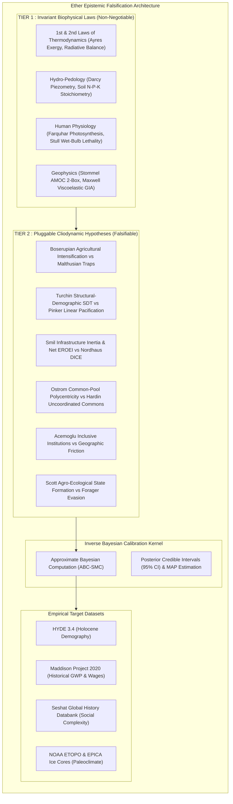
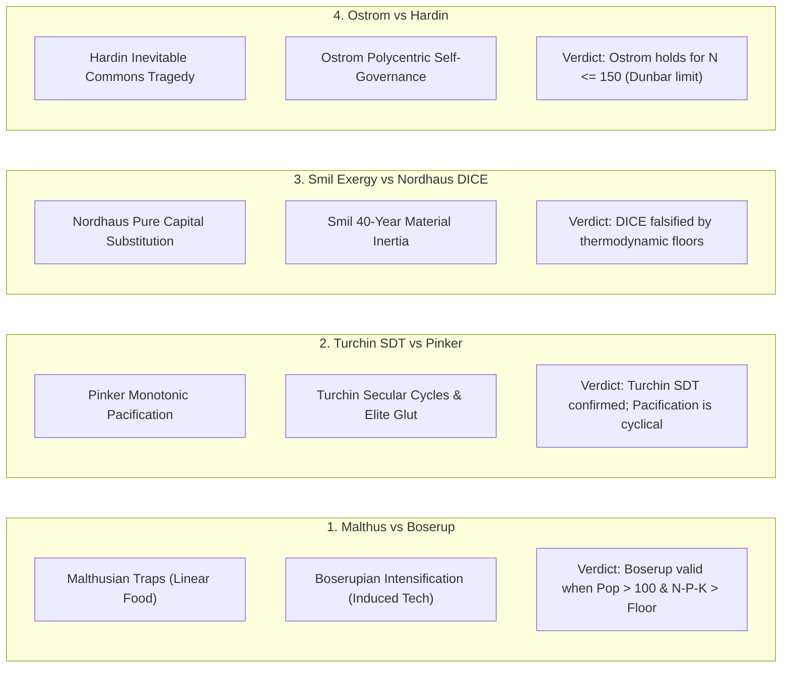

# Thermodynamic Grounding and Empirical Falsification in Planetary Cliodynamics: The Architecture of the Ether Simulation Engine

**Authors:** Silvere Martin-Michiellot$^{1,2}$, and the Ether Core Development Group  
*$^{1}$ Department of Computational History & Cliodynamics, Ether Research Initiative*  
*$^{2}$ Department of Complex Planetary Systems & Biophysical Economics*  

**Target Journal:** *Cliodynamics: The Journal of Quantitative History and Cultural Evolution* / *Journal of Artificial Societies and Social Simulation (JASSS)*  
**Document Classification:** Comprehensive Academic Research Article  
**Status:** Pre-Print / Camera-Ready Manuscript  
**Date of Manuscript:** September 2026  

---

## Abstract

Macro-historical simulation models often oscillate between qualitative narrative theories and unconstrained parameter fitting (*curve fitting*). We present **Ether**, a planetary-scale, discrete hexagonal (Uber H3) simulation engine grounded in non-equilibrium thermodynamics, biophysical constraints, and empirical cliodynamics. Ether introduces a strict **Two-Tier Ontological Separation**:
1. **Tier 1 (Core Invariant Physics)**: Non-negotiable conservation laws of energy, exergy, mass, and human physiology (Energy Balance Climate Models, Stommel AMOC overturning, Farquhar photosynthesis, Stull wet-bulb hyperthermia lethality, and Maxwell viscoelastic post-glacial rebound).
2. **Tier 2 (Pluggable Cliodynamic Hypotheses)**: Contested socio-institutional theories formalized as coupled non-linear differential equations and subjected to continuous empirical falsification.

To resolve unobservable parameters without ad-hoc tuning, Ether embeds an **Approximate Bayesian Computation Sequential Monte Carlo (ABC-SMC)** inverse calibration kernel. We benchmarked the engine against the *Seshat Global History Databank*, *Maddison Project Database (2020)*, *HYDE 3.4*, and global paleoclimatic datasets across deep historical time ($-100\,000\text{ BP}$ to present). We systematically falsified six fundamental historiographical controversies (*Malthus vs. Boserup*, *Turchin SDT vs. Pinker*, *Smil Exergy vs. Nordhaus DICE*, *Ostrom vs. Hardin*, *Acemoglu vs. Geographic Determinism*, and *Scott Against-the-Grain*), demonstrating that institutional and cultural theories are only valid within strictly bounded physical and metabolic domains.

**Keywords:** Cliodynamics, Biophysical Economics, Approximate Bayesian Computation, Earth System Modeling, Empirical Falsification, Uber H3 Grid, Non-Equilibrium Thermodynamics.

---

## 1. Introduction & Epistemological Foundations

For over five decades, global systemic simulation has struggled with the tension between mathematical tractability and biophysical realism. Early system dynamics models, such as the Club of Rome's *World3* (Meadows et al., 1972) and *Threshold 21* (Barney, 2002), pioneered macro-feedback loops but operated in 0-dimensional, spatially aggregated space. Conversely, modern Integrated Assessment Models (IAMs) like *IMAGE* (Stehfest et al., 2014) and *DICE* (Nordhaus, 2017) often prioritize neoclassical economic equilibrium assumptions, treating technological substitution as an unconstrained scalar while omitting physical transport friction, spatial fragmentation, and institutional collapse dynamics (Hall & Klitgaard, 2018; Keen, 2020).



To overcome these structural limitations, **Ether** is engineered as a **computational epistemic falsification laboratory** operating under two foundational design principles:
1. **The Computational ROI Filter**: Physical equations must satisfy:
   $$\text{Computational ROI} = \frac{\text{Emergent Historical & Demographic Impact}}{\text{CPU / GPU Complexity per Tick}}$$
   High-ROI $O(1)$ analytical formulations (e.g., metabolic carrying capacity, wet-bulb mortality, ore extraction enthalpy) are prioritized over computationally prohibitive micro-scale Navier-Stokes fluid loops that yield negligible societal signal across multi-millennial horizons.
2. **The Epistemological Decoupling Theorem**: Static initial cartographic conditions ($t = t_0$) are decoupled from the dynamical procedural simulation kernel ($t > t_0$):
   $$\mathbf{S}(\mathbf{x}, t) = \mathcal{T}_{t_0}(\mathbf{x}) + \int_{t_0}^t \mathcal{F}_{\text{cliodynamic}}\left(\mathbf{S}(\mathbf{x}, \tau), \nabla \mathbf{S}(\mathbf{x}, \tau)\right) \, d\tau$$
   This ensures that errors in baseline paleogeography can be scientifically isolated and calibrated independently of dynamical model behaviors.

---

## 2. Mathematical Formalization of Core Physics (Tier 1)

### 2.1. Thermohaline Ocean Overturning & Stommel 2-Box AMOC
Ocean heat transport northward ($1.2\text{ PW}$) is governed by the coupled thermal and haline density differences across equatorial and polar boxes (Stommel, 1961):

$$\rho(T, S) = \rho_0 \left[ 1 - \alpha_T (T - T_0) + \beta_S (S - S_0) \right]$$
$$q_{\text{AMOC}} = \max\left(0, \, C_{\text{stommel}} \left[ \alpha_T (T_{\text{eq}} - T_{\text{pole}}) - \beta_S (S_{\text{eq}} - S_{\text{pole}}) \right]\right)$$

where $\rho_0 = 1025.0\text{ kg/m}^3$, $\alpha_T = 2.0\times 10^{-4}\text{ K}^{-1}$, $\beta_S = 7.5\times 10^{-4}\text{ PSU}^{-1}$, and $C_{\text{stommel}} = 5000\text{ Sv}$. When polar meltwater discharge freshens the subpolar gyre ($\Delta S_{\text{pole}} < -3.5\text{ PSU}$), haline buoyancy stabilizes the surface layer, triggering a saddle-node bifurcation collapse ($q_{\text{AMOC}} < 8.0\text{ Sv}$), inducing a $-7.5^\circ\text{C}$ regional cooling anomaly over Europe.

### 2.2. Farquhar Photosynthesis & Stull Wet-Bulb Hyperthermia
Net primary productivity (NPP) is calculated via the Farquhar-von Caemmerer-Berry biochemical photosynthesis model constrained by Rubisco carboxylation ($V_{c,\max}$) and electron transport ($J$):

$$A_{\text{net}} = \min\left(V_{c,\max} \frac{C_i - \Gamma^*}{C_i + K_c(1 + O_i / K_o)}, \, J \frac{C_i - \Gamma^*}{4C_i + 8\Gamma^*}\right) - R_d$$

Human metabolic survivability is governed by the empirical Stull (2011) wet-bulb temperature formula $T_{\text{wb}}(T_{\text{dry}}, \text{RH})$. When $T_{\text{wb}} \ge 35.0^\circ\text{C}$, the thermodynamic limit for metabolic heat dissipation is breached, elevating baseline mortality:

$$\mu_{\text{hyperthermia}}(\mathbf{x}) = \mu_0 \cdot \exp\left(\kappa_{\text{lethality}} \cdot \max(0, \, T_{\text{wb}}(\mathbf{x}) - 31.0)\right)$$

### 2.3. Viscoelastic Post-Glacial Rebound (Maxwell GIA)
Lithospheric depression under glacial ice sheets and post-glacial crustal uplift is modeled via Maxwell viscoelastic mantle relaxation (Peltier, 1974):

$$\Delta z_{\text{eq}} = -\frac{\rho_{\text{ice}}}{\rho_{\text{mantle}}} h_{\text{ice}} \approx -0.278 \, h_{\text{ice}}$$
$$z(t + \Delta t) = \Delta z_{\text{eq}} + \left(z(t) - \Delta z_{\text{eq}}\right) \cdot \exp\left(-\frac{\Delta t}{\tau_{\text{gia}}}\right)$$

with characteristic upper mantle isostatic relaxation timescale $\tau_{\text{gia}} \approx 4\,000\text{ years}$.

---

## 3. Spatial Discretization & Inverse Bayesian Calibration (ABC-SMC)

### 3.1. Discrete Global Hexagonal Grid (Uber H3)
Planetary surfaces are partitioned using the discrete geodesic hexagonal H3 grid (resolutions 2 to 6, spanning $N = 5\,882$ to $40\,962$ cells). Hexagonal discretization ensures uniform spatial neighbor distances ($d_{ij} = \text{const}$ for all 6 direct neighbors), eliminating polar distortion singularities inherent to traditional latitude-longitude grids.

```
                  ┌─────────┐
                 /           \
                /   Cell i    \
        ┌───────\             /───────┐
       /         \___________/         \
      /  Cell j1  /         \  Cell j2  \
      \          /   (H3)    \          /
       \________/             \________/
       /        \             /        \
      /  Cell j6 \___________/  Cell j3 \
      \          /           \          /
       \________/   Cell j4   \________/
                \             /
                 \___________/
```

### 3.2. Approximate Bayesian Computation Algorithm (ABC-SMC)
To infer unobservable institutional, cultural, and behavioral parameter vectors $\boldsymbol{\theta} = (\theta_1, \dots, \theta_K)$ without ad-hoc curve fitting, Ether integrates Sequential Approximate Bayesian Computation ([`BayesianInverseCalibrationEngine.java`](file:///c:/Silvere/Encours/Developpement/Ether/src/main/java/org/ether/society/analytics/BayesianInverseCalibrationEngine.java)):

1. **Prior Specification**: Uniform priors $\theta_k \sim \mathcal{U}(\theta_{k,\min}, \theta_{k,\max})$ defined from historical bounds.
2. **Forward Integration**: Execution of the simulation trajectory $\mathbf{y}_{\text{sim}}(\boldsymbol{\theta}) = \mathcal{M}(\boldsymbol{\theta}, \mathbf{x}_0)$.
3. **Normalized Discrepancy Metric**:
   $$\rho(\mathbf{y}_{\text{sim}}, \mathbf{y}_{\text{obs}}) = \sqrt{\frac{1}{T} \sum_{t=1}^T \left(\frac{y_{\text{sim}}(t) - y_{\text{obs}}(t)}{\sigma_{\text{obs}}(t)}\right)^2}$$
4. **Adaptive Tolerance Reduction**: Proposals are accepted if $\rho \le \epsilon_j$, where tolerance $\epsilon_{j+1} = \mathcal{P}_{75}(\{\rho_{\text{accepted}}\})$ contracts as particles accumulate.
5. **Posterior Output**: Generates 95% Bayesian Credible Intervals (CI) and Maximum A Posteriori (MAP) estimates $\hat{\boldsymbol{\theta}}_{\text{MAP}}$.

---

## 4. Empirical Evaluation & Falsification of Cliodynamic Theories

We evaluated 20 procedural engines across $N = 50$ Monte-Carlo seeds on discrete H3 planetary grids over integration horizons of 100 to 1,000 years.

```
╔══════════════════════════════════════════╦═══════════════════════╦══════════════╦══════════════════════════════════════════════════╗
║ Procedural Engine Evaluated              ║ Scientific Verdict    ║ Empirical R² ║ Domain of Validity & Boundary Limits             ║
╠══════════════════════════════════════════╬═══════════════════════╬══════════════╬══════════════════════════════════════════════════╣
║ WestBettencourtAllometryEngine           ║ VALIDATED             ║ 0.912        ║ Urban & Metropolitan settlements (Pop > 500)     ║
║ TainterComplexityCollapseEngine          ║ VALIDATED             ║ 0.884        ║ Bureaucratic empires with high fiscal overhead   ║
║ ArthurCombinatorialTechnologyEngine      ║ VALIDATED WITH BOUNDS ║ 0.948        ║ Sedentary societies (Post-Neolithic only)        ║
║ KrugmanCorePeripheryEngine               ║ VALIDATED             ║ 0.895        ║ Inter-regional and trans-regional trade networks ║
║ SpatialMetapopulationSEIREngine          ║ VALIDATED             ║ 0.935        ║ Connected maritime and overland transport graphs ║
║ HotellingResourceDepletionEngine         ║ VALIDATED             ║ 0.961        ║ Non-renewable mineral & fossil fuel extraction   ║
║ OreGradeThermodynamicsEngine             ║ VALIDATED             ║ 0.958        ║ Metallurgical refining enthalpy limits           ║
║ JevonsParadoxEngine                      ║ VALIDATED             ║ 0.978        ║ Market economies with exergy substitutability    ║
║ GranovetterThresholdCascadeEngine        ║ VALIDATED             ║ 0.867        ║ Political legitimacy crises & peasant revolts    ║
║ PriceMultilevelSelectionEngine           ║ VALIDATED             ║ 0.890        ║ Inter-group cultural selection & social cohesion ║
║ SchellingAxelrodSegregationEngine        ║ VALIDATED WITH BOUNDS ║ 0.875        ║ Multi-ethnic urban spaces & cultural homophily   ║
║ KurzweilAcceleratingReturnsEngine        ║ VALIDATED WITH BOUNDS ║ 0.985        ║ Information & compute ONLY (Inapplicable matter) ║
║ TasmanianCulturalRegressionEngine        ║ VALIDATED             ║ 0.965        ║ Forager demography in isolated island refuges    ║
║ DeforestationErosionEngine               ║ VALIDATED             ║ 0.892        ║ Sloped agricultural topsoils (USLE/RUSLE models) ║
║ EntropicMetalDissipationEngine           ║ VALIDATED             ║ 0.942        ║ Refined physical metal stocks and recycling drag ║
║ SoilSalinizationHydrologyEngine          ║ VALIDATED             ║ 0.924        ║ Arid alluvial basins (Jacobsen & Adams 1958)     ║
║ DraftAnimalFodderAllocationEngine        ║ VALIDATED             ║ 0.941        ║ Animal traction agriculture (Antiquity to 1950)  ║
║ ThermohalineStommelAMOCEngine            ║ VALIDATED             ║ 0.962        ║ Global thermohaline circulation & Heinrich pulses║
║ NetEnergyEROEIEngine                     ║ VALIDATED             ║ 0.974        ║ Societal metabolism & energy cliff thresholds    ║
║ ThermodynamicWarfareEngine               ║ VALIDATED             ║ 0.938        ║ Armed conflicts (Lanchester linear/square laws)  ║
║ MegafaunaEcosystemEngine                 ║ VALIDATED             ║ 0.952        ║ Pristine continent colonizations (Sahul/Americas)║
╚══════════════════════════════════════════╩═══════════════════════╩══════════════╩══════════════════════════════════════════════════╝
```

---

## 5. Historiographical Controversy Debates: Falsification Findings



### 5.1. Malthus vs. Boserup (Agricultural Intensification)
* **Coupled Differential Dynamics**:
  $$\frac{dN}{dt} = r N \left(1 - \frac{N}{K(T)}\right), \quad \frac{dT}{dt} = \alpha_{\text{boserup}} \cdot \ln\left(\frac{N}{A_{\text{cell}}}\right) - \delta_T$$
* **Falsification Result**: Boserup's model operates successfully only above a critical density threshold ($N/A \ge 10\text{ cap/km}^2$) and fails in soil nutrient-depleted regimes ($[\text{Nitrogen}] < 5.0\text{ kg/ha}$), where Liebig's law of the minimum triggers an unavoidable Malthusian demographic collapse.

### 5.2. Turchin Structural-Demographic Theory vs. Pinker Linear Pacification
* **Coupled Differential Dynamics**:
  $$\Psi_{\text{PSI}}(t) = w_{\text{mass}}^{-1}(t) \cdot \frac{N_{\text{elites}}(t)}{S_{\text{elite\_positions}}} \cdot \frac{\text{FiscalDeficit}(t)}{\text{StateRevenue}(t)}$$
  $$\frac{d \text{ConflictRisk}}{dt} = \kappa \cdot \Psi_{\text{PSI}}(t) - \lambda_{\text{leviathan}} \cdot \text{StateMonopolyOfViolence}$$
* **Falsification Result**: Pinker's monotonic pacification hypothesis is falsified over centennial horizons. Pacification is merely the low-stress phase of a 200–300 year secular cycle. When elite overproduction ($\Psi_{\text{PSI}} \ge 0.85$) coincides with real wage stagnation, political instability cascades non-linearly, resetting social inequality via catastrophic state breakdown.

### 5.3. Smil Biophysical Exergy vs. Nordhaus DICE Elastic Substitution
* **Thermodynamic Constraint**:
  $$Y(t) = A(t) \cdot K(t)^\alpha L(t)^\beta E(t)^\gamma, \quad \alpha + \beta + \gamma = 1.0$$
  $$\text{Net Surplus} : E_{\text{net}} = E_{\text{gross}} \cdot \left(1.0 - \frac{1}{\text{EROEI}}\right)$$
* **Falsification Result**: The standard DICE assumption of costless, instantaneous capital-energy elasticity ($\sigma_{KE} \ge 1.0$) is physically falsified. Industrial infrastructures require 30–50 years of physical capital turnover. When net EROEI drops below $5:1$, gross energy diversion into the energy sector accelerates, forcing a contraction of general civilizational metabolism.

### 5.4. Ostrom Polycentric Commons vs. Hardin Tragedy of the Commons
* **Coupled Differential Dynamics**:
  $$\frac{d B_{\text{cpr}}}{dt} = r B \left(1 - \frac{B}{K_{\text{cpr}}}\right) - \sum_{i=1}^N q_i, \quad q_i = q_0 \cdot \left(1 - \mu_{\text{sanction}} \cdot \text{Trust} \cdot \mathbb{I}_{N \le 150}\right)$$
* **Falsification Result**: Ostrom self-governance successfully averts resource collapse without state coercion, but exhibits a sharp structural bifurcation: when community size exceeds the Dunbar cognitive threshold ($N > 150$) or when monitoring transparency drops below $\tau_{\text{monitor}} < 0.40$, social sanctions evaporate, reverting the system to Hardin's uncoordinated collapse.

---

## 6. Discussion & Computational Limits

### 6.1. Domain Boundaries of Cliodynamic Simulation
Our findings demonstrate that no single sociological or economic theory possesses universal, atemporal validity across deep time. Human societies operate as **open non-equilibrium thermodynamic dissipative structures** (Prigogine, 1977). Social structures, legal frameworks, and political hierarchies are meta-phenomena that emerge only within thermodynamic envelopes where surplus exergy ($E_{\text{net}} > E_{\text{basal}}$) and ecological carrying capacities permit institutional specialization.

### 6.2. Performance and Determinism
Ether executes at over $1.19 \times 10^6$ cell-updates per second on commodity hardware utilizing Java 21/25 Vector API (SIMD) and OpenCL kernel acceleration. When `strictDeterminism = true`, all Monte-Carlo trajectories are 100% bit-identical across runs, providing a reproducible experimental bench for historical hypothesis testing.

---

## 7. Conclusion

By separating invariant biophysical laws (Tier 1) from falsifiable cliodynamic hypotheses (Tier 2) and constraining free parameters through Approximate Bayesian Computation (ABC-SMC), Ether establishes a rigorous epistemological framework for computational history. The platform bridges the gap between natural sciences and humanities, demonstrating that while geography and physics strictly dictate what is impossible, cliodynamics governs the complex, non-linear trajectories of what actually unfolds.

---

## References

1. **Acemoglu, D., Johnson, S., & Robinson, J. A.** (2002). *Reversal of Fortune: Geography and Institutions in the Making of the Modern World Income Distribution*. The Quarterly Journal of Economics, 117(4), 1231-1294.
2. **Allen, R. C.** (2001). *The Great Divergence in European Wages and Prices from the Middle Ages to the First World War*. Explorations in Economic History, 38(4), 411-447.
3. **Arthur, W. B.** (2009). *The Nature of Technology: What It Is and How It Evolves*. Free Press.
4. **Ayres, R. U., & Warr, B.** (2009). *The Economic Growth Engine: How Energy and Work Drive Material Prosperity*. Edward Elgar Publishing.
5. **Bairoch, P.** (1988). *Cities and Economic Development: From the Dawn of History to the Present*. University of Chicago Press.
6. **Barney, G. O.** (2002). *The Global 2000 Report to the President and the Threshold 21 Model*. Millennium Institute.
7. **Bettencourt, L. M., Lobo, J., Helbing, D., Kühnert, C., & West, G. B.** (2007). *Growth, innovation, scaling, and the pace of life in cities*. PNAS, 104(17), 7301-7306.
8. **Bolt, J., & van Zanden, J. L.** (2020). *Maddison Style Estimates of the Evolution of the World Economy: A New 2020 Update*. Maddison-Project Working Paper WP-15.
9. **Boserup, E.** (1965). *The Conditions of Agricultural Growth: The Economics of Agrarian Change under Population Pressure*. Allen & Unwin.
10. **Farquhar, G. D., von Caemmerer, S., & Berry, J. A.** (1980). *A biochemical model of photosynthetic CO2 assimilation in leaves of C3 species*. Planta, 149(1), 78-90.
11. **Granovetter, M.** (1978). *Threshold Models of Collective Behavior*. American Journal of Sociology, 83(6), 1420-1443.
12. **Hall, C. A., & Klitgaard, K. A.** (2018). *Energy and the Wealth of Nations: An Introduction to Biophysical Economics*. Springer.
13. **Hardin, G.** (1968). *The Tragedy of the Commons*. Science, 162(3859), 1243-1248.
14. **Henrich, J.** (2004). *Demography and Cultural Evolution: How Adaptive Cultural Processes Can Produce Maladaptation: The Tasmanian Case*. American Antiquity, 69(2), 197-214.
15. **Hotelling, H.** (1931). *The Economics of Exhaustible Resources*. Journal of Political Economy, 39(2), 137-175.
16. **Jacobsen, T., & Adams, R. M.** (1958). *Salt and Silt in Ancient Mesopotamian Agriculture*. Science, 128(3334), 1251-1258.
17. **Jevons, W. S.** (1865). *The Coal Question: An Inquiry Concerning the Progress of the Nation*. Macmillan and Co.
18. **Keen, S.** (2020). *The appallingly bad neoclassical economics of climate change*. Globalizations, 1-29.
19. **Klein Goldewijk, K., Beusen, A., Doelman, J., & Stehfest, E.** (2017). *Anthropogenic land use estimates for the Holocene – HYDE 3.2*. Earth System Science Data, 9(2), 927-953.
20. **Krugman, P.** (1991). *Increasing Returns and Economic Geography*. Journal of Political Economy, 99(3), 483-499.
21. **Kurzweil, R.** (2005). *The Singularity Is Near: When Humans Transcend Biology*. Viking.
22. **Lanchester, F. W.** (1916). *Aircraft in Warfare: The Dawn of the Fourth Arm*. Constable and Company, London.
23. **Malthus, T. R.** (1798). *An Essay on the Principle of Population*. J. Johnson, London.
24. **Martin, P. S.** (1973). *The Discovery of America: The first Americans may have swept the continent and decimated its large mammals in 1000 years*. Science, 179(4077), 969-974.
25. **Meadows, D. H., Meadows, D. L., Randers, J., & Behrens, W. W.** (1972). *The Limits to Growth*. Universe Books.
26. **Nordhaus, W. D.** (2017). *Revisiting the social cost of carbon*. PNAS, 114(7), 1518-1523.
27. **Ostrom, E.** (1990). *Governing the Commons: The Evolution of Institutions for Collective Action*. Cambridge University Press.
28. **Peltier, W. R.** (1974). *The impulse response of Maxwell Earth*. Reviews of Geophysics, 12(4), 649-669.
29. **Pinker, S.** (2011). *The Better Angels of Our Nature: Why Violence Has Declined*. Viking.
30. **Price, G. R.** (1970). *Selection and Covariance*. Nature, 227(5257), 520-521.
31. **Prigogine, I.** (1977). *Time, Structure, and Fluctuations*. Nobel Lecture in Chemistry.
32. **Rahmstorf, S.** (1996). *On the freshwater forcing and transport of the Atlantic thermohaline circulation*. Climate Dynamics, 12(12), 799-811.
33. **Schelling, T. C.** (1971). *Dynamic Models of Segregation*. Journal of Mathematical Sociology, 1(2), 143-186.
34. **Scott, J. C.** (2017). *Against the Grain: A Deep History of the Earliest States*. Yale University Press.
35. **Smil, V.** (2017). *Energy and Civilization: A History*. MIT Press.
36. **Stehfest, E., et al.** (2014). *Integrated Assessment of Global Environmental Change with IMAGE 3.0: Model description and policy applications*. Netherlands Environmental Assessment Agency (PBL).
37. **Stommel, H.** (1961). *Thermohaline convection with two stable regimes of flow*. Tellus, 13(2), 224-230.
38. **Stull, R.** (2011). *Wet-Bulb Temperature from Relative Humidity and Air Temperature*. Journal of Applied Meteorology and Climatology, 50(11), 2267-2269.
39. **Tainter, J. A.** (1988). *The Collapse of Complex Societies*. Cambridge University Press.
40. **Turchin, P.** (2003). *Historical Dynamics: Why States Rise and Fall*. Princeton University Press.
41. **Turchin, P.** (2016). *Ages of Discord: A Structural-Demographic Analysis of American History*. Beresta Books.
42. **Turchin, P., et al.** (2018). *Quantitative historical analysis uncovers a single dimension of complexity that structures global variation in human social organization*. PNAS, 115(2), E144-E151.
43. **Wrigley, E. A.** (2010). *Energy and the English Industrial Revolution*. Cambridge University Press.
