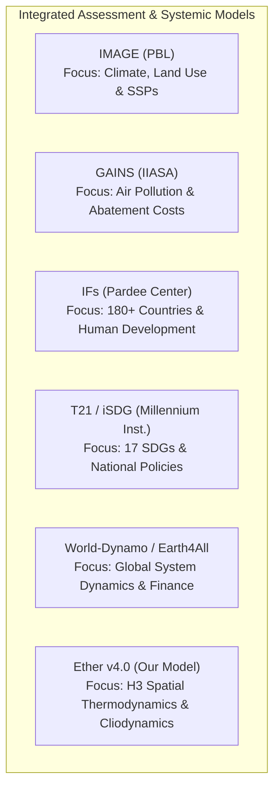

# Global Systemic Simulation Models: Comparative Analysis of Ether v4.0 vs. T21/iSDG, IFs, IMAGE, GAINS, and Post-World3 Models

> **Reference & Comparative Analysis Document**  
> *Prepared for the Ether Project — Human-Planetary Cliodynamic and Thermodynamic Simulation*  
> **Status**: Official | **Target Version**: Ether v4.0.0

---

## 1. Executive Summary & Positional Vision

Planetary-scale human and ecological systems modeling has historically been dominated by several major engineering and forecasting traditions:
- **National-scale aggregated System Dynamics** (Threshold 21 / iSDG),
- **High-density empirical multi-country macro-structural models** (International Futures - IFs),
- **Bio-geophysical Integrated Assessment Models (IAMs)** for environmental and climate policies (IMAGE, GAINS),
- **Post-World3 physical and macro-financial extensions** (World-Dynamo, Earth4All).

**Ether (v4.0)** builds upon this heritage while introducing a fundamental paradigm shift: abandoning abstract geopolitical aggregations (countries, continents, or single-box "world" models) in favor of **a physicalist, thermodynamic, and cliodynamic simulation distributed across a planetary hexagonal spatial grid (Uber H3)**.

This document presents an in-depth analysis of Ether's objectives, strengths, and limitations alongside the global pillars of macro-systemic simulation.

---

## 2. Detailed Model-by-Model Analysis

### A. Ether (v4.0) — Spatial Cliodynamic & Thermodynamic Simulation

> [!NOTE]
> **Ether Positioning**: A physical-first simulation engine spanning a continuous temporal horizon from 100,000 BCE to future prospective epochs (2100+). It couples the first law of thermodynamics (Joules, Carnot limits, Net EROEI, SOC, N-P-K stoichiometry, aquifer replenishment) with 30 pluggable cliodynamic engines.

#### 1. Objectives
- Simulate the deterministic and stochastic co-evolution of human civilization and the biosphere without artificial heuristic shortcuts or abstract financial proxies.
- Provide continuous fine-grained spatial resolution (Uber H3 grid from 175,000 to 10,000,000 hexagonal cells) coupling local biomes, topographic friction, maritime trade corridors, and frontier dynamics.
- Empirically validate equations across deep historical time (10,000 BCE to 2026 CE) via automated statistical metrics ($R^2$, RMSE) calibrated against Seshat, Maddison, HYDE 3.4, and COW datasets.
- Provide an autonomous planetary cybernetic regulator with Model Predictive Control (Archon Engine / MPC).

#### 2. Strengths
- **Continuous Global Spatial Resolution (Uber H3 Grid)**: Enables emergent city formation, realistic trade networks, strategic maritime chokepoints, and spatial diffusion of innovations and epidemics.
- **Strict Thermodynamic Grounding**: Avoids arbitrary monetary proxies; directly calculates energy balances in Joules, net EROEI yields, Carnot efficiency ceilings ($\eta_{\text{Carnot}} = 1 - T_C/T_H$), entropic dissipation of recycled metals, and real depletion of soil nutrients (N-P-K/SOC) and groundwater aquifers.
- **Unrivaled Temporal Depth (100k BP to 2100+)**: Seamlessly simulates paleoclimatic transitions, the hunter-gatherer to agriculture transition, imperial rise and collapse cycles, up through post-industrial and technological singularity trajectories.
- **Catalog of 30 Cliodynamic Engines (Type B Registry)**: Native integration of foundational models (Turchin Asabiyyah & Elite Overproduction, Ostrom Commons, Smil Material Inertia, Henrich Tasmanian Loss, Scott Agrarian Fragility, HANDY Collapse, World3, etc.).
- **High Computational Performance & Hardware Acceleration (DOD, CPU JIT, GPU OpenCL/TornadoVM)**: Achieves over 1.19 million cell-updates per second on planetary grids.

#### 3. Limitations & Trade-Offs
- **Reduced National Administrative Complexity**: Unlike IFs or T21, Ether does not model the fine-grained public accounting of specific modern government ministries (e.g., precise national education budgets or pay-as-you-go pension schedules).
- **Abstraction of the Modernist Monetary and Banking Sphere**: Physicalism deliberately prioritizes energy and material flows (Joules, physical capital stocks) over fiat money creation, central bank benchmark interest rates, and foreign exchange currency markets.
- **High Computational Footprint**: Distributed spatial simulation requires significantly higher CPU/GPU resources than 0D/1D ordinary differential equation (ODE) systems aggregated at the country level.

---

### B. Threshold 21 (T21) & iSDG (Millennium Institute)

#### 1. Status & Trajectory
Originally developed under the leadership of Gerald O. Barney at the **Millennium Institute**, T21 transitioned from a public software product in the 2000s into a customized institutional advisory framework. Its modern incarnation, **iSDG (Integrated Sustainable Development Goals)**, is specifically tailored to assess the UN's 17 Sustainable Development Goals (SDGs) for national governments.

#### 2. Architecture
- **National Macro-Systemic Model** (aggregated at the individual country scale).
- Built around more than **1,000 endogenous System Dynamics equations**.
- Tri-spherical coupling: **Economy**, **Society**, **Environment**.

#### 3. Dynamic Model (iSDG)
Simulates complex interdependencies across the 17 SDGs (e.g., the downstream impact of increased investment in female education on maternal health, 30-year GDP growth, and national carbon emissions).

#### 4. Strengths
- **Direct Institutional Alignment (UN SDGs)**: Decision-support tool immediately actionable for planning ministries and UN agencies.
- **Rich National Policy Levers**: Integrates concrete budgetary and sectoral policy trade-offs.
- **Balanced Tri-Spherical Structure**: Avoids purely economic or purely environmental reductionism.

#### 5. Limitations
- **Lack of Spatial Granularity (0D Country Aggregation)**: Unable to represent subnational geographic distributions (cities, river basins, local climate gradients, transport friction).
- **Proprietary & Closed Ecosystem**: Accessible almost exclusively through institutional consulting engagements with the Millennium Institute (lacks an open-source executable codebase).
- **Modernist-Only Time Horizon**: Designed for 15–50 year projections (unsuited for paleoclimatic scales, deep historical cliodynamics, or post-2100 long-range trajectories).

---

### C. International Futures (IFs) (Pardee Center, University of Denver)

#### 1. Overview & Status
Developed under the leadership of **Barry Hughes** at the Frederick S. Pardee Center for International Futures, IFs is one of the most comprehensive, mature, and thoroughly documented global forecasting systems in existence. It serves as an analytical engine for the US National Intelligence Council (NIC) *Global Trends* reports and UNEP's *Global Environmental Outlook*.

#### 2. Scope & Coupling
- **Multi-Country Coverage**: Over **180 individually modeled countries** interconnected through bilateral trade matrices, migration flows, and financial transfers.
- **12 Interconnected Endogenous Subsystems**: Demographics, Economy, Agriculture, Education, Health, Energy, Environment, Technology, Infrastructure, Governance, International Politics, Social Protection.
- **Massive Empirical Foundation**: Integrates an extensive historical database of over **5,000 global time series** from 1960 to the present.

#### 3. Strengths
- **Exceptional Modern Empirical Coverage**: Unmatched historical database and statistical calibration for 180+ countries over the 1960–present period.
- **Detailed Human and Social Subsystems**: Highly sophisticated cohort models for education (literacy, attainment by gender), healthcare (cause-specific mortality, DALY disease burdens), and public finance.
- **Proven Prospective Usability**: Rich interactive desktop/web interface allowing exploration of hundreds of policy levers through 2100.

#### 4. Limitations
- **Rigid Political Boundaries (Nation-State Centric)**: Cannot capture subnational bio-physical dynamics (e.g., local watershed deforestation, local aquifer stress, hexagonal urban sprawl).
- **Constrained Historical Depth (Post-1960)**: Tailored exclusively to the contemporary world; entirely unable to simulate pre-industrial historical dynamics, civilizational genesis, or deep cliodynamics.
- **Econometric & Statistical Regression Reliance**: Heavily dependent on historical statistical correlations, which may break down under non-linear thermodynamic regime shifts (e.g., steep EROEI degradation or extreme climate tipping points).

---

### D. Other Notable Macro-Systemic Models



#### 1. IMAGE (Integrated Model to Assess the Global Environment - PBL Netherlands)
- **Objectives & Scope**: Reference environmental-societal integrated assessment framework for the IPCC, focusing on land use, the carbon cycle, biodiversity (GLOBIO), and Shared Socioeconomic Pathways (SSPs).
- **Strengths**: Outstanding spatial bio-geophysical coupling (geographic grid for vegetation, agriculture, and climate) combined with energy (TIMER) and economic (MAGNET) models.
- **Limitations Relative to Ether**: Absence of cliodynamic modules (no Asabiyyah, elite dynamics, or Tainter collapse mechanisms), lack of autonomous cybernetic AI governance, and inability to run across deep historical timescales.

#### 2. GAINS (Greenhouse Gas and Air Pollution Interactions and Synergies - IIASA)
- **Objectives & Scope**: Techno-economic optimization model focusing on atmospheric pollutants, greenhouse gases, and emission abatement cost curves.
- **Strengths**: Unmatched precision in technological abatement cost curves and air quality health impact evaluations at regional and global levels.
- **Limitations Relative to Ether**: Specialized thematic focus (no full endogenous demographic simulation, no cliodynamics, no representation of power structures or net global EROEI).

#### 3. WORLD-DYNAMO & Post-World3 Models (Earth4All, LowGrow)
- **Objectives & Scope**: Academic initiatives extending the original World3 equations (Meadows et al., 1972) by integrating modern system dynamics, Stock-Flow Consistent (SFC) financial loops, and updated socio-economic feedbacks.
- **Strengths**: High conceptual clarity of global feedback loops; successful integration of debt, financial capital, and economic inequality (e.g., Club of Rome's *Earth4All*, 2022).
- **Limitations Relative to Ether**: Aggregated globally (0D single-box or ~10 regions at best), entirely lacking spatial geographic resolution (no map, no H3 grid, no physical transport logistics), and without JIT/GPU compilation architecture.

---

## 3. Synthetic Comparative Matrix

The matrix below summarizes the architectural and functional characteristics of Ether in comparison to its major peers.

| Dimension | **Ether (v4.0)** | **T21 / iSDG** | **International Futures (IFs)** | **IMAGE (PBL)** | **Earth4All / Post-World3** |
| :--- | :--- | :--- | :--- | :--- | :--- |
| **Spatial Resolution** | **Uber H3 Hex Grid** (175k–10M cells) | National Aggregate (0D per country) | **180+ Countries** (Multi-country matrices) | Geo Grid (Land/Biomes) + Eco Regions | Global Aggregate (0D) or ~10 Regions |
| **Temporal Horizon** | **-100,000 BP to 2100+** (Deep History & Future) | 2000 – 2050 (SDG Horizons) | 1960 – 2100 (Modern Horizons) | 1970 – 2100 (IPCC / SSP Scenarios) | 1970 – 2100 (Transition Scenarios) |
| **Physical & Thermodynamic Grounding** | **Strict (Joules, EROEI, Carnot, SOC, NPK)** | Partial (Physical resources & energy) | Intermediate (Energy demands & stocks) | **Very High (Carbon, Biomass, Climate)** | Moderate (Physical stocks & boundaries) |
| **Cliodynamics & Political Instability** | **30 Type B Engines** (Turchin, Scott, Ostrom...) | Limited (Basic social variables) | Integrated (Governance indices & forecasts) | None (Environmental/economic focus) | Limited (Social tension index) |
| **Economic & Financial Sphere** | **Physicalist** (Capital, Energy, Supply/Demand) | National Macro (GDP, Sectors) | **Highly Detailed** (SAM, Econometrics, Trade) | MAGNET/TIMER Models (Macro/Energy) | Macro-Financial SFC (Debt, Capital) |
| **Governance & Archon Engine (AI)** | **Closed-Loop MPC** (Cybernetic Regulation) | Manual policy levers | Advanced policy scenario sliders | Predefined SSP scenario pathways | Policy intervention scenario runs |
| **Historical Empirical Validation** | **Automated** ($R^2$, RMSE on -10k to 2026) | Ad-hoc country calibration | **Massive (5,000+ series 1960–2026)** | Historical environmental calibration | World3/Earth4All fit (1970–2020) |
| **Hardware Acceleration / JIT Compiler** | **Yes** (DOD SoA, CPU JIT, OpenCL/GPU) | No (Standard System Dynamics) | No (Sequential CPU execution) | No (Complex coupled codebases) | No (0D System Dynamics) |
| **Accessibility & Software Model** | **Open Source / Local / JavaFX Desktop** | Proprietary / Consulting Engagements | Free / Desktop & Web (Pardee Center) | Academic / Institutional Research | Open Source / Vensim & Stella Models |

---

## 4. Cross-Cutting Analysis: What are Ether's Key Distinctions?

```
┌─────────────────────────────────────────────────────────────────────────────┐
│                       SIMULATION PARADIGM MATRIX                            │
│                                                                             │
│   Spatial Resolution                                                        │
│        ▲                                                                    │
│        │                                                                    │
│   HIGH │                                 ✦ ETHER (v4.0)                     │
│        │                                 (H3 Hexagons, Phys/Cliodynamics)   │
│        │                                                                    │
│        │                                    IMAGE                           │
│        │                                    (Climate/Soil Grid)             │
│        │                                                                    │
│ MEDIUM │                                        IFs                         │
│        │                                        (180+ Countries, Econometric)│
│        │                                                                    │
│    LOW │    T21 / iSDG             Earth4All / World3                       │
│        │    (National 0D)          (Global 0D)                              │
│        └──────────────────────────────────────────────────────────────►     │
│             Short (20-50 yrs)      Medium (100 yrs)       Deep (-100k BP)   │
│                                   Temporal Horizon                          │
└─────────────────────────────────────────────────────────────────────────────┘
```

### 1. The End of Geopolitical "Black Boxes": The Contribution of the Uber H3 Grid
Models like IFs, T21, or traditional IAMs partition the world into fixed administrative boundaries (e.g., "France", "China", "Sub-Saharan Africa"). However, the biosphere, climate, aquifers, and ecosystems do not follow political borders.  
Ether resolves this limitation by defining **the H3 hexagonal cell as the fundamental state unit**. Political borders, urban networks, and imperial realms emerge endogenously from human density, terrain friction, and social cohesion (*Asabiyyah*).

### 2. From Econometric Reductionism to First-Principles Thermodynamics
The majority of institutional forecasting models (IFs, T21) rely on Cobb-Douglas production functions or econometric regressions calibrated during the post-WWII era of sustained economic expansion (1960–2020). These regressions implicitly assume continuous energetic abundance.  
Ether reverses this approach: **human activity is strictly bounded by thermodynamic laws (Joules, Carnot limits, Net EROEI, material entropy)**. If net EROEI declines or soil loses N-P-K fertility, physical output contracts regardless of monetary or price signals.

### 3. Temporal Depth and CLIODYNAMICS (Bridging Past and Future)
IFs and T21 cannot test their mathematical formulations against the fall of the Western Roman Empire, the expansion of Islam, the 14th-century crisis, or the Maya collapse.  
Ether is the only simulation platform capable of executing the exact same set of physical and sociological equations **from 100,000 BCE to 2100+**, empirically validated by an automated statistical calibration engine against global historical datasets (Seshat, Maddison, HYDE 3.4).

### 4. Modular Pluralism via the 30-Engine Registry (Type B)
Where IFs or iSDG impose a monolithic mathematical structure, Ether provides a fully pluggable architecture. Researchers can dynamically activate or deactivate the **HANDY** collapse model, **Turchin's** structural-demographic equations, **White's** energy law, **Scott's** agrarian fragility trap, or **Henrich's** cultural loss theorem in pure analytical mode or spatial hybrid mode.

---

## 5. Perspectives & Hybridization Opportunities for Ether

While Ether offers an advanced architecture for spatial physics and cliodynamics, it can incorporate strengths from its predecessors to enrich future releases:

> [!TIP]
> **Enhancement Opportunities in the Ether Roadmap**:
> 1. **Public Policy Indicator Accounting (Inspired by IFs / iSDG)**: Enrich the `Archon` engine and `GodModePanel` with SDG-style policy levers (e.g., targeted public health investments, educational attainment goals, or desalination infrastructure deployments).
> 2. **Sectoral Input-Output Coupling (Inspired by IMAGE / TIMER)**: Add an optional physicalized inter-sectoral exchange matrix layer (physical input-output) to model precise supply dependencies between metallurgy, industrial chemistry, and energy systems.
> 3. **Epidemiological & Health Precision (Inspired by IFs / GAINS)**: Expand Ether's `BioMolecularEpidemiologyEngine` to incorporate disability-adjusted life year (DALY) morbidity burdens from air pollution and particulate exposure.

---

## 6. Conclusion

Ether does not aim to replace T21/iSDG or International Futures on their specialized domains — namely near-term ministerial policy advisory or granular national public finance budgeting.

Instead, **Ether stands as the reference simulation framework for disruptive global foresight, spatial cliodynamics, and the exploration of fundamental physical boundaries governing civilization**. Through its unique coupling of the Uber H3 planetary grid, the first law of thermodynamics, 30 sociological engines, and JIT/GPU hardware acceleration, Ether provides an experimental platform of unparalleled analytical power and rigor in the field of systemic planetary modeling.

---
*Document produced and validated for the Ether project.*

