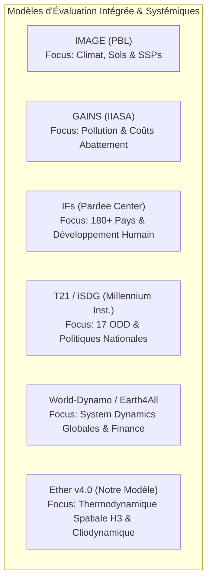

# Modèles de Simulation Systémique Globale : Comparatif d'Ether v4.0 avec T21/iSDG, IFs, IMAGE, GAINS et les Modèles Post-World3

> **Document de Référence et d'Analyse Comparative**  
> *Rédigé pour le projet Ether — Simulation Cliodynamique et Thermodynamique Humano-Planétaire*  
> **Statut** : Officiel | **Version Target** : Ether v4.0.0

---

## 1. Résumé Exécutif & Vision Positionnelle

La modélisation des systèmes humains et écologiques à l'échelle planétaire est dominée par plusieurs grandes traditions d'ingénierie prospective :
- La **Dynamique des Systèmes agrégée à l'échelle nationale** (Threshold 21 / iSDG),
- Les **modèles macro-structurels multi-pays à haute densité empirique** (International Futures - IFs),
- Les **modèles d'évaluation intégrée bio-géo-physiques** pour les politiques environnementales et climatiques (IMAGE, GAINS),
- Les **extensions macro-financières et physiques post-World3** (World-Dynamo, Earth4All).

**Ether (v4.0)** s'inscrit dans cette lignée tout en introduisant une rupture paradigmatique majeure : l'abandon des agrégations géopolitiques abstraites (pays, continents ou planète entière à 1 seule boîte) au profit d'une **modélisation physicaliste, thermodynamique et cliodynamique distribuée sur une grille spatiale hexagonale planétaire (Uber H3)**. 

Le présent document analyse en profondeur les objectifs, forces et faiblesses d'Ether au regard des piliers mondiaux de la simulation macro-systémique.

---

## 2. Analyse Détaillée par Modèle

### A. Ether (v4.0) — La Simulation Cliodynamique & Thermodynamique Spatiale

> [!NOTE]
> **Positionnement d'Ether** : Moteur de simulation physico-centré couvrant une échelle temporelle allant de -100 000 avant J.-C. aux horizons prospectifs futurs (2100+). Il combine la rigueur du premier principe de la thermodynamique (Joules, Carnot, EROEI net, SOC, N-P-K, aquifères) et 30 moteurs cliodynamiques pluggables.

#### 1. Objectifs
- Simuler la co-évolution déterministe et stochastique de la civilisation humaine et de la biosphère sans "court-circuit" heuristique ou financier fictif.
- Proposer une résolution spatiale fine continue (grille Uber H3 de 175 000 à 10 000 000 de cellules hexagonales) couplant biomes locaux, frottement géographique, routes maritimes et dynamiques de frontière.
- Valider empiriquement les équations sur la longue durée historique (-10 000 à 2026 apr. J.-C.) via des métriques statistiques ($R^2$, RMSE) adossées aux bases Seshat, Maddison, HYDE 3.4 et COW.
- Offrir un régulateur cybernétique planétaire autonome à contrôle prédictif (Moteur Archon / MPC).

#### 2. Forces
- **Résolution Spatiale Globale & Continue (Grille Uber H3)** : Permet de modéliser l'émergence des villes, les routes commerciales, les points de passage stratégiques (chokepoints) et la diffusion spatiale de l'innovation et des épidémies.
- **Rigueur Thermodynamique Strictement Ancrée** : Pas de variables financières abstraites arbitraires ; calcul direct des bilans en Joules, rendement EROEI net, limites de Carnot ($\eta_{\text{Carnot}} = 1 - T_C/T_H$), dissipation entropique du recyclage des métaux et épuisement réel du sol (N-P-K/SOC) et des nappes phréatiques.
- **Profondeur Temporelle Inégalée (-100k BP à 2100+)** : Modélise les transitions paléoclimatiques, le passage des chasseurs-cueilleurs à l'agriculture, l'essor et l'effondrement des empires, jusqu'à la Singularité technologique.
- **Catalogue de 30 Moteurs Cliodynamiques (Registry Type B)** : Intégration de modèles fondamentaux (Turchin Asabiyyah, Ostrom Communs, Smil Inertie, Henrich Perte Tasmanienne, Scott Fragilité Agrarienne, HANDY Collapse, World3, etc.).
- **Haute Performance & Accélération Matérielle (DOD, CPU JIT, GPU OpenCL/TornadoVM)** : Traitement de plus de 1,19 million de mises à jour de cellules par seconde.

#### 3. Faiblesses & Limites
- **Complexité Politico-Administrative Nationale Réduite** : Contrairement à IFs ou T21, Ether ne modélise pas la comptabilité publique détaillée d'un ministère spécifique (ex. budget précis de l'éducation nationale ou système de retraite par répartition d'un État moderne).
- **Abstraction de la Sphère Monétaire et Bancaire Moderniste** : Le choix délibéré du physicalisme priorise les flux énergétiques et matériels (Joules, stocks de capital physique) au détriment de la création monétaire fiduciaire, des taux d'intérêt des banques centrales ou du marché des devises.
- **Empreinte Calculatoire Élevée** : La simulation spatiale distribuée exige des capacités CPU/GPU significativement plus importantes qu'un système d'équations différentielles ordinaires (EDO) 0D/1D agrégé par pays.

---

### B. Threshold 21 (T21) & iSDG (Millennium Institute)

#### 1. Statut et Trajectoire
Développé à l'origine sous la direction de Gerald O. Barney au **Millennium Institute**, T21 a quitté le format de logiciel grand public dans les années 2000. Il a évolué vers une offre d'expertise institutionnelle sur mesure. Son incarnation moderne, **iSDG (Integrated Sustainable Development Goals)**, est spécifiquement conçue pour évaluer les 17 Objectifs de Développement Durable (ODD) de l'ONU à l'échelle des gouvernements nationaux.

#### 2. Architecture
- **Modèle Macro-Systémique National** (agrégé à l'échelle d'un pays).
- S'articule autour de plus de **1 000 équations endogènes** en Dynamique des Systèmes (System Dynamics).
- Couplage tri-sphérique : **Économie**, **Société**, **Environnement**.

#### 3. Modèle de Mutation (iSDG)
L'outil simule les interdépendances complexes entre les 17 ODD (ex. impact d'une hausse des investissements dans l'éducation des filles sur la santé maternelle, le PIB à 30 ans, et les émissions de carbone nationales).

#### 4. Forces
- **Alignement Institutionnel Parfait (ODD ONU)** : Outil de décision directement exploitable par les ministères de la planification et les agences de l'ONU.
- **Richesse des Leviers Politiques Nationaux** : Intègre des arbitrages budgétaires et sectoriels très concrets.
- **Structure Tri-Sphérique Équilibrée** : Évite le réductionnisme purement économique ou purement environnemental.

#### 5. Faiblesses
- **Absence de Granularité Spatiale (Agrégat 0D Pays)** : Incapable de représenter la répartition géographique interne (villes, bassins versants, gradients climatiques locaux, infrastructures de transport).
- **Modèle Propriétaire et Fermé** : Accessible quasi-exclusivement via des missions de conseil institutionnel du Millennium Institute (pas d'écosystème open-source exécutable).
- **Ancrage Temporel Moderniste Uniquement** : Conçu pour des projections à 15-50 ans (inadapté aux échelles paléoclimatiques, à la cliodynamique historique ou aux horizons post-2100).

---

### C. International Futures (IFs) (Pardee Center, Université de Denver)

#### 1. Présentation & Statut
Développé sous la direction de **Barry Hughes** au Frederick S. Pardee Center for International Futures, IFs est aujourd'hui l'un des systèmes de simulation prospective globale les plus vastes, pérennes et documentés au monde. Il sert de moteur analytique pour les rapports *Global Trends* du US National Intelligence Council (NIC) et du PNUE (*Global Environmental Outlook*).

#### 2. Périmètre et Couplage
- **Couverture Multi-Pays** : Plus de **180 pays** individuellement modélisés et interconnectés par des matrices de commerce international, de migrations et d'échanges financiers.
- **12 Sous-Systèmes Endogènes Interconnectés** : Démographie, Économie, Agriculture, Éducation, Santé, Énergie, Environnement, Technologie, Infrastructure, Governance, Politique Internationale, Protection Sociale.
- **Base Empirique Masssource** : Intègre une base de données historique colossale de plus de **5 000 séries chronologiques mondiales** depuis les années 1960.

#### 3. Forces
- **Couverture Empirique Moderne Exceptionnelle** : Base historique et étalonnage statistique inégalés sur la période 1960-présent pour 180+ pays.
- **Finesse des Sous-Systèmes Sociaux et Humains** : Modèles extrêmement détaillés de cohortes éducatives (alphabétisation, accomplissement scolaire par genre), de santé (mortalité par cause spécifique, fardeau de la maladie DALY) et de finances publiques.
- **Utilisabilité Prospective Éprouvée** : Outil interactif riche permettant de manipuler des centaines de leviers de politiques publiques jusqu'en 2100.

#### 4. Faiblesses
- **Frontières Politiques Rigides (Modèle Centré sur l'État-Nation)** : Incapable de capturer la dynamique bio-physique sous-nationale (ex. déforestation d'un bassin hydrologique spécifique, stress hydrique d'une nappe locale, étalement urbain hexagonal).
- **Profondeur Historique Restreinte (post-1960)** : Conçu uniquement pour le monde contemporain ; totalement incapable de simuler les dynamiques historiques pré-industrielles, l'émergence des civilisations ou la cliodynamique de longue durée.
- **Formulation Économétrique & Régressions** : S'appuie fortement sur des régressions statistiques historiques qui peuvent s'effondrer en cas de ruptures thermodynamiques systémiques non linéaires hors-champ (ex. effondrement d'EROEI ou emballement climatique extrême).

---

### D. Autres Modèles Macro-Systémiques Notables



#### 1. IMAGE (Integrated Model to Assess the Global Environment - PBL Néerlandais)
- **Objectifs & Champ** : Cadre de modélisation intégrée environnement-société référent pour le GIEC, particulièrement axé sur l'utilisation des sols, le cycle du carbone, la biodiversité (GLOBIO) et les scénarios SSP (*Shared Socioeconomic Pathways*).
- **Forces** : Excellence du couplage bio-géo-physique spatialisé (grille géographique pour la végétation, l'agriculture et le climat) combiné avec des modèles énergétiques (TIMER) et économiques (MAGNET).
- **Faiblesses vis-à-vis d'Ether** : Absence de modules cliodynamiques (pas d'Asabiyyah, pas de dynamique des élites, pas de mécanismes d'effondrement sociétal de Tainter), absence de gouvernance IA cybernétique et incapacité à exécuter des simulations sur la longue durée historique.

#### 2. GAINS (Greenhouse Gas and Air Pollution Interactions and Synergies - IIASA)
- **Objectifs & Champ** : Modèle d'optimisation techno-économique centré sur la pollution atmosphérique, les gaz à effet de serre et les coûts des politiques de réduction d'émissions.
- **Forces** : Précision inégalée des courbes de coûts d'abattement technologique et des impacts sanitaires de la qualité de l'air à l'échelle régionale et mondiale.
- **Faiblesses vis-à-vis d'Ether** : Modèle thématique spécialisé (pas de simulation démographique endogène complète, pas de cliodynamique, pas de représentation des structures de pouvoir ou de l'énergie nette EROEI globale).

#### 3. WORLD-DYNAMO & Modèles Post-World3 (Earth4All, LowGrow)
- **Objectifs & Champ** : Initiatives académiques prolongeant les équations originelles de World3 (Meadows 1972) en y injectant de la dynamique des systèmes moderne, des boucles financières (Stock-Flow Consistent / SFC) et des rétroactions socio-économiques actualisées.
- **Forces** : Grande clarté conceptuelle des boucles de rétroaction globales ; intégration réussie de la dette, du capital financier et des inégalités (ex. *Earth4All* du Club de Rome, 2022).
- **Faiblesses vis-à-vis d'Ether** : Modèles agrégés à l'échelle mondiale (0D ou 10 régions au mieux), totalement dépourvus de résolution spatiale géographique (pas de carte, pas de géométrie H3, pas de transport matériel physique), et sans architecture de compilation JIT GPU.

---

## 3. Matrice Comparative Synthétique

Le tableau ci-dessous résume les caractéristiques architecturales et fonctionnelles d'Ether par rapport à ses homologues majeurs.

| Dimension d'Analyse | **Ether (v4.0)** | **T21 / iSDG** | **International Futures (IFs)** | **IMAGE (PBL)** | **Earth4All / Post-World3** |
| :--- | :--- | :--- | :--- | :--- | :--- |
| **Résolution Spatiale** | **Grille Hexagonale Uber H3** (175k-10M cellules) | Agrégat National (0D par pays) | **180+ Pays** (Matrices multi-pays) | Grille Géo (Sols/Biomes) + Régions Eco | Agrégat Global (0D) ou 10 Régions |
| **Échelle Temporelle** | **-100 000 BP à 2100+** (Deep History & Futur) | 2000 – 2050 (Prospective ODD) | 1960 – 2100 (Prospective Moderne) | 1970 – 2100 (Scénarios GIEC / SSP) | 1970 – 2100 (Scénarios Transition) |
| **Ancrage Physique & Thermodynamique** | **Strict (Joules, EROEI, Carnot, SOC, NPK)** | Partiel (Ressources physiques & énergie) | Intermédiaire (Besoins/Stocks énergétiques) | **Très Élevé (Carbone, Biomasse, Climat)** | Modéré (Stocks physiques & limites) |
| **Cliodynamique & Instabilité Politique** | **30 Moteurs Type B** (Turchin, Scott, Ostrom...) | Limité (Variables sociales de base) | Intégré (Index de gouvernance & prédiction) | Aucun (Focus environnement/économie) | Limité (Index de tension sociale) |
| **Sphère Économique & Financière** | **Physico-Centrée** (Capital, Énergie, Offre/Demande) | Macro-économique nationale (PIB, Secteurs) | **Très Détaillée** (SAM, Économétrie, Commerce) | Modèle MAGNET/TIMER (Macro/Énergie) | Macro-Financière SFC (Dette, Investissement) |
| **Gouvernance & Archon Engine (IA)** | **Closed-Loop MPC** (Contrôle Cybernétique) | Leviers politiques manuels | Scénarios de leviers politiques avancés | Scénarios SSP prédéfinis | Scénarios d'interventions politiques |
| **Validation Empirique Historique** | **Automatisée** ($R^2$, RMSE sur -10k à 2026) | Étalonnage ponctuel pays | **Massive (5 000+ séries 1960-2026)** | Étalonnage historique environnemental | Étalonnage World3/Earth4All (1970-2020) |
| **Accélération Matérielle / JIT Compiler** | **Oui** (DOD SoA, CPU JIT, OpenCL/GPU) | Non (System Dynamics standard) | Non (Exécution séquentielle CPU) | Non (Modèles couplés complexes) | Non (System Dynamics 0D) |
| **Accessibilité & Modèle Logiciel** | **Open Source / Local / Client JavaFX** | Propriétaire / Mission de Conseil | Gratuit / Desktop & Web (Pardee Inst) | Académique / Recherche Institutionnelle | Open Source / Modèles Vensim/Stella |

---

## 4. Analyse Transversale : Quels sont les Atouts Distinctions d'Ether ?

```
┌─────────────────────────────────────────────────────────────────────────────┐
│                      MATRICE DES PARADIGMES DE SIMULATION                   │
│                                                                             │
│   Résolution Spatiale                                                       │
│        ▲                                                                    │
│        │                                                                    │
│   HAUTE│                                 ✦ ETHER (v4.0)                     │
│        │                                 (H3 Hexagons, Phys/Cliodynamique)  │
│        │                                                                    │
│        │                                    IMAGE                           │
│        │                                    (Grille Climat/Sols)            │
│        │                                                                    │
│  MOYENNE                                        IFs                         │
│        │                                        (180+ Pays, Économétrie)    │
│        │                                                                    │
│   BASSE│    T21 / iSDG             Earth4All / World3                       │
│        │    (National 0D)          (Global 0D)                              │
│        └──────────────────────────────────────────────────────────────►     │
│             Courte (20-50 ans)     Moyenne (100 ans)      Profonde (-100k BP) │
│                                  Profondeur Temporelle                      │
└─────────────────────────────────────────────────────────────────────────────┘
```

### 1. La Fin des "Boîtes Noires" Géopolitiques : L'Apport de la Grille Uber H3
Les modèles comme IFs, T21 ou les IAMs traditionnels découpent le monde en entités administratives fixes (ex. "France", "Chine", "Afrique subsaharienne"). Or, la biosphère, le climat, les aquifères et les écosystèmes ne connaissent pas les frontières politiques. 
Ether résout cette contradiction en posant **la cellule H3 comme unité fondamentale d'état**. Les frontières politiques, les réseaux urbains et les territoires impériaux émergent endogènement de la densité humaine, du frottement du relief et de la cohésion sociale (*Asabiyyah*).

### 2. Du Réductionnisme Économétrique au Premier Principe Thermodynamique
La majorité des modèles prospectifs institutionnels (IFs, T21) s'appuient sur des équations de production de type Cobb-Douglas ou des Régressions Économétriques calibrées sur les Trente Glorieuses et la mondialisation (1960-2020). Ces régressions supposent implicitement la continuité de l'abondance énergétique. 
Ether prend le problème à l'inverse : **l'activité humaine est contrainte par les lois de la thermodynamique (Joules, Carnot, EROEI net, entropie des matériaux)**. Si l'EROEI s'effondre ou si le sol perd son N-P-K, la production s'effondre indépendamment des signaux monétaires.

### 3. Profondeur Temporelle et CLIODYNAMIQUE (Le Pont Passé-Futur)
IFs et T21 sont incapables de tester leurs équations sur la chute de l'Empire Romain, l'expansion de l'Islam, la crise du XIVe siècle ou l'effondrement des Mayas. 
Ether est le seul moteur capable de dérouler un même jeu d'équations physiques et sociologiques **de -100 000 BP à 2100+**, validé empiriquement par un noyau de calibration statistique contre les bases de données historiques mondiales (Seshat, Maddison, HYDE 3.4).

### 4. Pluralisme Modulaire via le Registry de 30 Moteurs (Type B)
Là où IFs ou iSDG imposent une structure mathématique monolithique fermée, Ether propose une architecture pluggable. Un chercheur peut activer ou désactiver à la volée le modèle de collapse **HANDY**, les lois de **Turchin**, le principe de **White**, la trappe de **Scott** ou la perte culturelle d'**Henrich**, en mode analytique pur ou en mode hybride spatialisé.

---

## 5. Perspectives & Opportunités d'Hybridation pour Ether

Bien qu'Ether possède une supériorité architecturale sur le plan de la physique spatiale et de la cliodynamique, il peut s'inspirer des forces de ses prédécesseurs pour enrichir ses futures versions :

> [!TIP]
> **Pistes d'Amélioration Incluses dans la Feuille de Route d'Ether** :
> 1. **Comptabilité des Leviers de Politiques Publiques (Inspiration IFs / iSDG)** : Enrichir le moteur `Archon` et le `GodModePanel` avec des séries de leviers d'intervention sous forme d'ODD (ex. taux de scolarisation, investissement ciblé en santé publique ou infrastructures de dessalement).
> 2. **Couplage d'Économie Sectorielle (Inspiration IMAGE / TIMER)** : Ajouter une couche optionnelle de matrice d'échanges intersectoriels (Input-Output physicalisé) pour mieux simuler les dépendances entre métallurgie, chimie minérale et énergie.
> 3. **Précision des Métriques Sanitaires & Épidémiologiques (Inspiration IFs / GAINS)** : Étendre le moteur épidémiologique (`BioMolecularEpidemiologyEngine`) d'Ether pour intégrer les fardeaux de morbidité (DALY) liés à la pollution de l'air.

---

## 6. Conclusion

Ether ne cherche pas à remplacer T21/iSDG ou International Futures sur leur terrain d'élection — à savoir le conseil en prospective ministérielle à court/moyen terme ou la comptabilité des finances publiques nationales. 

En revanche, **Ether s'impose comme le cadre de simulation de référence pour la prospective globale de rupture, la cliodynamique spatiale et l'étude des limites physiques fondamentales de la civilisation**. Par son couplage unique entre la géométrie planétaire Uber H3, le premier principe de la thermodynamique, 30 moteurs sociologiques et l'accélération matérielle JIT/GPU, Ether offre une plateforme d'expérimentation d'une puissance et d'une rigueur sans équivalent dans le paysage de la modélisation systémique mondiale.

---
*Document produit et validé pour le projet Ether.*
