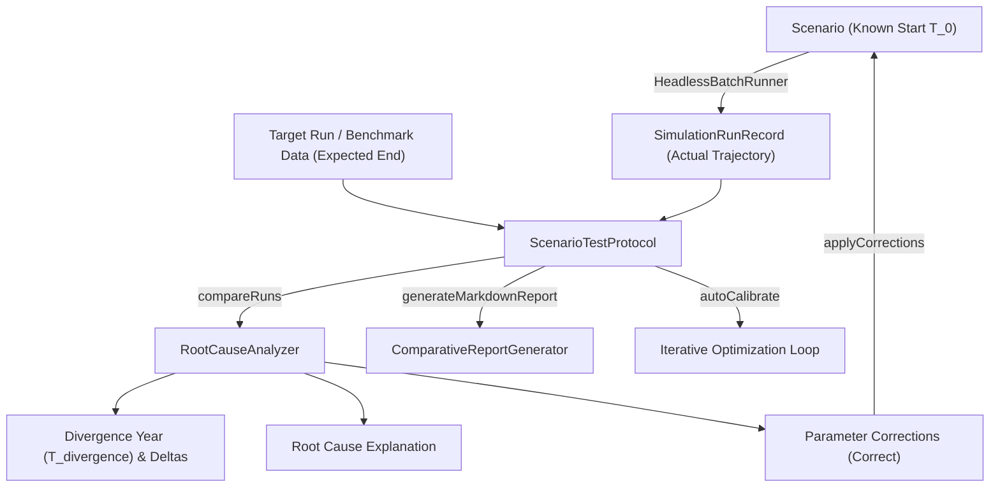

# 🔬 Formalization of Simulation Scenario Testing & Auto-Calibration Protocol ("Known Start, Expected End, Explain and Correct")

## 📌 Context & Objectives

A robust, reproducible validation scaffold was developed for testing, comparing, and calibrating simulation scenarios within the **Ether** engine. This replaces manual ad-hoc testing with a standardized four-phase framework:

1. **Known Start**: Initialize and execute scenarios headlessly from precise initial boundary conditions ($T_0$: population, physical capital $K_0$, energy reserves $E_0$, food reserves $F_0$, information density $I_0$, and active Type B cliodynamic engines).
2. **Expected End Comparison**: Compare actual output trajectories against reference historical benchmarks (20 socio-economic/cliodynamic variables from `HistoricalValidationKernel`) or expected target runs (`SimulationRunRecord`).
3. **Explain (Root Cause Analysis & Divergence Identification)**: Detect the divergence epoch year ($T_{\text{divergence}}$), compute teleometric deltas (Population, Food, Tech, Stability), and formulate natural language root cause explanations via `RootCauseAnalyzer`.
4. **Correct (Automated Parameter Correction & Self-Calibration)**: Generate actionable parameter adjustment recommendations (`ParameterCorrection`), apply corrections directly to scenario models, and execute iterative optimization loops (`autoCalibrate`).

---

## 🏗️ Architecture & Component Overview



### Key Classes & Responsibilities

| Class / Module | Role & Responsibility | Key Methods / Additions |
| :--- | :--- | :--- |
| `ScenarioTestProtocol` | Core orchestrator for the testing protocol. Runs simulations, computes fits ($R^2$, RMSE), triggers diagnosis, and handles auto-calibration iterations. | `runProtocol(...)`, `runProtocolAgainstBenchmark(...)`, `applyCorrections(...)`, `autoCalibrate(...)` |
| `RootCauseAnalyzer` | Analytical engine identifying parameter differences, $T_{\text{divergence}}$, metric deltas, primary causes, and parameter correction proposals. | `compareRuns(...)`, `ParameterCorrection`, `generateParameterCorrections(...)` |
| `ComparativeReportGenerator` | Generates formatted analytical reports in Markdown, CSV, and HTML. Includes Section 4: *Automated Correction Recommendations ("Correct")*. | `generateMarkdownReport(...)`, `generateCsvExport(...)` |
| `HistoricalValidationKernel` | Multi-metric empirical benchmark engine containing 20 historical variables and evaluation windows (`EpochWindow`). | `evaluateWindowedFit(...)`, `calculateRmse(...)`, `calculateRSquared(...)` |
| `HeadlessBatchRunner` | Background execution runner populating telemetry snapshots for offline comparison. | `executeScenarioHeadless(...)` |

---

## 🛠️ Automated Correction Logic ("Correct")

The parameter correction engine evaluates final metric deltas and divergence characteristics to calculate directional adjustments:

- **Population Deficit ($< -5\%$)**: Increases `initialFoodReserveMonths` and `initialCapitalPerCapita` to prevent early Malthusian mortality.
- **Population Overshoot ($> +5\%$)**: Adjusts `initialHumanCount` down to align with carrying capacity benchmarks.
- **Technological Lag ($< -5\%$)**: Increases `initialInformationPerCapita` to boost baseline innovation rates.
- **Sociopolitical Instability ($\text{Stability} < 40.0$)**: Proposes enabling stabilization engines (e.g. `FrontierAsabiyyah`).

---

## 🧪 Verification & Test Results

The new protocol suite was validated using Maven (`mvn test`):

```text
[INFO] Running org.ether.society.analytics.ScenarioTestProtocolTest
[INFO] Tests run: 4, Failures: 0, Errors: 0, Skipped: 0, Time elapsed: 0.210 s
[INFO] 
[INFO] Results:
[INFO] Tests run: 16, Failures: 0, Errors: 0, Skipped: 0
[INFO] BUILD SUCCESS
```

### Verified Test Batteries:
1. `testKnownStartExpectedEndProtocol`: Validates headless execution, divergence detection ($T_{\text{divergence}}$), metric delta calculation, and correction proposal generation.
2. `testParameterCorrectionApplication`: Confirms programmatic updates to `Scenario` initial conditions (`initialFoodReserveMonths`, `initialCapitalPerCapita`, etc.).
3. `testIterativeAutoCalibrationLoop`: Confirms multi-iteration convergence where parameters are iteratively adjusted to minimize trajectory error.
4. `testBenchmarkProtocolExecution`: Validates execution against `HistoricalValidationKernel` 20-variable historical datasets across deep horizon epoch windows.
