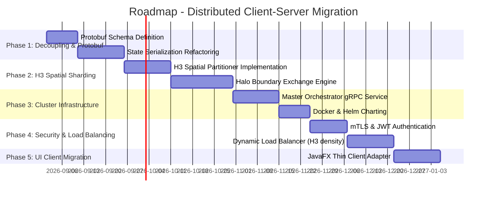

# Detailed Implementation Plan: Transition to Client-Server & Distributed Architecture for Ether / SwarmForge

## 1. Executive Summary & Feasibility Analysis

Currently, the **Ether / SwarmForge** simulation engine operates as a local monolithic application (in-memory single-machine), leveraging multithreading and SIMD optimizations (Java Incubator Vector API).

Transitioning to a **distributed Client-Server architecture** enables scaling simulation capacity from tens of thousands of agents on a single workstation to millions/billions of agents distributed across a compute cluster. However, this introduces significant architectural complexity regarding network latency, spatial boundary synchronization across hex cells (Uber H3), and infrastructure orchestration.

### Decision Matrix: Monolithic Local vs. Distributed Cluster

| Criterion | Monolithic Local (Current Vector API + Parallel Streams) | Distributed Cluster (Master-Worker + Spatial Sharding) |
| :--- | :--- | :--- |
| **Agent / Hex Capacity** | ~50k to 500k agents / H3 Hexagons Res 5-7 | 10M+ agents / Global Earth H3 Res 8-10 |
| **Tick Loop Latency** | Very low (< 16ms, fluid real-time rendering) | Variable (50-200ms per tick depending on network sync) |
| **Architectural Complexity** | Low (Shared memory, zero network failures) | High (Partitioning, node failure recovery, desync handling) |
| **Infrastructure Cost** | Zero / Local PC | Cloud hosting (High-CPU/GPU nodes, high-speed network) |
| **Current Recommendation** | **Ideal for local prototyping, editing, and simulations** | **Only pursue if simulation exceeds single-machine RAM/CPU** |

---

## 2. Framework Selection for Distributed Computing

The choice of distributed computing framework must fit the step-by-step (**tick-by-tick**) nature of agent-based spatial simulations (Uber H3).

### Comparative Technology Analysis

1. **Apache Spark / Flink**:
   - *Drawback*: Designed for streaming/analytics or batch processing pipelines. DAG scheduler overhead introduces unacceptable latency for interactive simulation ticks (tens of ms per tick minimum).
   - *Verdict*: Unsuitable for the core simulation loop. Useful only for offline post-processing / analytics.

2. **MPI / MPJ Express (Message Passing Interface)**:
   - *Advantage*: HPC industry standard, ultra-low latency (RDMA / InfiniBand), ideal for physical domain decomposition.
   - *Drawback*: Difficult to integrate with JavaFX / Spring Boot, complex container orchestration, lacks elastic fault tolerance.
   - *Verdict*: Too rigid unless targeting dedicated scientific supercomputers.

3. **Custom Architecture: H3 Spatial Partitioning + gRPC/Netty + Ray/Hazelcast (Recommended)**:
   - *Advantage*: Leverages the Uber H3 hexagonal grid already built into Ether as a native partitioning key. Each **Worker Node** is responsible for a spatial hexagonal region (H3 cluster).
   - *Communication*: gRPC / Protobuf v3 over Netty for high-density, strongly typed binary transfers.
   - *State Store*: Hazelcast / Redis Cluster for lightweight global shared state and node registry.

---

## 3. Target Architecture: Master-Worker & Spatial Sharding

```mermaid
graph TD
    Client[JavaFX / Web Editor Client] <-->|gRPC / WebSockets| Master[Master Orchestrator / Spatial Router]
    
    subgraph Distributed Compute Cluster (Docker / K8s)
        Master <-->|gRPC Stream / State Sync| Worker1[Worker Node 1 - Europe H3 Region]
        Master <-->|gRPC Stream / State Sync| Worker2[Worker Node 2 - America H3 Region]
        Master <-->|gRPC Stream / State Sync| Worker3[Worker Node 3 - Asia H3 Region]
        
        Worker1 <-->|Ghost Cell / Halo Exchange| Worker2
        Worker2 <-->|Ghost Cell / Halo Exchange| Worker3
        Worker3 <-->|Ghost Cell / Halo Exchange| Worker1
    end
    
    Master <-->|Persistence & Snapshot| DB[(PostgreSQL + PostGIS / TimescaleDB)]
```

### 3.1. Component Responsibilities

1. **Master Orchestrator (Central Server)**:
   - Maintains the global spatial index of H3 partitions.
   - Routes user interactions (God Mode interventions, weather tweaks, policies).
   - Enforces global tick synchronization (barrier synchronization).
   - Broadcasts aggregated state deltas to client renderers (JavaFX / Web Client).

2. **Worker Compute Nodes**:
   - Autonomous `H3SimulationEngine` execution units handling assigned H3 index subsets.
   - Boundary exchange (**Halo/Ghost Cell Exchange**): Synchronizes agents transitioning between hexes managed by adjacent nodes.

3. **Clients (UI / Editor)**:
   - Thin Client mode: Offloads physics and agent calculations, receiving visual deltas over WebSockets / Protobuf Streams.

---

## 4. Synchronization Strategy & Network Protocol

### 4.1. Binary Serialization Protocol (Protobuf)
Replaces raw JSON string transfers (`DataOutputStream.writeUTF`) with strict binary serialization via **Protocol Buffers** to reduce memory overhead and serialization cost by up to 10x.

#### `ether_network.proto` (Conceptual Schema)
```protobuf
syntax = "proto3";
package org.ether.society.network.pb;

message TickSyncCommand {
  uint64 tick_number = 1;
  double delta_time = 2;
}

message AgentStateSnapshot {
  uint64 agent_id = 1;
  uint64 h3_cell_index = 2;
  float pos_x = 3;
  float pos_y = 4;
  float health = 5;
}

message HaloBoundaryExchange {
  uint32 source_node_id = 1;
  uint64 target_h3_cell = 2;
  repeated AgentStateSnapshot migrating_agents = 3;
}
```

### 4.2. Boundary Exchange Algorithm (Halo Exchange)
For each simulation tick:
1. **Step 1 (Local Compute)**: Each worker executes agent and climate updates for its H3 region.
2. **Step 2 (Migration Detection)**: Agents crossing spatial boundary hexes are flagged.
3. **Step 3 (Halo Sync)**: Direct peer-to-peer gRPC sync transfers `migrating_agents` between workers.
4. **Step 4 (Tick Barrier)**: Workers report tick completion to Master. Master increments global tick.

---

## 5. Security, Authentication & Audit Logging

1. **Transport Layer Security**:
   - TLS 1.3 with **mTLS (Mutual TLS)** for strict authentication between Worker Nodes and Master.
   - Internal CA auto-signed certificates for Docker/Kubernetes container networks.

2. **Authentication & Access Control (RBAC)**:
   - RSA256-signed JWT (JSON Web Tokens) for client connections.
   - Roles: `OBSERVER` (visual delta stream), `PLANNER` (policy voting), `GOD_MODE` (pause/play, climate/disaster control).

3. **Enhanced Audit Trail (`EtherSecurityAuditLogger`)**:
   - Full IP origin logging for every policy or intervention command.
   - Replay attack mitigation using unique timestamps and nonces per gRPC message.

---

## 6. Phased Implementation Roadmap



---

## 7. Sample Container Configuration (`docker-compose.cluster.yml`)

```yaml
version: '3.8'

services:
  ether-master:
    build:
      context: .
      dockerfile: Dockerfile.master
    ports:
      - "9090:9090" # gRPC Master
      - "8080:8080" # REST/WebSocket UI Client API
    environment:
      - ETHER_MODE=MASTER
      - ETHER_TICK_RATE_MS=16
    networks:
      - ether-net

  ether-worker-1:
    build:
      context: .
      dockerfile: Dockerfile.worker
    environment:
      - ETHER_MODE=WORKER
      - MASTER_HOST=ether-master
      - H3_REGION_START=85283473fffffff
    depends_on:
      - ether-master
    networks:
      - ether-net

  ether-worker-2:
    build:
      context: .
      dockerfile: Dockerfile.worker
    environment:
      - ETHER_MODE=WORKER
      - MASTER_HOST=ether-master
      - H3_REGION_START=85283477fffffff
    depends_on:
      - ether-master
    networks:
      - ether-net

networks:
  ether-net:
    driver: bridge
```

---

## 8. Performance Overhead of Running Distributed Mode Locally (Single Machine Penalty)

Running a distributed Client-Server architecture locally on a single physical machine (Master process + Worker process(es) + Client process on localhost) introduces significant performance penalties compared to the native Monolithic Local mode:

### Overhead Factors & Penalty Breakdown

| Overhead Layer | Monolithic Local (Current) | Distributed Local (Client-Server on 1 PC) | Performance Penalty Factor |
| :--- | :--- | :--- | :--- |
| **Data Memory Access** | Direct L1/L2/L3 CPU Cache & RAM pointer references | Object Serialization (Protobuf/JSON) + Deserialization | **5x to 10x slower** serialization CPU cost |
| **Inter-Thread Sync** | Java `volatile`, `Atomic`, or Lock-free queue | Loopback Network Stack (`127.0.0.1` TCP socket / IPC buffer) | **10x to 50x higher** latency per tick |
| **Context Switching** | 1 JVM Process thread pool | Multiple JVM Processes (Master JVM + Worker JVMs + Client JVM) | **2x to 4x higher** CPU context switching penalty |
| **Memory Footprint** | 1 JVM heap (shared memory space) | N JVM heaps + duplicated class metadata + IPC buffers | **3x to 5x higher** RAM usage |
| **SIMD & Vector API** | Direct SIMD vectorization across full grid | Chunked vectorization bounded by worker spatial partitions | Reduced vectorization efficiency |

### Estimated Speed & Throughput Loss
- **TPS (Ticks Per Second)**: Expect a **60% to 85% drop** in ticks per second when running Client-Server locally on a single machine versus the current monolithic engine.
- **Tick Latency**: Monolithic tick (~1-5 ms) vs Local Distributed tick (~15-50 ms due to loopback IPC overhead and barrier sync).

---

## 9. Strategic Rationale: Why This Architecture Is Not Currently Implemented

Based on the architectural feasibility and performance audit, implementing the distributed Client-Server architecture at the current project stage is **explicitly rejected** for the following key reasons:

1. **Current Monolithic Efficiency**: The native Java 21 engine—utilizing SIMD vectorization (Vector API), parallel multi-core streams, and Uber H3 hexagonal spatial indexing in shared RAM—comfortably handles up to ~500,000 agents per scene with zero network overhead and sub-16ms tick latency.
2. **Local Single-Machine Penalty**: As detailed in Section 8, running a distributed Master-Worker setup locally on a single workstation degrades performance by 60% to 85% due to IPC loopback overhead, serialization costs, and process context switching.
3. **Infrastructure & Complexity Overhead**: Deploying and maintaining a multi-node Kubernetes/Docker cluster with gRPC streaming, mTLS certificates, and dynamic spatial rebalancing introduces immense operational complexity that is unnecessary for current simulation scales.
4. **Strategic Focus**: Engineering efforts are prioritized on expanding simulation fidelity (climate models, ocean currents, genetics, and interactive UI tools) rather than premature network distribution.

**Conclusion**: The distributed architecture remains fully documented as a blueprint for future enterprise scaling (10M+ agents), but the codebase will remain on the optimized monolithic local architecture for the immediate future.
