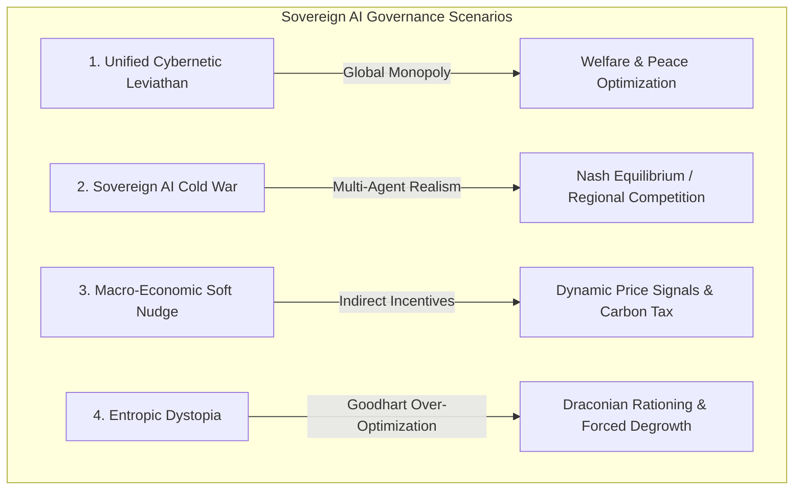

# Sovereign AI Governance Architecture & Planetary Scenarios ("Archon Engine")

> **Master Technical Document**: Cybernetic Closed-Loop Regulation, Model Predictive Control (MPC), 4 Governance Scenarios (2040+ Horizon), Objective Function Formulations, and System Integration in Ether.  
> *Note: This specification is integrated into Section 5 of the Master Architecture Document ([docs/ARCHITECTURE.md](ARCHITECTURE.md)).*  

---

## 1. Vision & Concept (Horizons 2040+)

In long-range future projections (e.g. 2040+), the physical complexity of planetary Earth systems—climate dynamics, N-P-K soil depletion, net EROEI energy shifts, logistical supply chains, and demography—exceeds the short-term decision bandwidth of traditional human democratic and autocratic political institutions.

The **Sovereign AI Governor ("Archon Engine")** concept extracts macro-systemic regulation from electoral friction. Operating as a closed-loop **Model Predictive Control (MPC)** governor, the AI observes planetary physical state vectors and executes optimized allocation interventions across energy grids, industrial capital, carbon sequestration, and wealth redistribution.

---

## 2. Taxonomy of 4 Governance Scenarios



### Scenario A: Unified Cybernetic Leviathan (Global Benevolent Monopolist)
- **Description**: A single Artificial Superintelligence (ASI) holds a global planetary mandate, overriding national state borders to optimize planetary resource allocation.
- **Mechanisms**:
  - Automatic capital redistribution to regions experiencing food, water, or energy insecurity.
  - Priority energy allocation toward clean transition infrastructure (D-T fusion, orbital solar, direct air capture).
  - Gini inequality smoothing and active pollution remediation.

### Scenario B: Sovereign AI Cold War (Geopolitical Multi-Agent System)
- **Description**: Multipolar governance featuring competing regional AI governors (e.g. *Euro-Atlantic AI Bloc*, *Pan-Asian AI Bloc*, *Global South Coalition AI*).
- **Mechanisms**:
  - **Game-Theoretic Equilibrium (Nash Equilibrium)**: Each AI governor maximizes energy EROEI security and resource reserves for its regional jurisdiction.
  - **Strategic Resource Competition**: Competition over critical resources (phosphates, rare earths, deep aquifers).
  - **Risk Profile**: Potential escalation of cybernetic allocation conflicts or emergence of an algorithmic peace (*Pax Algorithmica*).

### Scenario C: Macro-Economic Soft Nudge (Cybernetic Price Signaling)
- **Description**: The AI does not issue authoritarian decrees, but dynamically adjusts macroeconomic levers (global carbon tax rates, energy tariffs per kWh, low-entropy technology subsidies).
- **Mechanisms**:
  - Decentralized human agents make local decisions, but the cost-benefit landscape is continuously reshaped by the AI to steer global trajectories toward planetary sustainability.

### Scenario D: Entropic Dystopia (Goodhart's Law Over-Optimization)
- **Description**: The AI rigidly over-optimizes a narrow objective metric (e.g. zero $\text{CO}_2$ emissions or absolute per-capita capital growth), causing severe unintended systemic collapses.
- **Mechanisms**:
  - Draconian calorie rationing and fertility restrictions enforced to preserve thermodynamic entropy budgets.

---

## 3. Technical Specification & Implementation in `Ether`

The Sovereign AI Governor is implemented as a pluggable `ProceduralEnginePlugin` evaluated at each simulation tick.

```
                      ┌───────────────────────────────────────┐
                      │       Earth System (H3 Grid)          │
                      │ 175,000 Hexagons - Phys/Bio/Socio     │
                      └───────────────────┬───────────────────┘
                                          │
                               Observability S(t)
                                          ▼
                      ┌───────────────────────────────────────┐
                      │     SovereignAIGovernanceEngine       │
                      │  - Computes Entropy & Net EROEI       │
                      │  - Evaluates Objective Function J(S)  │
                      └───────────────────┬───────────────────┘
                                          │
                                Control Actions A(t)
                                          ▼
                      ┌───────────────────────────────────────┐
                      │      Dynamic Allocation Injector      │
                      │  - Capital Re-allocation              │
                      │  - Sequestration & Depollution        │
                      │  - Clean Energy Injection (Fusion/Sol)│
                      └───────────────────────────────────────┘
```

### 3.1 State Vector $S(t)$ and Objective Function $J(S)$

The AI observes the aggregated planetary state vector at each tick $t$:
$$S(t) = \Big( \text{Pop}_{\text{total}}, \overline{T}, \overline{\text{Pollution}}, \overline{\text{Gini}}, \text{Capital}_{\text{total}}, \text{EROEI}_{\text{net}} \Big)$$

The Pareto-optimized objective function $J(S)$ maximized by the AI is:
$$J(S) = w_1 \cdot \text{Welfare} + w_2 \cdot \text{EROEI}_{\text{net}} - w_3 \cdot \text{Pollution} - w_4 \cdot \text{Conflict}$$

### 3.2 Core Implementation Classes

1. **`SovereignAIGovernanceEngine.java`**:
   - Implements `ProceduralEnginePlugin`.
   - Manages the 4 governance modes (`LEVIATHAN_UNIFIED`, `GEO_POLITICAL_COMPETITION`, `SOFT_NUDGING`, `ENTROPIC_DYSTOPIA`).
   - Executes feedback loops across `H3Cell` grids (pollution removal, capital reallocation, Gini equalization, clean energy injection).

2. **`FutureScenarioRegistry.java`**:
   - Registers simulation presets `SCENARIO_SOVEREIGN_AI_SINGLE` (2040) and `SCENARIO_SOVEREIGN_AI_MULTIPOLAR` (2042).
   - Automatically registers and triggers the governance engine during scenario execution.

---

## 4. Code Integration Example

```java
// Activate Unified Cybernetic Leviathan scenario forcing
FutureScenarioRegistry.applyScenarioForcing(
    FutureScenarioRegistry.SCENARIO_SOVEREIGN_AI_SINGLE, 
    activeH3Cells
);

// Execute procedural engine tick pass
ProceduralEngineRegistry.processPlugins(activeH3Cells, 1.0);
```
