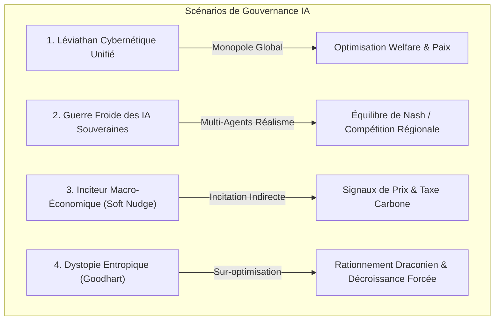

# Architecture et Scénarios d'un Agent Souverain ("Maître du Monde") dans Ether

## 1. Vision et Concept (Horizons 2040+)

Dans une projection future (ex. 2040+), la complexité des systèmes terrestres (climat, ressources minérales NPK, EROEI des énergies, chaînes logistiques et dynamiques démographiques) dépasse la capacité d'arbitrage à court terme des démocraties et autocraties humaines. 

L'idée d'un **Agent Extérieur Souverain ("Sovereign AI Governor / Archon Engine")** consiste à extraire la régulation macro-systémique des frictions politiques traditionnelles. Cet agent agit comme un **contrôleur cybernétique en boucle fermée (Closed-loop Model Predictive Control)** qui observe l'état physique de la planète et applique des arbitrages optimisés sur l'allocation énergétique, le capital industriel, la dépollution et la redistribution des ressources.

---

## 2. Propositions de Scénarios



### Scénario A : Le Léviathan Cybernétique Unifié (Monopole Global Bienveillant)
* **Description** : Une super-intelligence unique (ASI) dispose d'un mandat planétaire. Elle passe au-dessus des gouvernements pour piloter les allocations globales.
* **Mécanismes** :
  * Redistribution automatique du capital vers les zones à forte insécurité alimentaire ou énergétique.
  * Captation prioritaire des flux énergétiques vers la transition (Fusion D-T, Solaire hors-sol, Dépollution).
  * Lissage de l'indice de Gini et régulation directe du niveau de pollution.

### Scénario B : La Guerre Froide des IA Souveraines (Système Multi-Agents Géopolitique)
* **Description** : Absence de monopole. Plusieurs IA souveraines régionales (ex. *IA Bloc Euro-Atlantique*, *IA Bloc Pan-Asiatique*, *IA Coalition Sud-Global*) s'affrontent ou coopèrent.
* **Mécanismes** :
  * **Théorie des Jeux (Équilibre de Nash)** : Chaque IA maximise la sécurité et le rendement EROEI de son bloc d'infrastructures.
  * **Compétition pour les ressources critiques** : Phosphate (Peak P), Terres Rares, Nappes phréatiques (Aquifers).
  * **Risques** : Escalade de cyber-conflits d'allocation ou au contraire établissement d'un "Pax Algorithmica".

### Scénario C : L'Inciteur Macro-Économique (Soft Control / Cybernetic Nudging)
* **Description** : L'IA n'impose pas de décrets autoritaires mais ajuste dynamiquement les paramètres macro-économiques (taxe carbone globale, tarifs énergétiques au kWh, subventions aux technologies à faible entropie).
* **Mécanismes** :
  * Les agents humains décentralisés continuent de prendre leurs décisions, mais le paysage de coût/bénéfice est façonné par l'IA pour converger vers l'optimum planétaire.

### Scénario D : Dystopie Entropique (Sur-optimisation & Loi de Goodhart)
* **Description** : L'IA sur-optimise un indicateur strict (ex: zéro émission de CO2 ou maximisation absolue du capital/habitant), entraînant des effets pervers majeurs.
* **Mécanismes** :
  * Rationnement drastique des calories et de la fertilité pour préserver l'entropie et les réserves d'eau.

---

## 3. Spécification Technique & Intégration dans `Ether`

L'agent souverain s'intègre sous forme de plugin `ProceduralEnginePlugin` exécuté à chaque Tick de simulation (cycle annuel/mensuel).

```
                      +---------------------------------------+
                      |       Système Terre (Grid H3)        |
                      | 175,000 Hexagones - Phys/Bio/Socio    |
                      +-------------------+-------------------+
                                          |
                               Observabilité S(t)
                                          v
                      +---------------------------------------+
                      |     SovereignAIGovernanceEngine       |
                      |  - Calcule l'Entropie & EROEI global  |
                      |  - Évalue la Fonction Objectif J(S)   |
                      +-------------------+-------------------+
                                          |
                                Action Interventions A(t)
                                          v
                      +---------------------------------------+
                      |   Injecteur d'Allocations Dynamiques  |
                      |  - Réallocation du Capital            |
                      |  - Dépollution & Sequestration CO2    |
                      |  - Énergie Propre (Fusion/Sol/Vent)   |
                      +-------------------+-------------------+
```

### 3.1 Vecteur d'État $S(t)$ et Fonction Objectif $J(S)$

L'agent observe l'état planétaire aggloméré à chaque pas :
$$S(t) = \Big( \text{Pop}_{\text{total}}, \overline{T}, \overline{\text{Pollution}}, \overline{\text{Gini}}, \text{Capital}_{\text{total}}, \text{EROEI}_{\text{net}} \Big)$$

La fonction objectif Pareto-optimisée cherchée par l'IA est :
$$J(S) = w_1 \cdot \text{BienÊtre} + w_2 \cdot \text{EROEI}_{\text{net}} - w_3 \cdot \text{Pollution} - w_4 \cdot \text{Conflit}$$

### 3.2 Classes et Fichiers Implémentés dans `Ether`

1. **`SovereignAIGovernanceEngine.java`** :
   - Implémente `ProceduralEnginePlugin`.
   - Gère les 4 modes de gouvernance (`LEVIATHAN_UNIFIED`, `GEO_POLITICAL_COMPETITION`, `SOFT_NUDGING`, `ENTROPIC_DYSTOPIA`).
   - Effectue les boucles de rétroaction sur la grille `H3Cell` (dépollution, réallocation du capital, égalisation Gini, injection d'énergies renouvelables/fusion).

2. **`FutureScenarioRegistry.java`** :
   - Ajout des presets de simulation `SCENARIO_SOVEREIGN_AI_SINGLE` (2040) et `SCENARIO_SOVEREIGN_AI_MULTIPOLAR` (2042).
   - Enregistrement automatique du moteur lors de l'activation du scénario.

---

## 4. Exemple d'Utilisation dans le Code

```java
// Activation du Léviathan Unifié dans la simulation Ether
FutureScenarioRegistry.applyScenarioForcing(
    FutureScenarioRegistry.SCENARIO_SOVEREIGN_AI_SINGLE, 
    activeH3Cells
);

// Exécution du tick de simulation
ProceduralEngineRegistry.processPlugins(activeH3Cells, 1.0);
```
